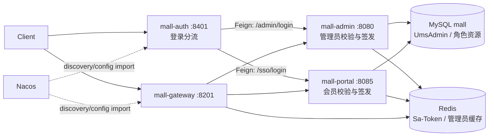
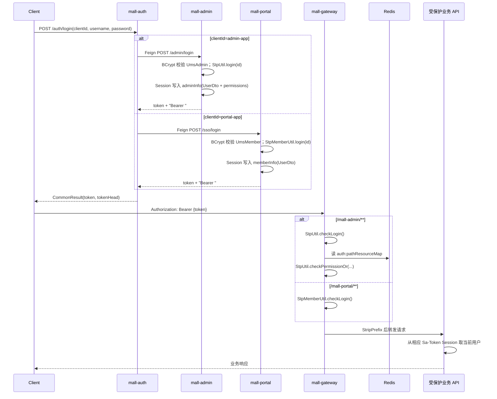
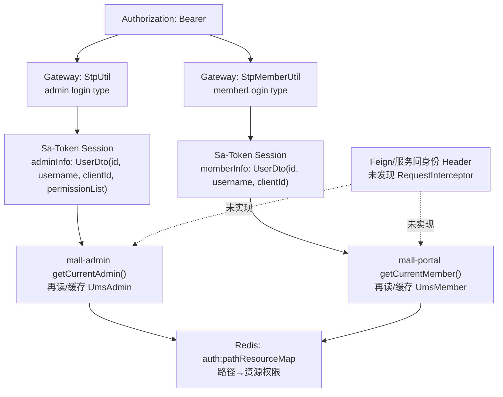

---
type: "concept"
tags: ["ecommerce", "mall-swarm", "authentication", "authorization", "sa-token", "jwt"]
summary: "mall-auth 是登录分流代理；admin 与 portal 分别校验账号并签发 Sa-Token Simple JWT，Gateway 统一实施入口校验与后台资源权限匹配。"
sources:
  - "[[30-sources/repositories/mall-swarm/来源_mall-swarm_项目源码]]"
  - "mall-auth/src/main/java/com/macro/mall/auth/controller/AuthController.java"
  - "mall-gateway/src/main/java/com/macro/mall/config/SaTokenConfig.java"
  - "mall-admin/src/main/java/com/macro/mall/service/impl/UmsAdminServiceImpl.java"
  - "mall-portal/src/main/java/com/macro/mall/portal/service/impl/UmsMemberServiceImpl.java"
status: "evolving"
confidence: 0.91
created: "2026-07-13"
updated: "2026-07-13"
---

# 概念：mall-swarm mall-auth 设计

## 结论与证据边界

**当前实现不是 OAuth2 授权服务器，也不是自行签发令牌的统一身份中心。**`mall-auth` 仅按调用方提交的 `clientId` 将用户名/密码转发给 `mall-admin` 或 `mall-portal`；实际密码校验、`StpUtil.login` / `StpMemberUtil.login`、会话写入和 Token 返回均发生在两个下游业务服务。源码未见 `AuthorizationServer`、OAuth2 grant、refresh token API、client secret 校验或服务账号实体。  
证据：`mall-auth/src/main/java/com/macro/mall/auth/controller/AuthController.java#login`；`service/UmsAdminService.java`、`UmsMemberService.java` 的 `@FeignClient`；`mall-admin/src/main/java/com/macro/mall/service/impl/UmsAdminServiceImpl.java#login`；`mall-portal/src/main/java/com/macro/mall/portal/service/impl/UmsMemberServiceImpl.java#login`。

项目使用 Sa-Token 的 `StpLogicJwtForSimple`（Simple JWT）处理 admin 默认登录类型和 `memberLogin` 登录类型。`sa-token-redis-jackson`、Spring Redis 和 JWT 依赖都在 admin、portal、gateway POM 中；源码直接可见的 Redis 认证用途是 Gateway 的路径—资源权限表，Sa-Token 会话/注销在该组合下的最终 Redis key、失效语义须以运行时配置与库版本验证，不能仅由依赖反推。  
证据：`mall-admin/src/main/java/com/macro/mall/config/SaTokenConfigure.java#getStpLogicJwt`；`mall-portal/src/main/java/com/macro/mall/portal/util/StpMemberUtil.java#TYPE,#stpLogic`；`mall-gateway/src/main/java/com/macro/mall/util/StpMemberUtil.java#TYPE,#stpLogic`；三个模块 `pom.xml`；`mall-gateway/src/main/java/com/macro/mall/config/SaTokenConfig.java#getSaReactorFilter`。

## 定义与职责

| 组件 | 源码事实与职责 | 证据 |
| --- | --- | --- |
| `mall-auth` | MVC 服务，监听 8401、注册 Nacos、启用 Feign；暴露一个登录分流 API。它不访问账号 Mapper、Redis 或 Sa-Token API。 | `MallAuthApplication.java`；`application.yml#server.port`；`AuthController.java`；`pom.xml` |
| `mall-admin` | 管理员账号、密码与资源权限的权威业务服务；成功登录后签发 admin 类型 Token，并把 `UserDto`（含 permission list）放入 Sa-Token Session。 | `UmsAdminServiceImpl.java#login`；`UmsAdminController.java#login` |
| `mall-portal` | 会员账号权威业务服务；成功登录后以 `memberLogin` 类型签发 Token，在 Session 放入会员 `UserDto`。 | `UmsMemberServiceImpl.java#login`；`UmsMemberController.java#login`；`StpMemberUtil.java#TYPE` |
| `mall-gateway` | WebFlux 边缘入口：根据路由前缀分别检查会员/管理员登录态，并依据 Redis 路径资源表对后台接口补做权限校验。 | `SaTokenConfig.java#getSaReactorFilter`；`application.yml#spring.cloud.gateway` |

### 启动入口与对外 API

- 启动：`com.macro.mall.auth.MallAuthApplication#main`，标注 `@EnableDiscoveryClient`、`@EnableFeignClients`、`@SpringBootApplication`；`mall-auth/src/main/resources/application.yml#server.port=8401`。
- 唯一业务 Controller：`AuthController`，基路径 `/auth`。
- 对外登录：`POST /auth/login?clientId={admin-app|portal-app}&username=...&password=...`。`admin-app` 转发 `POST mall-admin/admin/login`（JSON body），`portal-app` 转发 `POST mall-portal/sso/login`（request params）；其他 `clientId` 返回“clientId不正确”。证据：`AuthController#login`、`mall-common/src/main/java/com/macro/mall/common/constant/AuthConstant.java#ADMIN_CLIENT_ID,#PORTAL_CLIENT_ID`。
- 未发现：logout、refresh、token introspection、JWKS、角色/权限管理或机器凭证 API（待验证：实际 Nacos 中是否另有网关/认证扩展配置；仓库 `config/` 不含 `mall-auth-*.yaml`）。

## 模块结构与运行时依赖

`mall-auth` 的 dev/prod profile 均导入 `nacos:mall-auth-{profile}.yaml`，但受版本控制的 `config/` 目录未提交对应文件；故真实部署环境是否覆盖 Token 或 Feign 参数为**待验证**。  
证据：`mall-auth/src/main/resources/application-dev.yml`、`application-prod.yml`；`config/` 文件清单。

## 核心调用链

### 登录到受保护 API（源码事实）

证据：`AuthController#login`；`UmsAdminServiceImpl#login`；`UmsMemberServiceImpl#login`；`SaTokenConfig#getSaReactorFilter`；`UmsResourceServiceImpl#initPathResourceMap`；Gateway `application.yml` 路由的 `StripPrefix=1`。Gateway 代码没有显式重写/删除 `Authorization` header，Spring Cloud Gateway 的实际 header 透传行为应通过集成测试确认。

### Token 与用户上下文传播图

`UserDto` 的 `clientId` 仅被写入会话；在允许范围内未找到服务端据此对“用户调用 / 系统调用”分类、Feign `RequestInterceptor` 或内部签名校验。  
证据：`mall-common/src/main/java/com/macro/mall/common/dto/UserDto.java`；`UmsAdminServiceImpl#login,#getCurrentAdmin`；`UmsMemberServiceImpl#login,#getCurrentMember`；对 `mall-auth`、`mall-admin`、`mall-portal` 的 `RequestInterceptor|FeignClient|Authorization` 检索。

## 数据与状态

| 主体 | 账号与状态 | 权限/会话状态 | 边界 |
| --- | --- | --- | --- |
| 管理员 | `UmsAdmin`：`username/password/status`，密码使用 `BCrypt` 比对；两个服务都配置同一 MySQL `mall` 数据源。 | 资源来自 `getResourceList(adminId)`；登录时生成 `id:name` 权限串，Session key 为 `adminInfo`。 | 独立 admin 登录类型；Gateway 对 `/mall-admin/**` 做登录+路径资源权限校验。 |
| 会员 | `UmsMember`：`username/password/phone/status`，密码使用 `BCrypt` 比对；portal 直接调用 `UmsMemberMapper`。 | Session key 为 `memberInfo`；未将 permissionList 写入用户 DTO。 | 独立 `memberLogin` 类型；Gateway 对 `/mall-portal/**` 仅做登录校验。 |
| 服务账号 | 未发现实体、表 Mapper、client credentials、API key 或专用 Token。 | 未发现。 | **不存在源码证据，不可假设为已支持。** |

证据：`mall-mbg/src/main/java/com/macro/mall/model/UmsAdmin.java`、`UmsMember.java`；`UmsAdminServiceImpl#login`、`UmsMemberServiceImpl#login`；admin/portal `application.yml#spring.datasource`；`AuthConstant#STP_ADMIN_INFO,#STP_MEMBER_INFO`。

### Token 生命周期

- **签发**：admin 调 `StpUtil.login(admin.id)`，portal 调 `StpMemberUtil.login(member.id)`，Controller 返回 `SaTokenInfo.tokenValue` 和 `Bearer ` 前缀。证据：两个 `Ums*ServiceImpl#login`、两个 Controller `#login`。
- **校验**：Gateway 用两种 login type 的 `checkLogin`；管理员再按 Redis `auth:pathResourceMap` 做 `checkPermissionOr`。下游业务通过 `getSession()` 读取身份，而不是在允许范围内找到的 Controller/Filter 中再次显式 `checkLogin`。证据：Gateway `SaTokenConfig#getSaReactorFilter`；`UmsAdminServiceImpl#getCurrentAdmin`；`UmsMemberServiceImpl#getCurrentMember`。
- **过期**：admin/portal 本地配置均为 `timeout: 604800`（7 天）、`active-timeout: -1`、`is-concurrent: true`、`is-share: false`；Gateway 是 `timeout: 2592000`（30 天）。`Authorization` 为 token name，仅读 header，前缀 `Bearer`。证据：三个 `application.yml#sa-token`。
- **刷新**：未发现 refresh token 数据结构或 `/refresh` 端点；过期后重新登录是源码可见的唯一获取新 Token 路径。
- **注销**：`/admin/logout` 和 `/sso/logout` 先删各自用户缓存，后调用 `StpUtil.logout()` / `StpMemberUtil.logout()`。对已签 Token 能否立即在每个实例被拒绝、重启后的行为及 Redis 中实际撤销记录，**待以带 Redis 的集成测试验证**。证据：两个 Controller `#logout`、两个 ServiceImpl `#logout`。
- **存储**：代码显式在 Sa-Token Session 写 `UserDto`；admin/portal/gateway 均引入 Sa-Token Redis Jackson，业务显式 Redis 键另有 `auth:pathResourceMap`、`ums:admin`、`ums:member`。Simple JWT 的载荷、Session 后端键和撤销机制不能凭 POM 断言。证据：三个 POM；`AuthConstant`；`UmsResourceServiceImpl#initPathResourceMap`；admin/portal `application.yml#redis.key`。

## 关键设计、权限边界与风险

| 身份 | 允许的认证路径 | Gateway 权限边界（事实） | 主要风险 / 待验证 |
| --- | --- | --- | --- |
| 管理员 | `/mall-auth/auth/login?clientId=admin-app`，或白名单直连 `/mall-admin/admin/login` | `/mall-admin/**` 登录校验；匹配到 Redis 路径资源表时须拥有任一资源权限。 | Compose 直接暴露 8080，且 admin 源码未发现下游 HTTP 登录/权限 filter；绕过 Gateway 后资源权限边界不由本模块强制。 |
| 会员 | `/mall-auth/auth/login?clientId=portal-app`，或白名单直连 `/mall-portal/sso/login` | `/mall-portal/**` 仅 `memberLogin` 登录校验。 | Compose 直接暴露 8085；portal 源码未发现下游 HTTP filter，直连可能绕过登录校验。对象归属检查存在于部分业务方法，覆盖度待审计。 |
| 服务账号 | 无 | 无 | 当前不可用；不能用管理员 Token 冒充服务身份。 |

1. **双重/不对称校验**：Gateway 管理端同时做登录与资源权限，业务层以 Session 取用户；portal 在 Gateway 只做登录，且有些 Service 再做订单/地址归属校验。这不是完整纵深防御：下游 HTTP 层未见统一校验。证据：`SaTokenConfig#getSaReactorFilter`；`OmsPortalOrderServiceImpl#confirmReceiveOrder,#deleteOrder`；对下游 filter/interceptor 检索。
2. **旁路真实可达**：`document/docker/docker-compose-app.yml` 发布 admin:8080、portal:8085、auth:8401 到宿主机；虽 Kubernetes Service 是 ClusterIP，但未见 NetworkPolicy。生产是否有外部反向代理/网络隔离为待验证。证据：Compose 相应 `ports`；`document/k8s/mall-{admin,portal,auth}-service.yaml`。
3. **共享密钥与配置漂移风险**：admin、portal 的源码配置均为相同 `jwt-secret-key: sa-secret-key123`；Gateway 受控 YAML 未配置该密钥。跨节点验签是否依赖 Sa-Token 默认值、Nacos 未纳管配置或库行为必须验证；不要假定它天然一致。证据：admin/portal `application.yml#sa-token.jwt-secret-key`；gateway `application.yml` 与 `config/gateway/*.yaml`。
4. **权限快照与失效风险**：管理员权限列表登录时写入 Session；资源路径表只在资源 create/update/delete 时重建。角色变更、用户禁用、权限变更是否立即影响已登录 Token，源码未见统一会话失效调用，待验证。证据：`UmsAdminServiceImpl#login,#updateRole`；`UmsResourceServiceImpl#create,#update,#delete,#initPathResourceMap`。
5. **敏感管理端点**：auth/admin/portal 均在源码配置 `management.endpoints.web.exposure.include: '*'`，且 Gateway 白名单 `/actuator/**`；实际端点暴露范围与访问控制应在部署环境验证。证据：三个服务 `application.yml#management`；Gateway `application.yml#secure.ignore.urls`。

## 扩展点

- 认证分流：`AuthController#login` 的 `clientId` 分支与两个 Feign 接口是当前唯一扩展位置；新增身份域不能仅增常量，必须补充凭证校验、签发策略和资源边界。
- 管理端权限：`UmsResourceServiceImpl#initPathResourceMap` 写入 Redis，Gateway `SaTokenConfig#getSaReactorFilter` 动态匹配 URL 并调用 `StpUtil.checkPermissionOr`；`StpInterfaceImpl#getPermissionList` 从 Session 的 `adminInfo` 返回权限。
- 多账号体系：`StpMemberUtil.TYPE = memberLogin` 使会员与默认 admin 登录类型隔离；新增类型应使用独立 type、audience/issuer、密钥与可验证的下游 enforcement。

## AI 二开启示（非项目现有能力）

下述内容均为**二开建议**，不是源码现有 AI 或 Agent 能力。

1. **委托用户身份（delegation）**：AI 工具请求必须携带经认证的用户主体、`actor_type=user`、用户 ID、明确 scope、短 TTL、工具名、请求关联 ID；工具网关只允许 scope 与目标 API 对应。不得把浏览器 `Authorization` 原样交给模型或让模型自行选择 `clientId`。
2. **系统身份（machine identity）**：为 Agent 服务创建独立 service account、私钥/工作负载身份与最小 scope（例如只读商品检索）；令牌 audience 绑定到具体工具服务，禁止复用 admin/portal 的 Simple JWT。当前源码无此能力，应独立设计与实现。
3. **高风险操作**：下单、支付、地址修改、删除、后台商品/权限变更使用细粒度 action scope + 资源归属检查；金额、删除、授权类操作要求用户确认和不可抵赖审计。AI 不应取得全局管理员权限。
4. **网关与服务双层执行**：将 Gateway 作为策略执行点，同时在每个下游服务实现可验证的 token/内部身份过滤器；仅信任 mTLS/服务网格或签名的内部调用头，拒绝客户端伪造的 `X-User-*`。这是对现有旁路风险的修复建议。
5. **可审计性**：记录 actor（用户或服务）、delegator、Agent/run ID、tool、scope、资源 ID、决策结果与 token `jti`；敏感字段脱敏，日志不可记录原始 Token/密码。

## 风险与待验证项

- 运行 Nacos 中 `mall-auth-{dev,prod}.yaml` 是否存在，以及是否覆盖 Sa-Token、Feign timeout、鉴权白名单或密钥。
- 使用真实 admin/member Token 分别请求 Gateway 与直连 8080/8085，验证认证、权限、退出后 token、过期和跨实例表现。
- 确认 Gateway、admin、portal 使用同一 Sa-Token/JWT 密钥、序列化协议和 Redis namespace；当前源码配置显示可能不一致。
- 审计所有 portal 写操作是否都由 `getCurrentMember()` 与资源归属校验保护；审计 admin Controller 是否所有敏感路径都进入资源表。
- 确认生产网络策略是否只允许 Gateway 北向访问、是否额外保护 Actuator 与 Swagger。

## 相关链接

- [[20-projects/mall-swarm/architecture/概念_mall-swarm_认证网关与部署安全]]：第二轮 P0 对直连旁路、密钥/超时漂移、撤销和部署边界的汇总。
- [[20-projects/mall-swarm/architecture/主题_mall-swarm_架构全景_综述]]
- [[30-sources/repositories/mall-swarm/来源_mall-swarm_项目源码]]
- [[30-sources/repositories/mall-swarm/来源_mall-swarm_项目入口与模块地图]]
- [[10-domains/java/spring/概念_Spring_Web层_DispatcherServlet_HandlerMapping_参数返回值_过滤器拦截器]]
