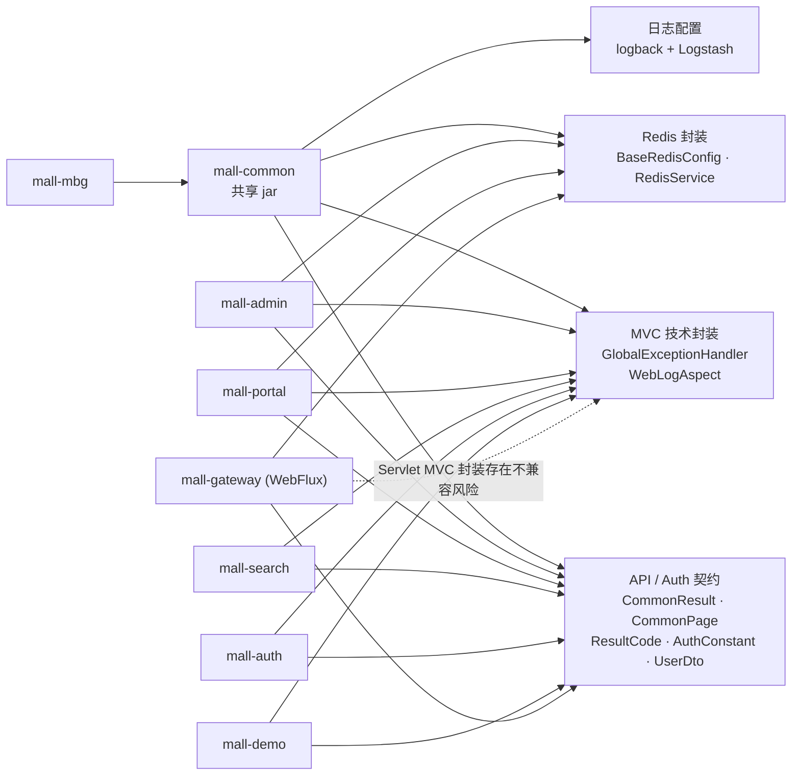
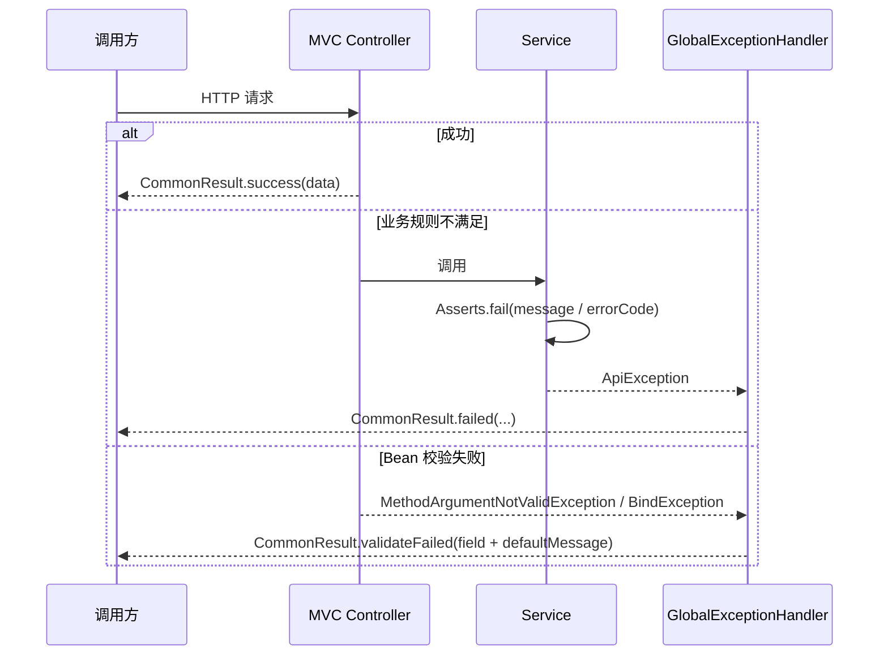

---
type: "concept"
tags: ["ecommerce", "mall-swarm", "mall-common", "shared-kernel", "redis", "webmvc", "webflux"]
summary: "mall-common 的跨服务契约、技术封装、MVC/WebFlux 边界及 AI 二开公共层边界。"
sources:
  - "[[30-sources/repositories/mall-swarm/来源_mall-swarm_项目源码]]"
source_project: "/Users/yangyuguang/Documents/project_code/mall/mall-swarm"
status: "evidence-based"
confidence: 0.91
created: "2026-07-13"
updated: "2026-07-13"
---

# 概念：mall-swarm 的 mall-common 设计

## 定义与职责

`mall-common` 是 Maven `jar` 共享模块，而非独立服务。它同时放置 API 返回协议、分页 DTO、常用错误码、认证常量和 `UserDto` 等跨服务契约，以及 Redis 基础 Bean、Redis 操作门面、MVC 全局异常处理、Servlet Controller 日志切面和日志输出配置。以下结论仅来自源码、POM 与配置；未运行验证的装配结果均标“待验证”。

| 能力 | 定位 | 已证实行为 | 代码证据 |
| --- | --- | --- | --- |
| 统一响应与错误码 | **跨服务 HTTP 契约** | `CommonResult<T>` 固定 `code`、`message`、`data`；`ResultCode` 有 200/500/404/401/403 五个码。 | `mall-common/src/main/java/com/macro/mall/common/api/CommonResult.java`：字段/工厂方法；`ResultCode.java`：枚举 |
| 分页响应 | **跨服务 HTTP 契约** | `CommonPage<T>` 固定 `pageNum`、`pageSize`、`totalPage`、`total`、`list`，可转换 PageHelper 或 Spring Data `Page`。 | `api/CommonPage.java`：两个 `restPage` |
| 认证共享模型 | **跨服务契约** | `AuthConstant` 定义 Authorization/Bearer、权限 Redis key、Sa-Token session 名；`UserDto` 含 id、用户名、clientId、权限列表。 | `constant/AuthConstant.java`；`dto/UserDto.java` |
| 业务异常与校验反馈 | MVC 技术封装 | `Asserts.fail` 抛 `ApiException`；`@ControllerAdvice` 将业务异常与两类 MVC 校验异常包装为 `CommonResult`。 | `exception/Asserts.java`；`ApiException.java`；`GlobalExceptionHandler.java` |
| Redis | 可复用技术封装 | 提供字符串 key/JSON value 的 Template、默认一天 TTL CacheManager、value/hash/set/list 门面。 | `config/BaseRedisConfig.java`；`service/RedisService.java`；`service/impl/RedisServiceImpl.java` |
| HTTP 访问日志 | Servlet/MVC 技术封装 | AOP 记录 Controller 的请求参数、返回值和耗时，并用 Logstash marker 输出。 | `log/WebLogAspect.java`：`@Around("webLog()")` |
| 日志输出 | 基础设施配置 | 控制台、debug/error 滚动文件与可选 Logstash TCP（4560–4563）。 | `resources/logback-spring.xml`：`LOG_STASH_*` appender |
| OpenAPI/校验/负载均衡 | 依赖供给，非统一策略 | POM 引入 Springdoc/Knife4j、Validation、LoadBalancer；服务各自定义 OpenAPI。 | `mall-common/pom.xml`；`mall-admin/src/main/java/com/macro/mall/config/SpringDocConfig.java`：`mallAdminOpenAPI()` |

`CacheException` 仅见声明及 portal 导入，未在允许范围找到使用点或处理切面，故不能视作有效缓存异常机制（待验证）。证据：`mall-common/.../annotation/CacheException.java`；`mall-portal/.../UmsMemberCacheServiceImpl.java`。

## 模块结构

```text
mall-common
├── api/          CommonResult、CommonPage、IErrorCode、ResultCode
├── constant/     AuthConstant
├── dto/          UserDto
├── exception/    ApiException、Asserts、GlobalExceptionHandler
├── config/       BaseRedisConfig
├── service/      RedisService、RedisServiceImpl
├── log/          WebLogAspect
├── domain/       WebLog
└── resources/    logback-spring.xml
```

## 运行时依赖：公共能力 → 使用模块



admin/portal/search/demo 经 `mall-mbg` 获得 common 的传递依赖，并直接 import 公共类型；auth/gateway 直接声明 common。证据：根 `pom.xml`：`<modules>` / `<dependencyManagement>`；各模块 `pom.xml`；各模块 Java import。

## 核心调用链



`GlobalExceptionHandler` 只包装返回对象，不设置 `ResponseEntity` 或 `@ResponseStatus`；因此可确认业务 `code`，但不能确认 HTTP status 会同步为 4xx/5xx（常规 MVC 路径很可能保持默认 200，需集成测试）。系统异常没有 `Exception.class` 兜底 handler，会走 Spring Boot 默认异常链，响应形状不保证是 `CommonResult`。证据：`GlobalExceptionHandler.java`：三个 `@ExceptionHandler`；`CommonResult.java`：工厂方法。

业务异常是显式 `Asserts.fail`/`ApiException`；参数校验异常是上述两类 MVC 异常；其余为未统一转换的系统异常。portal 的“优惠券不存在”“库存不足”与 admin 的“密码不正确”均通过 `Asserts.fail` 触发。证据：`mall-portal/.../UmsMemberCouponServiceImpl.java`；`mall-portal/.../OmsPortalOrderServiceImpl.java`：`generateOrder`；`mall-admin/.../UmsAdminServiceImpl.java`：`login`。

Redis 调用链：`BaseRedisConfig.redisTemplate()` 配置序列化，admin 的 `UmsResourceServiceImpl.initResourceRolesMap()` 写 `auth:pathResourceMap`，gateway 的 `SaTokenConfig.getSaReactorFilter()` 每次鉴权读取此 Hash 并按路径匹配。证据：`BaseRedisConfig.java`：三个 `@Bean`；`mall-admin/.../UmsResourceServiceImpl.java`：`initResourceRolesMap`；`mall-gateway/.../SaTokenConfig.java`：`getSaReactorFilter`。

## 关键设计

- **兼容性敏感契约**：`CommonResult`、`CommonPage`、`IErrorCode`、`ResultCode`、`AuthConstant` 中跨网关读取的 header/key/session 常量和 `UserDto`。它们已被 Controller、Feign demo 返回值或 Gateway 鉴权直接使用，例如 `mall-demo/.../FeignAdminService.java` 返回 `CommonResult`，`mall-gateway/.../SaTokenConfig.java` 使用 `CommonResult`/`AuthConstant`。
- **工具封装**：`RedisService`、`BaseRedisConfig`、`WebLogAspect`、`WebLog`、`Asserts`/`ApiException`、Logback 配置。变更仍有跨服务影响，但不是 HTTP JSON schema。
- 响应/分页字段形状已固定可见，但无 API 版本、弃用策略或契约测试；业务错误常为字符串 `failed(message)`，不能称为受治理的稳定错误码体系。
- `CommonPage.restPage(Page<T>)` 直接取 Spring Data 零基 `getNumber()`，而 PageHelper 分支取 `getPageNum()`；同一 `pageNum` 存在基数不一致风险。证据：`CommonPage.java`：两个 `restPage`。
- `BaseRedisConfig` 用 `StringRedisSerializer` 序列化 key/hash-key，用开启 `LaissezFaireSubTypeValidator` 默认多态的 Jackson 序列化 value/hash-value；CacheManager 默认 TTL 一天。这能恢复对象，但未见 allowlist、schema version 或迁移机制。证据：`BaseRedisConfig.java`：`redisSerializer`/`redisCacheManager`。
- key 命名没有 common 级 builder/namespace/version 规则：admin 和 portal 在各自缓存服务中拼接键，Gateway 读取 common 常量 `auth:pathResourceMap`。证据：`mall-admin/.../UmsAdminCacheServiceImpl.java`：`setAdmin`；`mall-portal/.../UmsMemberCacheServiceImpl.java`：`setMember`/`setAuthCode`；`AuthConstant.java`：`PATH_RESOURCE_MAP`。
- 日志是统一收集而非统一安全约束：`WebLogAspect` 记录 `@RequestBody`、`@RequestParam` 和完整返回对象；未见字段脱敏、敏感注解、traceId/correlationId 或 MDC 注入。证据：`WebLogAspect.java`：`getParameter`、`doAround`；`logback-spring.xml`：JSON encoder。因此含密码、token、手机号、地址或模型 prompt/response 的接口不得直接依赖该切面，需二开脱敏与追踪；这并不等同于断言生产日志已泄露数据。

## MVC 与 Gateway/WebFlux 边界

- common 直接依赖 `spring-boot-starter-web`、`springdoc-openapi-starter-webmvc-ui`，且 `WebLogAspect` 强制使用 `ServletRequestAttributes`/`HttpServletRequest`，是 MVC/Servlet 绑定。证据：`mall-common/pom.xml`；`WebLogAspect.java`：`doAround`。
- Gateway 排除了 common 带来的 web/redis starter，自己使用 WebFlux gateway starter；它实际只需 `CommonResult`、`AuthConstant`、`UserDto`、Redis Bean。证据：`mall-gateway/pom.xml`：exclusion 与 WebFlux starter；`MallGatewayApplication.java`：`@SpringBootApplication`；`SaTokenConfig.java`：`handleException`。
- `GlobalExceptionHandler` 仅处理 MVC 的 `MethodArgumentNotValidException`/`BindException`，未处理 WebFlux 的 `WebExchangeBindException`；Servlet 切面无法作为 reactive 请求日志方案。Gateway 是否注册 advice/aspect、是否影响启动均**待以启动/集成测试验证**，但类型和依赖的复用风险已证实。

## 数据与状态

`mall-common` 不维护数据库表或领域状态。它维护的是跨服务的数据形状：HTTP envelope、分页 metadata、认证 header/session 名、`UserDto` 以及 Redis 对象 JSON 序列化约定。`RedisService` 的带 TTL 方法以秒为单位；与 `RedisCacheManager` 的“一天默认 TTL”是两条不同策略入口。证据：`mall-common/src/main/java/com/macro/mall/common/service/RedisService.java`：`set`/`expire`；`config/BaseRedisConfig.java`：`Duration.ofDays(1)`。

## 扩展点

- 新业务错误码可实现 `IErrorCode`，由 `Asserts.fail(IErrorCode)` 或 `CommonResult.failed(IErrorCode)` 使用；应先定义码段、版本和契约测试。
- admin/portal/gateway 以 `extends BaseRedisConfig` 暴露 Bean，portal 额外标注 `@EnableCaching`。证据：三个模块的 `RedisConfig.java`。
- OpenAPI 的标题、安全 scheme、全局定制器应保留服务侧 `SpringDocConfig`；common 未提供统一文档定义。
- WebFlux 应提供 reactive 的异常 mapper、日志 filter 与上下文传播，不能直接复用 MVC 切面。

## AI 二开启示（均为二开建议，非现有能力）

| 基础设施能力 | 建议复用 / 沉淀到 common | 不建议复用 / 不应放入 common | 理由与落点 |
| --- | --- | --- | --- |
| 工具层响应 envelope | 复用 `CommonResult` 外形；新增版本化 AI 错误码 | 模型供应商原始 payload 成为通用契约 | 保持调用一致；payload 放 AI adapter/service DTO |
| 分页与检索 | 可复用 `CommonPage` 外形，但明确页号基数 | 向量 score、cursor、rerank metadata 硬塞普通分页 | AI 检索用独立 cursor/result 契约 |
| 鉴权与租户上下文 | header 名、请求 ID、审计主体抽象 | 模型账号、prompt、业务工具权限规则 | 前者横切；后者属于 AI/业务安全域 |
| Redis | key namespace、序列化 allowlist、TTL/版本、幂等锁抽象 | 对话记忆语义、prompt cache 淘汰策略 | 技术约束共享，AI 记忆由场景决定 |
| 日志与观测 | 脱敏、MDC traceId、审计事件、指标字段 | 原始 prompt/response、推理过程、成本决策 | 后者需 AI 域的访问与保留期治理 |
| AI 客户端与编排 | 多服务真实需要时才沉淀供应商无关接口/错误分类 | SDK client、模型选择、Agent/RAG/Tool workflow、向量库 schema | 避免模型与业务耦合；放独立 AI 服务/adapter |
| Web 适配 | 仅共享无框架 DTO/契约 | MVC advice/Servlet AOP 与 WebFlux filter 混放 | 建议拆 `common-contract`、`common-webmvc`、`common-webflux` |

## 风险与待验证项

1. **高：WebFlux 混用。** common 携带 MVC/Servlet；Gateway 是 WebFlux。先做 gateway 启动、异常和日志集成测试，再拆依赖。
2. **高：日志隐私。** 切面序列化请求/响应，缺脱敏和 trace 标准；先补敏感字段策略、采样、保留期与审计授权。
3. **中：错误 HTTP status。** 业务 `code` 不等于 HTTP status；AI tool/API 客户端需明确映射与契约测试。
4. **中：分页页号。** 两个 `restPage` 分支应测试并文档化 0/1 基语义。
5. **中：Redis 多态序列化。** 评估 class metadata、allowlist、DTO 演进和跨服务缓存兼容，补 key 版本化。
6. **待验证：`CacheException`。** 未发现处理逻辑或使用点。
7. **待验证：负载均衡实际封装。** common POM 仅引入 LoadBalancer；Feign 在 admin/portal/auth/demo POM 引入，未发现 common 自有 Feign 扩展类，不能称其提供 Feign 调用封装。

## 相关链接

- [[20-projects/mall-swarm/architecture/主题_mall-swarm_架构全景_综述]]
- [[30-sources/repositories/mall-swarm/来源_mall-swarm_项目源码]]
- [[10-domains/java/spring-framework/主题_Spring_Framework源码学习_综述]]
- [[10-domains/java/spring-framework/概念_Spring_WebFlux响应式处理链]]
