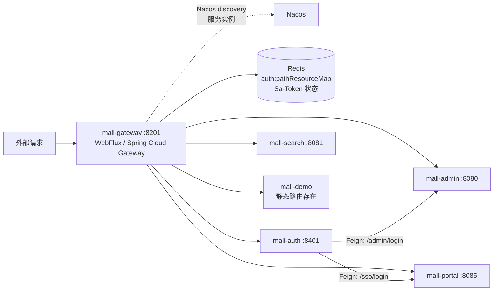
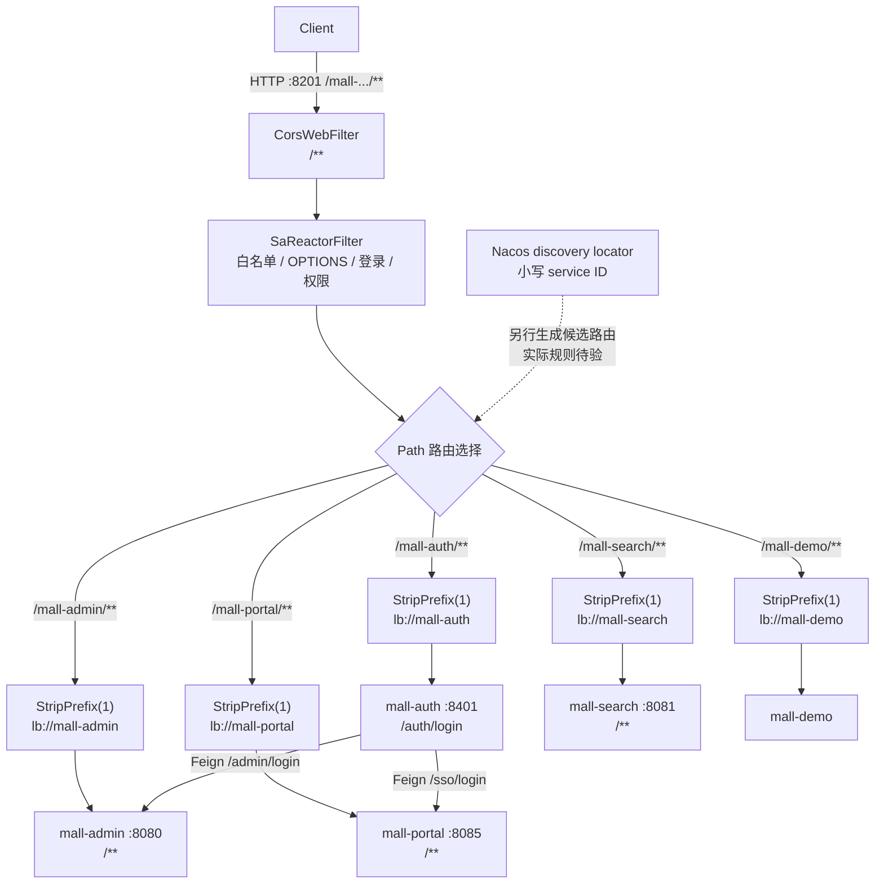

---
type: "concept"
tags: ["ecommerce", "mall-swarm", "mall-gateway", "spring-cloud-gateway", "webflux", "sa-token", "nacos", "knife4j"]
summary: "mall-gateway 的静态与服务发现路由、WebFlux 过滤边界、Sa-Token 双账号鉴权、OpenAPI 聚合及 AI API 接入边界。"
sources:
  - "[[30-sources/repositories/mall-swarm/来源_mall-swarm_项目源码]]"
source_project: "/Users/yangyuguang/Documents/project_code/mall/mall-swarm"
status: "evidence-based"
confidence: 0.93
created: "2026-07-13"
updated: "2026-07-13"
---

# 概念：mall-swarm 的 mall-gateway 设计

## 证据边界

本页只依据 `mall-gateway/**`、`config/gateway/**`、各目标服务的 `application*.yml` 中服务名/端口/context-path、以及 `mall-auth`、`mall-common` 的认证或响应相关源码编写。未读取 admin、portal、search 的 Controller/Service；因此“下游最终由哪个 Controller 处理”“登录后怎样写入 Sa-Token session”“Redis 权限 Hash 如何初始化”等均不能在本页断言，统一标为待验证。

## 定义与职责

`mall-gateway` 是监听 `8201` 的 Spring Cloud Gateway WebFlux 进程，注册为 Nacos 服务 `mall-gateway`。它承担北向 HTTP 入口、基于 `lb://` 的服务发现转发、前台会员和后台管理员的登录检查、后台接口权限检查、全局 CORS，以及 Knife4j OpenAPI 服务发现聚合。它**不是**业务登录实现者：认证入口 `mall-auth` 会再以 OpenFeign 调用 `mall-admin` 或 `mall-portal`。

| 职责 | 已证实实现 | 证据 |
| --- | --- | --- |
| 网关与发现 | Gateway WebFlux starter、Nacos discovery/config；启动类启用 discovery | `mall-gateway/pom.xml`：Gateway/Nacos 依赖；`MallGatewayApplication.java`：`@EnableDiscoveryClient` |
| 静态转发 | 五条显式 `Path` → `lb://service` → `StripPrefix=1` | `mall-gateway/src/main/resources/application.yml`：`spring.cloud.gateway.server.webflux.routes` |
| 服务发现路由 | 开启 discovery locator，并将服务 ID 小写化 | 同文件：`discovery.locator.enabled=true`、`lower-case-service-id=true` |
| 身份与权限 | `SaReactorFilter` 执行白名单、前台/后台登录检查和后台资源权限检查 | `config/SaTokenConfig.java`：`getSaReactorFilter` |
| 跨域 | 对全部路径和 method/header/origin pattern 放行，并允许 credential | `config/GlobalCorsConfig.java`：`corsFilter` |
| 文档入口 | Knife4j Gateway 按服务发现聚合 OpenAPI 3，排除 monitor | `application.yml`：`knife4j.gateway`；`pom.xml`：`knife4j-gateway-spring-boot-starter` |

没有任何 Gateway 自定义 `GlobalFilter`、`GatewayFilter`、`WebFilter` 实现、`RequestRateLimiter` / `RedisRateLimiter` 配置或限流 Bean。**限流当前未实现**，不能把 Redis 或 Sa-Token 依赖误称为限流能力。

## 模块结构

```text
mall-gateway
├── MallGatewayApplication.java      启动 + Nacos discovery
├── config/
│   ├── GlobalCorsConfig.java        CorsWebFilter
│   ├── IgnoreUrlsConfig.java        secure.ignore.urls 属性绑定
│   ├── RedisConfig.java             复用 BaseRedisConfig
│   └── SaTokenConfig.java           SaReactorFilter、认证/权限/错误 envelope
├── component/StpInterfaceImpl.java  后台权限列表适配
├── util/StpMemberUtil.java          memberLogin 独立 StpLogicJwtForSimple
└── resources/application*.yml       端口、路由、白名单、Knife4j、Sa-Token、Nacos import
```

## 运行时依赖



`lb://mall-*` 说明网关先从 LoadBalancer/服务发现选择目标实例，不能据此断言它会访问上表中某个固定 `host:port`。端口来自各服务 `application.yml`，且允许范围内未见 `server.servlet.context-path`（下游 MVC 服务）或 `server.context-path`（网关）配置；因此静态 `StripPrefix=1` 后的路径以服务根路径为基准。

**证据**：`mall-gateway/src/main/resources/application.yml`；`mall-{auth,admin,portal,search}/src/main/resources/application.yml` 的 `server.port`、`spring.application.name`；对这些文件的 `context-path` 检索无命中。

## 路由模型：静态规则与 Nacos 服务发现并存

结论是**两者兼有，但不是“路由都保存在 Nacos 配置中心”**：

1. 本地 `application.yml` 直接定义了 auth/admin/portal/search/demo 五条静态路由及 `StripPrefix=1`；这是当前可审计的业务前缀规则。
2. `discovery.locator.enabled=true` 同时启用以注册中心服务实例为输入的自动路由，且 service ID 使用小写。由于它的输入是 Nacos discovery，新增/下线实例会影响可路由实例集合；其生成规则并不出现在仓库 YAML 中。
3. `application-dev.yml` / `application-prod.yml` 确实用 `spring.config.import` 导入 `nacos:mall-gateway-<env>.yaml?refreshEnabled=true`，但仓库 `config/gateway/mall-gateway-{dev,prod}.yaml` 只含 Redis、日志/Logstash 配置，未定义 `spring.cloud.gateway...routes`。真实 Nacos Data ID 是否另有覆盖、合并优先级及刷新后的有效路由，需以运行时 `/actuator/gateway/routes` 和 Nacos 实例验证。

### 路由表

| 外部路径 | 静态目标与下游路径 | 显式改写 | 网关鉴权策略 | 证据位置 |
| --- | --- | --- | --- | --- |
| `/mall-auth/**` | `lb://mall-auth`；例如 `POST /mall-auth/auth/login` → `/auth/login`，服务端口 8401 | `StripPrefix=1`；无 `RewritePath` | 整个前缀在白名单，Gateway 不做登录/权限检查 | `mall-gateway/src/main/resources/application.yml`：routes/`secure.ignore.urls`；`mall-auth/.../AuthController.java`：类/方法映射 |
| `/mall-admin/**` | `lb://mall-admin`；去前缀后为 `/**`，服务端口 8080 | `StripPrefix=1`；无 `RewritePath` | `/mall-admin/admin/login`、`/mall-admin/admin/register`、`/mall-admin/minio/upload` 白名单；其余先 `StpUtil.checkLogin()`，再按 Redis 路径资源映射做“任一权限”检查 | `application.yml`：route/ignore；`SaTokenConfig#getSaReactorFilter`；`mall-admin/.../application.yml` |
| `/mall-portal/**` | `lb://mall-portal`；去前缀后为 `/**`，服务端口 8085 | `StripPrefix=1`；无 `RewritePath` | 登录/注册/验证码、home/product/brand、alipay 路径白名单；其他先 `StpMemberUtil.checkLogin()` | `application.yml`：route/ignore；`SaTokenConfig#getSaReactorFilter`；`mall-portal/.../application.yml` |
| `/mall-search/**` | `lb://mall-search`；去前缀后为 `/**`，服务端口 8081 | `StripPrefix=1`；无 `RewritePath` | 整个前缀白名单；不做 Gateway 登录或权限检查 | `application.yml`：route/ignore；`mall-search/.../application.yml` |
| `/mall-demo/**` | `lb://mall-demo`；去前缀后为 `/**` | `StripPrefix=1`；无 `RewritePath` | 未单列白名单；SaToken 代码又未对 demo 指定 `checkLogin`，因此仅会在 Redis 映射命中其原始网关路径时触发 `StpUtil.checkPermissionOr`。该行为是否有业务意图：待验证 | `application.yml`：route/ignore；`SaTokenConfig#getSaReactorFilter` |
| `/{Nacos 服务名小写}/**` | discovery locator 自动生成的候选入口 | 具体 predicate/filter 为 Spring Cloud Gateway locator 默认行为，不在项目源码配置中声明 | `SaReactorFilter` 仍按**原始请求路径**匹配；未列入 ignore 时会走其通用逻辑 | `application.yml`：`discovery.locator`；实际生成规则/冲突优先级待运行时验证 |

静态规则中没有 `RewritePath`。不要把 locator 可能生成的默认 path rewrite 写成项目显式规则；本项目源码只直接证明上述五条 `StripPrefix=1`。

## 外部请求 → 网关 → 下游服务路由图



### 四条重点到达路径

| 目标 | 完整已证实路径 | 认证边界 |
| --- | --- | --- |
| admin | `Client → :8201/mall-admin/** → SaReactorFilter → StripPrefix(1) → lb://mall-admin → mall-admin:8080/**` | 管理登录/注册/MinIO 上传例外；其余 admin 登录检查 + Redis 资源权限检查 |
| portal | `Client → :8201/mall-portal/** → SaReactorFilter → StripPrefix(1) → lb://mall-portal → mall-portal:8085/**` | 列出的 SSO/home/product/brand/alipay 例外；其他会员登录检查 |
| search | `Client → :8201/mall-search/** → 白名单 → StripPrefix(1) → lb://mall-search → mall-search:8081/**` | Gateway 全前缀放行；下游是否另鉴权不在允许读取范围 |
| auth | `Client → :8201/mall-auth/auth/login → 白名单 → StripPrefix(1) → lb://mall-auth → mall-auth:8401/auth/login → Feign mall-admin:/admin/login 或 mall-portal:/sso/login` | Gateway 放行 auth；分支由 `clientId=admin-app` / `portal-app` 决定；登录会话建立的下游实现待验证 |

**证据**：`application.yml`：route/ignore；`SaTokenConfig#getSaReactorFilter`；`mall-auth/.../AuthController#login`、`UmsAdminService#login`、`UmsMemberService#login`；`mall-common/.../AuthConstant.java`：两个 client ID。

## Filter 执行顺序表

项目没有为 `CorsWebFilter` 或 `SaReactorFilter` 设置 `@Order` / `Ordered`，也没有自定义 Gateway global filter。因此源码能够给出的是**职责与约束顺序**，而不是可承诺的完整数值排序。应通过启动后 actuator/DEBUG 日志或集成测试记录真实顺序，尤其是 CORS 预检与 Sa-Token 的相对位置。

| 阶段 / 组件 | 类型与顺序证据 | 职责 | 已知结果 |
| --- | --- | --- | --- |
| 1（相对顺序待验证） | `GlobalCorsConfig#corsFilter` 返回 `CorsWebFilter`；未设置 order | `/ **` 跨域策略；允许任意方法、header、origin pattern，且 `allowCredentials=true` | CORS 拒绝/预检的准确短路时机待运行时验证 |
| 2（相对顺序待验证） | `SaTokenConfig#getSaReactorFilter` 返回 `SaReactorFilter`；未设置 order | include `/**`，先排除 `secure.ignore.urls`；OPTIONS 直接 stop；portal/admin 登录检查；再查权限 | Sa-Token 异常被 `handleException` 转为 `CommonResult` |
| 3 | Gateway 路由 predicate：每条 `Path=/mall-*/**` | 选择静态 route；locator 还可供应动态候选 route | 未匹配或静态/动态 route 冲突的最终选择待验证 |
| 4 | route filter：每条静态 route 的 `StripPrefix=1` | 在转发前移除第一个路径段，例如 `/mall-auth/auth/login` → `/auth/login` | 无 `RewritePath` |
| 5 | Gateway / LoadBalancer 框架基础设施（POM 引入 Gateway WebFlux，非本项目自定义） | 将 `lb://` 解析为实例并以 reactive HTTP client 代理请求与响应 | 具体内部 filter 类、order 和超时配置未由项目代码声明，待在版本 `Spring Cloud 2025.0.2` 的实际运行时验证 |

注意：`Path` 是 predicate，不是 filter；把它列为“阶段 3”仅用于说明本项目配置的逻辑链。`SaReactorFilter#setAuth` 内部的顺序则是源码可确认的：白名单排除在 filter 定义时生效 → OPTIONS → portal 登录 → admin 登录 → Redis 路径权限收集 → `checkPermissionOr`。

## 白名单、Token、权限、异常与跨域

### 白名单与登录校验

`IgnoreUrlsConfig` 以 `@ConfigurationProperties(prefix="secure.ignore")` 绑定 YAML URL 列表，并传给 `SaReactorFilter#setExcludeList`。白名单除文档、actuator、favicon 外，包含完整 auth/search 前缀及 portal/admin 的若干公开接口。白名单意味着**Gateway 的 Sa-Token 检查跳过**，并不证明下游一定匿名可访问。

默认 Sa-Token 配置从请求 header（不读 cookie）取 `Authorization`，前缀为 `Bearer`，UUID token，timeout 为 2,592,000 秒（30 天）。后台调用默认 `StpUtil`；前台调用 `StpMemberUtil`，后者以 `TYPE="memberLogin"` 构造 `StpLogicJwtForSimple`。Sa-Token JWT 依赖存在，但默认 token `uuid`、两种 StpLogic 的实际 token 格式/签名/Redis 持久化写入链不能仅凭这里确认，需追踪 admin/portal 登录实现与运行时配置。

**证据**：`IgnoreUrlsConfig.java`；`SaTokenConfig#getSaReactorFilter`；`application.yml`：`secure.ignore.urls`、`sa-token`；`StpMemberUtil.java`：`TYPE`、`stpLogic`；`mall-gateway/pom.xml`：Sa-Token/JWT/Redis 依赖。

### 后台权限判断与状态

对非白名单 admin 请求，代码从 Redis Hash `auth:pathResourceMap` 读取全部 `path → resource` 条目，以 `AntPathMatcher` 比较**当前原始网关路径**。任一匹配资源进入 `needPermissionList` 后，`StpUtil.checkPermissionOr(...)` 允许拥有任一权限的管理员通过。`StpInterfaceImpl#getPermissionList` 从当前后台会话的 `adminInfo` 取 `UserDto.permissionList`；member login type 返回 `null` 权限列表。

| 数据 / 状态 | 读写可确认性 | 证据 |
| --- | --- | --- |
| Authorization header | 读取可确认；写入方待验证 | `application.yml`：`sa-token.token-name/is-read-header/token-prefix`；`AuthConstant.java` |
| 管理员/会员会话 | Gateway 消费可确认；登录写入方待验证 | `SaTokenConfig.java`；`StpMemberUtil.java` |
| `adminInfo` / `memberInfo` | 常量与 Gateway 读取 adminInfo 可确认；赋值待验证 | `AuthConstant.java`；`StpInterfaceImpl#getPermissionList` |
| `auth:pathResourceMap` | Gateway 每次权限校验读取；初始化/刷新方待验证 | `AuthConstant.java`：`PATH_RESOURCE_MAP`；`SaTokenConfig#getSaReactorFilter` |

`RedisTemplate.opsForHash().entries(...)` 是同步风格调用，且其结果在 reactive `setAuth` lambda 中被直接遍历；源码未见 scheduler 切换、缓存快照或 reactive Redis API。不能由静态代码证明事件循环必被阻塞，但这是一项明确的**阻塞调用风险**，应压测和 BlockHound/线程诊断验证。

### 异常转换与 CORS

Sa-Token 鉴权阶段发生 `NotLoginException` 时，`handleException` 返回 `CommonResult.unauthorized(null)`（业务 code 401）；`NotPermissionException` 返回 `CommonResult.forbidden(null)`（业务 code 403）；其他异常返回 `CommonResult.failed(message)`（业务 code 500），并手动设置 JSON、`Access-Control-Allow-Origin: *`、`Cache-Control: no-cache`。代码没有设置 HTTP status，因此不能宣称 HTTP 响应 status 一定是 401/403/500。`mall-common` 的 MVC `GlobalExceptionHandler` 处理的是下游 Servlet MVC 的 `ApiException` / 参数校验异常，不是 Gateway 的 WebFlux 异常总线。

全局 CORS 的 `addAllowedOriginPattern("*")` 与 `setAllowCredentials(true)` 构成宽松策略；是否满足浏览器对具体 `Origin` 回显和 credential 的行为，需浏览器集成测试确认。AI API 若可能携带用户数据，不能沿用该策略而不缩小 origin allowlist。

**证据**：`SaTokenConfig#handleException`；`mall-common/.../CommonResult.java`、`ResultCode.java`、`exception/GlobalExceptionHandler.java`；`GlobalCorsConfig#corsFilter`。

## OpenAPI / Knife4j 聚合

Gateway 引入 `knife4j-gateway-spring-boot-starter`，开启 `knife4j.gateway` 的 `discover` 策略、OpenAPI 3、服务发现和排序，并显式排除 `mall-monitor`。同时网关白名单允许 `/doc.html`、`/v3/api-docs/swagger-config`、`/*/v3/api-docs/default`、`/*/v3/api-docs`、`/*/swagger-ui/**`、`/webjars/**` 等文档资源。这说明文档以服务发现来聚合，不是手工逐服务静态 `urls` 列表。

认证服务有自己的 `SpringDocConfig#mallAuthOpenAPI`，定义 bearer `Authorization` scheme；其 `application.yml` 开启 `/v3/api-docs`，扫描 `com.macro.mall.auth.controller`。因此 auth 是可被聚合的服务端文档供给者。其他服务是否都正确暴露 OpenAPI、Gateway 的聚合地址/标签是否在运行时可见，待启动并访问 `/doc.html` / OpenAPI endpoint 验证。

**证据**：`mall-gateway/pom.xml`；`mall-gateway/src/main/resources/application.yml`：`knife4j.gateway`、`secure.ignore.urls`；`mall-auth/src/main/java/com/macro/mall/auth/config/SpringDocConfig.java`；`mall-auth/src/main/resources/application.yml`：`springdoc`。

## WebFlux 到下游 MVC 的衔接与阻塞边界

Gateway 选择 `spring-cloud-starter-gateway-server-webflux`，并在 POM 中排除 `mall-common` 传递的 `spring-boot-starter-web` / `spring-boot-starter-data-redis`，再显式引入 Redis；这是入口采用 reactive 栈、避免直接混入 Servlet Web starter 的证据。其 HTTP 代理到 `lb://` 下游不要求下游同为 WebFlux：下游 admin/portal/search/auth 的配置均使用 `spring.mvc.pathmatch`，auth Controller 使用 `org.springframework.stereotype.Controller` 与 Spring MVC 注解。两端通过 HTTP 字节流衔接；网关 Netty/WebFlux 线程与下游 MVC Servlet 工作线程是不同运行时边界。

| 风险 | 为什么是风险 | 源码证据与建议 |
| --- | --- | --- |
| 网关 auth 中同步 Redis 扫描 | 每个需要权限的请求读取整个 Hash 并在 reactive lambda 直接匹配 | `SaTokenConfig#getSaReactorFilter`。二开前做 Redis 延迟压测；改为 reactive client / 本地只读快照 / 合理缓存前均需验证一致性与失效策略 |
| 流式响应被缓冲或超时 | 项目未声明 response timeout、SSE/streaming 相关 route filter、buffer 策略 | `application.yml` routes 仅有 `StripPrefix`。AI 流式接口必须端到端压测首 token、断连、背压、代理超时，当前行为待验证 |
| Gateway 复用 common 的 MVC 内容 | common 有 MVC `@ControllerAdvice`，Gateway 是 WebFlux；Gateway 已排除 web starter，但仍依赖 common 契约类 | `mall-gateway/pom.xml`；`mall-common/.../GlobalExceptionHandler.java`。保持 Gateway 只复用 DTO/常量，WebFlux 异常/日志使用 reactive 专属实现 |
| 下游慢/阻塞业务 | admin/portal/search 是 MVC 配置，Gateway 虽非阻塞也会被下游连接占用、超时和并发放大影响 | 各服务 `application.yml`；Gateway 无超时/熔断配置。需以压测数据设置连接、响应超时和隔离策略 |

## 扩展点

- **加一条显式路由**：在 Gateway `application.yml` 增加 `id`、`Path`、`uri` 与最少的 path filter；同时补白名单/登录/权限测试。不要依赖 discovery locator 默认路径承载稳定对外 API。
- **资源权限**：Redis `auth:pathResourceMap` 是现有后台路径权限输入；新 admin API 必须确认其初始化/刷新机制后才可接入，避免映射缺失而实际不触发 `checkPermissionOr`。
- **认证账号体系**：后台 `StpUtil` 与前台 `StpMemberUtil(TYPE=memberLogin)` 已是两个验证入口。新增 machine/API client 不应借用 member/admin 身份，应设计独立 login type、scope 与撤销策略（**二开建议**）。
- **错误与观测**：Sa-Token error mapper 是当前 Gateway 唯一可见的错误转换点。可增加 WebFlux `GlobalFilter` / `WebExceptionHandler`、trace ID、审计事件和指标，但目前均不存在（**二开建议**）。

## AI 二开启示（均为二开建议，非项目现有能力）

### 部署边界选择

当前能力下，推荐“**Gateway 负责横切接入 + 独立 AI 服务负责模型/流式/业务编排**”，不推荐把模型调用实现直接塞进 Gateway；只有强绑定、低延迟且不需要流式或跨域治理的微小业务能力，才考虑放进现有业务服务。

| 落点 | 利弊（只基于当前网关能力） | 结论 |
| --- | --- | --- |
| Gateway 内直接调用模型 | 可复用入口、Sa-Token、路由和 CORS；但 Gateway 当前没有限流、审计、超时/熔断或流式配置，且已有同步 Redis 权限扫描风险。模型慢调用会放大边缘层资源竞争 | 不建议承载模型/Agent/RAG 业务逻辑 |
| 独立 `mall-ai` 服务 | 可由 Gateway 新增稳定 `/mall-ai/**` 路由并复用现有认证入口；模型密钥、会话、队列、成本、SSE 和故障隔离可独立演进 | 推荐作为需要流式、RAG、工具调用或多业务复用时的默认边界 |
| 现有 admin/portal/search 服务内 | 最近业务数据和权限语义，适合窄场景，例如后台文案辅助或搜索结果解释；但会把模型延迟、依赖和发布节奏耦合进 MVC 业务服务，且现有 Gateway 无细粒度 AI 保护 | 仅适合小范围、同步、明确归属的功能；仍经 Gateway 做统一横切控制 |

### AI API 网关接入最小建议

| 维度 | 网关层建议 | 当前证据 / 缺口 |
| --- | --- | --- |
| 鉴权 | 新增 `/mall-ai/**` 后默认要求登录；按调用者区分 admin/member/machine identity，AI tool 再做业务授权 | 现有代码仅对 `/mall-admin/**` 和 `/mall-portal/**` 显式 login；需新增规则，不能假设 `mall-ai` 自动受保护 |
| 限流 | 按 loginId、租户/API key、IP、模型/endpoint 设置并发与 token/请求配额；返回可识别的 429 envelope | 当前未检出 `RequestRateLimiter`、RedisRateLimiter 或自定义限流 filter；必须新建并压测 |
| 审计 | 记录主体、路由、模型、工具、耗时、输入/输出摘要和成本；prompt、token、手机号等字段脱敏且设保留期 | Gateway 当前没有自定义审计 filter；common MVC 日志会记录完整参数/返回值，不能直接用于敏感 AI 审计 |
| 流式响应 | 以 SSE/`text/event-stream` 或所选流协议透传；避免聚合 body；明确首 token/空闲/总超时、客户端断连取消和背压指标 | 当前 route 仅有 StripPrefix，未见 streaming、timeout、retry 或 response body 修改 filter；兼容性必须集成测试验证 |
| 文档 | 让独立 AI 服务暴露 OpenAPI，再由 Knife4j discover 聚合；流式语义、错误码和鉴权要写入 API 契约 | 当前 Knife4j 已为 discover/OpenAPI3；AI 服务是否被发现、文档是否支持流式展示均待验证 |

## 风险与待验证项

1. **高：CORS 过宽。** `*` origin pattern + credentials 覆盖全部路径；生产允许 origin、预检缓存和 cookie/header 组合需收紧并浏览器验证。
2. **高：未有限流与边缘超时/熔断声明。** 特别是 AI 或搜索高成本接口，必须先补隔离、配额和压测，再开放公网入口。
3. **高：权限 Redis 同步扫描。** 每次 admin 请求拉取整个 Hash；数据量、Redis 不可用、空映射、多规则命中和 event-loop 延迟均待验证。
4. **中：白名单与下游保护是两层边界。** Gateway 白名单不等于下游公开；当前未读下游 Controller/Security，不能据此形成公开 API 清单。
5. **中：动态 locator 与静态 route 共存。** 新服务名、大小写、path 冲突、静态/动态优先级和 Nacos 更新后的行为，需用 `/actuator/gateway/routes` 验证。
6. **中：异常 envelope 的 HTTP status 未明确。** `CommonResult` 的 401/403/500 是业务 code；Sa-Token 响应的实际 HTTP status 待集成测试。
7. **中：文档暴露面。** docs/actuator 在白名单；生产应确认管理端点、OpenAPI 聚合是否需要网络或身份隔离。
8. **待验证：Token/session 的创建和共享。** auth 只是 Feign 转发，admin/portal 登录实现和两个 Sa-Token login type 的 session 写入不在本轮范围。
9. **待验证：真实过滤器总顺序与流式代理。** 项目未声明 order、timeout 或 streaming filter；不得用本文逻辑顺序代替运行时证据。

## 相关链接

- [[20-projects/mall-swarm/architecture/概念_mall-swarm_认证网关与部署安全]]：第二轮 P0 对 Docker/Kubernetes 旁路、白名单、CORS、下游防伪造与 AI 委托的交叉核查。
- [[20-projects/mall-swarm/architecture/主题_mall-swarm_架构全景_综述]]：全服务运行时边界与后续学习路线。
- [[30-sources/repositories/mall-swarm/来源_mall-swarm_项目入口与模块地图]]：模块、Nacos、路由的第一轮证据地图。
- [[20-projects/mall-swarm/architecture/概念_mall-swarm_mall-common设计]]：`CommonResult`、`AuthConstant`、Redis 与 MVC/WebFlux 共享边界。
- [[10-domains/java/spring-framework/概念_Spring_WebFlux响应式处理链]]：理解 Gateway 所在 WebFlux 请求链的框架基础。
