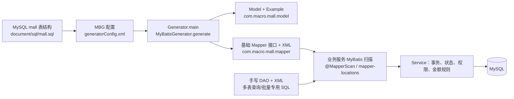

---
type: "concept"
tags: ["ecommerce", "mall-swarm", "mybatis", "mybatis-generator", "data-access", "ai-data-governance"]
summary: "mall-mbg 是以 mall.sql 为数据库事实来源、由 MyBatis Generator 生成基础 Model/Example/Mapper/XML 的共享数据访问模块；业务模块在其上叠加手写 DAO、事务与业务规则。"
sources:
  - "[[30-sources/repositories/mall-swarm/来源_mall-swarm_项目源码]]"
  - "mall-swarm/mall-mbg/src/main/resources/generatorConfig.xml"
  - "mall-swarm/document/sql/mall.sql"
  - "mall-swarm/mall-admin/src/main/java/com/macro/mall/config/MyBatisConfig.java"
  - "mall-swarm/mall-portal/src/main/java/com/macro/mall/portal/config/MyBatisConfig.java"
status: "evolving"
confidence: 0.92
created: "2026-07-13"
updated: "2026-07-13"
---

# 概念：mall-swarm mall-mbg 设计

## 定义与职责

`mall-mbg` 是根 Maven 聚合工程中的 JAR 模块，向业务服务提供 MyBatis Generator（MBG）生成的表行模型、按条件查询对象以及基础 CRUD Mapper。根 `pom.xml` 将其作为受统一版本管理的 `mall-mbg` 依赖；模块 POM 引入 `mybatis-generator-core`、MyBatis、PageHelper、Druid 和 MySQL 驱动。**证据**：`pom.xml` 的 `modules`、`dependencyManagement`；`mall-mbg/pom.xml` 的 `dependencies`。

它不包含独立启动类或业务 Service。其职责是把一张数据库表的列映射为一组稳定的基础产物：

- `com.macro.mall.model.<X>`：表行 Model；
- `com.macro.mall.model.<X>Example`：可组合条件、排序和 distinct 的查询条件对象；
- `com.macro.mall.mapper.<X>Mapper`：`count/delete/insert/select/update` 基础接口；
- `resources/com/macro/mall/mapper/<X>Mapper.xml`：接口对应 SQL、`ResultMap` 和 `Example_Where_Clause`。

例如 `OmsOrderMapper` 公开 `selectByExample`、`updateByExampleSelective` 等十个基础方法，XML 将其绑定到 `oms_order`。**证据**：`mall-mbg/src/main/java/com/macro/mall/mapper/OmsOrderMapper.java`；`mall-mbg/src/main/resources/com/macro/mall/mapper/OmsOrderMapper.xml` 的 `BaseResultMap`、`Example_Where_Clause`。

## 模块结构与生成来源

`Generator.main` 从 classpath 读取 `/generatorConfig.xml`，以 `DefaultShellCallback(overwrite=true)` 调用 `MyBatisGenerator.generate(null)`；因此执行生成会覆盖同名目标文件。**证据**：`mall-mbg/src/main/java/com/macro/mall/Generator.java` 的 `main`。

生成配置的关键事实如下：

| 配置项 | 已证实行为 | 证据 |
| --- | --- | --- |
| 数据源 | MySQL `mall` 库，连接参数来自 `generator.properties` | `mall-mbg/src/main/resources/generator.properties` 的 `jdbc.*` |
| 生成范围 | `<table tableName="%">`，即连接数据库当前 catalog 中可见的全部表 | `generatorConfig.xml` 的 `table` |
| Java Model | 输出到 `mall-mbg/src/main/java` 下的 `com.macro.mall.model` | `generatorConfig.xml` 的 `javaModelGenerator` |
| Mapper 接口/XML | `XMLMAPPER` 接口输出到 `.../mapper`，XML 输出到 resources 同包路径 | `generatorConfig.xml` 的 `javaClientGenerator`、`sqlMapGenerator` |
| 主键 | 每个表按 `id`、MySQL identity 配置生成 key 回填 | `generatorConfig.xml` 的 `generatedKey` |
| 模型附加能力 | `SerializablePlugin`、`ToStringPlugin`；字段可由自定义生成器补 `@Schema(title=表列备注)` | `generatorConfig.xml` plugins；`CommentGenerator.addFieldComment` |
| 覆盖风险 | `UnmergeableXmlMappersPlugin` 与 `overwrite=true` 均指向 XML/同名文件的覆盖式产出 | `generatorConfig.xml`；`Generator.main` |

本轮文件计数为 **152 个 Model（其中 76 个 `*Example`）+ 76 个 Mapper 接口 + 76 个 Mapper XML**，对应 SQL 中 76 条 `CREATE TABLE`。Model、Example、Mapper 均按同一表的驼峰类名成组生成；完整表清单见下一节。**证据**：`mall-mbg/src/main/java/com/macro/mall/model/`、`.../mapper/`、`src/main/resources/com/macro/mall/mapper/`；`document/sql/mall.sql` 的 `CREATE TABLE`。

## 领域表分组表

下表的域划分依据表名前缀及 SQL 表注释；每一项都生成同名 `Model + Example + Mapper + Mapper.xml`（例如 `PmsProduct` 组）。`pms_feight_template`、`pms_product_vertify_record` 的拼写按现有表/类名保留。

| 业务域（前缀） | 表（共 76 张） | 可确认内容与证据 |
| --- | --- | --- |
| 内容与社区 CMS（12） | `cms_help`、`cms_help_category`、`cms_member_report`、`cms_prefrence_area`、`cms_prefrence_area_product_relation`、`cms_subject`、`cms_subject_category`、`cms_subject_comment`、`cms_subject_product_relation`、`cms_topic`、`cms_topic_category`、`cms_topic_comment` | 帮助、专区、专题、话题、评论与举报；`document/sql/mall.sql` 对应建表注释 |
| 订单 OMS（8） | `oms_cart_item`、`oms_company_address`、`oms_order`、`oms_order_item`、`oms_order_operate_history`、`oms_order_return_apply`、`oms_order_return_reason`、`oms_order_setting` | 购物车、订单、订单项、操作/退货与订单设置；`mall.sql`；portal 下单链见 `OmsPortalOrderServiceImpl.generateOrder` |
| 商品 PMS（18） | `pms_album`、`pms_album_pic`、`pms_brand`、`pms_comment`、`pms_comment_replay`、`pms_feight_template`、`pms_member_price`、`pms_product`、`pms_product_attribute`、`pms_product_attribute_category`、`pms_product_attribute_value`、`pms_product_category`、`pms_product_category_attribute_relation`、`pms_product_full_reduction`、`pms_product_ladder`、`pms_product_operate_log`、`pms_product_vertify_record`、`pms_sku_stock` | 商品主数据、类目/属性、SKU、价格规则、审核与操作日志；`mall.sql` 各表注释 |
| 营销与首页 SMS（13） | `sms_coupon`、`sms_coupon_history`、`sms_coupon_product_category_relation`、`sms_coupon_product_relation`、`sms_flash_promotion`、`sms_flash_promotion_log`、`sms_flash_promotion_product_relation`、`sms_flash_promotion_session`、`sms_home_advertise`、`sms_home_brand`、`sms_home_new_product`、`sms_home_recommend_product`、`sms_home_recommend_subject` | 优惠券、限时购、首页广告/推荐；`mall.sql` 对应表注释 |
| 会员、后台权限与系统 UMS（25） | `ums_admin`、`ums_admin_login_log`、`ums_admin_permission_relation`、`ums_admin_role_relation`、`ums_growth_change_history`、`ums_integration_change_history`、`ums_integration_consume_setting`、`ums_member`、`ums_member_level`、`ums_member_login_log`、`ums_member_member_tag_relation`、`ums_member_product_category_relation`、`ums_member_receive_address`、`ums_member_rule_setting`、`ums_member_statistics_info`、`ums_member_tag`、`ums_member_task`、`ums_menu`、`ums_permission`、`ums_resource`、`ums_resource_category`、`ums_role`、`ums_role_menu_relation`、`ums_role_permission_relation`、`ums_role_resource_relation` | 管理员、会员、积分/成长、地址、标签、菜单、角色与资源授权；`mall.sql` 对应表注释 |

上述分组为 `12 + 8 + 18 + 13 + 25 = 76`，与生成目录的 Mapper/XML 数量及 `mall.sql` 中的 `CREATE TABLE` 数量一致。表前缀对应业务域是命名/表注释上的分类，不表示数据库设置了物理外键。

## 运行时依赖与核心调用链

admin 与 portal 都通过 `@MapperScan` 同时扫描 MBG 的 `com.macro.mall.mapper` 与各自手写 DAO 包；MyBatis mapper locations 同时加载 `classpath:dao/*.xml` 和 `classpath*:com/**/mapper/*.xml`。**证据**：`mall-admin/.../config/MyBatisConfig.java`、`mall-portal/.../config/MyBatisConfig.java`；两模块 `src/main/resources/application.yml` 的 `mybatis.mapper-locations`。

已读到的典型订单主线是：`OmsPortalOrderServiceImpl.generateOrder` 用 MBG Mapper 读取积分规则和订单设置、写入 `OmsOrderMapper.insert`，再借助手写 `PortalOrderItemDao.insertList` 批量插入订单项；库存更新通过手写 `PortalOrderDao.updateSkuStock` 完成。**证据**：`mall-portal/src/main/java/com/macro/mall/portal/service/impl/OmsPortalOrderServiceImpl.java` 的 `generateOrder`；`portal/dao/PortalOrderDao.java`、`PortalOrderItemDao.java`。该方法未标注 `@Transactional`，其事务边界是否由调用方/AOP 配置提供，**待验证**。

## 关键设计

1. **平面单表边界**：`defaultModelType="flat"` 使生成 Model 直接承载单表列，跨表结果不进入生成层，而由业务 DAO 返回 DTO/Domain；这解释了 `OmsOrderDao.getDetail`、`PortalOrderDao.getDetail` 的存在。**证据**：`generatorConfig.xml` 的 context 属性；两个 DAO 接口。
2. **条件对象与 SQL 模板分离**：Example 只表达条件树，Mapper XML 统一把它编译为 `WHERE`；生成层避免针对每个单表手写筛选 SQL，但复杂联表仍留给 DAO。**证据**：`OmsOrderExample`、`OmsOrderMapper.xml` 的 `Example_Where_Clause`。
3. **生成物可再生、业务语义外置**：Model 附加序列化、`toString` 与字段 Schema 注释，但状态机、权限、金额算法、事务编排不在生成器中，而在 Service。**证据**：`generatorConfig.xml` plugins、`CommentGenerator`；`OmsPortalOrderServiceImpl.generateOrder`。

## 生成代码与手写业务代码的职责边界

| 层次 | 责任 | 代表证据 |
| --- | --- | --- |
| 生成 Model/Example/Mapper/XML | 单表字段映射、按主键 CRUD、按 Example 条件 CRUD | `OmsOrderMapper.java`；`OmsOrderMapper.xml` |
| 手写 DAO/XML | 多表关联、业务投影、批量专用 SQL、库存/订单详情等非通用语句 | `mall-admin/.../dao/OmsOrderDao.java`：`getList/delivery/getDetail`；`mall-portal/.../dao/PortalOrderDao.java`：库存、超时订单、批量改状态 |
| 手写 Service | 组合 Mapper/DAO，控制状态迁移、金额计算、成员边界与后续副作用 | `OmsPortalOrderServiceImpl.generateOrder`；`mall-admin/.../service/impl/OmsOrderServiceImpl.cancelOrder/delete` |

不得把手写 SQL 放进 MBG 生成 Mapper XML：配置明确使用不可合并 XML 插件，重新生成有覆盖风险。业务扩展应放在业务模块的 `dao` 接口/XML 或独立 Mapper 包。**证据**：`generatorConfig.xml` 的 `UnmergeableXmlMappersPlugin`；admin/portal 的 DAO 扫描与 XML location 配置。

## Example、分页和批量更新：用法与风险

`Example.createCriteria()` 内条件是 AND；`example.or()` 会追加 OR 条件；`setOrderByClause` 与 `setDistinct` 直接影响生成 SQL。`Example_Where_Clause` 对 list 条件展开 `IN (...)`，`selectByExample` 将 `orderByClause` 以 `${orderByClause}` 拼入 SQL。**证据**：`mall-mbg/src/main/java/com/macro/mall/model/OmsOrderExample.java` 的 `createCriteria/or`；`OmsOrderMapper.xml` 的 `Example_Where_Clause`、`selectByExample`。

典型已实现用法包括：

- `PageHelper.startPage(pageNum,pageSize)` 后紧接 `selectByExample`，如商品后台列表、门户商品搜索、订单列表。**证据**：`mall-admin/.../PmsProductServiceImpl.list`；`mall-portal/.../PmsPortalProductServiceImpl.search`；`OmsPortalOrderServiceImpl.list`。
- `id in (...)` + `updateByExampleSelective` 做批量状态变更，如后台关闭/逻辑删除订单，或更新商品的 `delete_status`。**证据**：`mall-admin/.../OmsOrderServiceImpl.cancelOrder/delete`；`PmsProductServiceImpl.updateDeleteStatus`。
- `Example` 附加资源归属条件以避免跨会员修改，如购物车更新用 `delete_status + id + member_id`。**证据**：`mall-portal/.../OmsCartItemServiceImpl.updateQuantity`。

风险与约束：

1. `Example` 为空时 XML 的 `where` 为空，`updateByExample*`/`deleteByExample` 会作用于整表；调用前必须确保至少一个受控条件。这个风险由生成 XML 可直接推导，现有代码不能证明全局防护。
2. `orderByClause` 使用 `${}` 原样拼接；只能由服务端白名单枚举列/方向，不能接收请求原文。**证据**：`OmsOrderMapper.xml` 的 `order by ${orderByClause}`。
3. `IN` 集合过大可能触发 SQL 长度/参数限制并放大锁范围；需分批且用事务语义评估。生成器不提供自动分片。
4. PageHelper 是 offset 分页：深页可能因大 OFFSET 变慢；`Example` 也未提供列裁剪，`selectByExample` 使用全字段 `Base_Column_List`。高频大表场景应改手写投影/seek pagination（**二开建议**，非既有能力）。
5. `updateByExampleSelective` 仅更新非 null 字段，但不自动附加版本、租户、逻辑删除或权限条件；这些谓词由业务代码负责。

## 数据与状态约定

- **逻辑删除是局部约定，不是 MBG 全局机制**：`oms_order`、`oms_cart_item`、`pms_product` 有 `delete_status`；portal/admin 会显式设置/过滤，例如订单和购物车置 `1`，商品/订单查询要求 `0`。**证据**：`document/sql/mall.sql` 中三表定义；`OmsPortalOrderServiceImpl.delete/list`、`OmsCartItemServiceImpl.delete/list`、`PmsProductServiceImpl.list`。其他表是否统一软删，未证实。
- **审计字段不统一**：可见 `create_time`、`modify_time`（订单）、`create_date`、`modify_date`（购物车）等不同命名，未发现统一父类、自动填充器或数据库触发器。**证据**：`mall.sql` 的 `oms_order`、`oms_cart_item`；`mall-mbg` 仅平面 Model。 
- **未见乐观锁统一约定**：SQL 未检出 `version` 列，生成 Mapper 的更新条件也未自动带版本字段。**证据**：`document/sql/mall.sql`；`OmsOrderMapper.xml` 的 update/where 模板。
- **金额精度明确为 `decimal(10,2)`，Java 映射为 `BigDecimal`**：订单总额/应付额、订单项价格、商品价格等均如此；下单服务使用 `BigDecimal` 和 `RoundingMode.HALF_EVEN` 分摊积分。**证据**：`mall.sql` 的 `oms_order`、`oms_order_item`、`pms_product`；`OmsOrder.java`；`OmsPortalOrderServiceImpl.generateOrder`。
- **状态字段按表定义，非跨域统一枚举**：`oms_order.status` 定义 0 待付款至 5 无效，`pms_product` 有发布/审核/推荐等独立状态。**证据**：`mall.sql` 的两表字段注释；`OmsPortalOrderServiceImpl.generateOrder` 的状态初始化。

## AI 数据访问安全边界表

以下是基于现有表列的资料分级，服务端并未发现“AI 数据访问”实现；所有“可用于”均为**二开建议**，不代表项目现有 AI 能力。

| 数据源 | 可读用途（仅二开建议） | 绝不可进入模型上下文 / 必须脱敏字段 | 边界与证据 |
| --- | --- | --- | --- |
| `pms_product`、`pms_brand`、类目/属性/SKU、专辑 | 商品知识检索、运营文案辅助；只读、仅上架且未删除商品应由查询侧过滤 | 内部 `note`、库存、成本/促销策略、未上架/未审核内容需按权限过滤 | `pms_product` 的 `delete_status/publish_status/verify_status`、详情字段；`PmsPortalProductServiceImpl.search` 明确过滤删除状态 |
| CMS 专题/帮助/话题（`cms_*`） | FAQ、专题内容检索，需遵循 `show_status` | 评论/举报中的昵称、内容、图片 URL 可能含个人信息或不当内容，先审核/脱敏 | `cms_subject_comment`、`cms_topic_comment`、`cms_member_report` 的成员/内容字段；`mall.sql` |
| 首页与营销（`sms_*`） | 面向运营的券/活动配置分析，使用聚合数据 | `sms_coupon_history.member_id/order_sn`、限时购日志中的用户关联禁止外发；优惠规则不可被无权限用户读取 | `sms_coupon_history` 的会员/订单索引；`mall.sql` |
| 订单与订单项（`oms_order*`） | 仅在受控内网做聚合运营分析，如品类销量、履约时效 | 收件人姓名、电话、完整地址、邮编、发票抬头/内容、收票电话/邮箱、订单备注、订单号、会员 ID 均不得直接入提示词 | `oms_order` 字段定义；`mall.sql`；应改为按时间/品类聚合并最小化字段 |
| 购物车（`oms_cart_item`） | **默认不作为模型上下文**；若做推荐训练也需另行合法性评审 | `member_id`、昵称、商品偏好与未完成购买意图；属于高敏感行为数据 | `oms_cart_item` 的 `member_id/member_nickname/product_attr`；`mall.sql` |
| 会员与地址（`ums_member*`） | 默认禁止；仅允许经审批的去标识化聚合统计 | `password`（即使看似 bcrypt 也不得输出）、用户名、手机号、生日、城市、职业、签名、地址、登录日志、积分/成长明细 | `ums_member`、`ums_member_receive_address`、`ums_member_login_log`；`mall.sql` |
| 管理员与权限（`ums_admin*`、角色/资源） | 默认禁止模型上下文；可在受控工具中做 RBAC 判定但不把凭据/资源详情给模型 | 管理员 `password`、用户名、邮箱、登录日志、权限关系、资源 URL | `ums_admin`、`ums_admin_login_log`、`ums_role_*`、`ums_resource`；`mall.sql` |

通用二开安全规则：AI 服务不能直接持有 `mall` 库的全表读账号；应以面向任务的只读视图/API 提供白名单字段，执行行级权限、状态过滤、审计、限流和输出脱敏。项目现有代码未体现这些控制，故均为**二开建议**。

## 扩展点与安全再生成流程

安全流程（其中第 1–5 步由现有生成器行为推导，第 6–8 步为避免覆盖的二开工程建议）：

1. 在受控数据库实例执行并评审 schema migration；以 `document/sql/mall.sql` 和实际目标库差异为依据，勿仅改 Java Model。
2. 备份/提交当前生成目录变更，使用独立数据库或临时输出目录先生成并审阅 diff；连接信息当前在 `generator.properties`，其中含明文 root 凭据，禁止提交真实生产凭据。**证据**：`generator.properties`。
3. 运行 `com.macro.mall.Generator.main`，它读取 `generatorConfig.xml` 且全表匹配 `%`；不要把它当作“只更新一张表”的工具。**证据**：`Generator.main`、`generatorConfig.xml`。
4. 审核 Model 字段类型、`ResultMap`、`Base_Column_List`、主键回填和 Example 条件；金额字段必须仍为 `BigDecimal`。
5. 编译受影响业务模块，并针对受影响单表 CRUD、手写 DAO 联表 SQL、状态更新与分页做集成验证；运行时 Mapper 扫描同时覆盖生成 XML 与业务 DAO XML。**证据**：admin/portal 的 MyBatis 配置。
6. 不编辑生成 Mapper/XML 来承载手写 SQL；将扩展语句放到 `mall-admin`/`mall-portal` 等业务模块的 DAO + XML，遵循现有扫描路径。
7. 将生成前后差异作为 code review 内容；对删除列、改名列、精度/nullable 变化额外检查 Service/DTO/SQL。
8. 若确需只更新部分表，当前 checked-in 配置并无 `tableName` 白名单；需在独立分支临时改配置或引入专用生成配置，并在生成后恢复，避免误刷新所有 76 表（**二开建议**）。

## 风险与待验证项

- SQL 中未检出 `FOREIGN KEY`；`*_id` 与关系表的关联大多可由命名和手写 DAO 推断，但物理约束不存在/未导出，不能宣称数据库强制参照完整性。具体业务关系、级联策略和孤儿数据治理均为**待验证**。**证据**：`document/sql/mall.sql` 未见 `FOREIGN KEY`。
- `mall.sql` 是 2023-05-11 导出文件；生成时连接的本地 `mall` 实例是否与该脚本完全一致，**待验证**。**证据**：`mall.sql` 文件头日期；`generator.properties` 本地连接 URL。
- 下单涉及库存锁定、订单/订单项写入、优惠券与积分更新；虽然 Service 中有这些调用，但当前方法未见 `@Transactional`，整体原子性和消息失败补偿策略**待验证**。**证据**：`OmsPortalOrderServiceImpl.generateOrder`。
- 全局软删除、创建/更新人、数据权限、乐观锁、分页最大页大小、慢查询监控均未在 `mall-mbg` 生成配置或已查 SQL/调用处形成统一机制，**待验证**。
- 表级数据分级、用户授权、保留期限与删除权未见实现；上节 AI 访问边界是二开治理建议，**不是现有功能**。

## 相关链接

- [[20-projects/mall-swarm/architecture/主题_mall-swarm_架构全景_综述]]
- [[20-projects/mall-swarm/项目_mall-swarm]]
- [[10-domains/java/mybatis/概念_MyBatis_XML语句解析与MappedStatement构建]]
- [[10-domains/java/mybatis/概念_MyBatis_Mapper代理与MappedStatement]]
