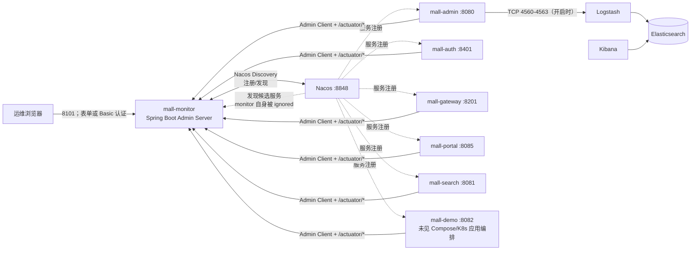
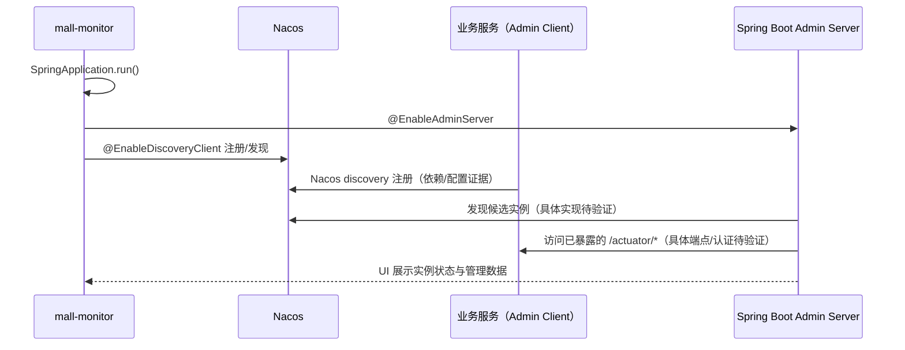

---
type: "concept"
tags: ["ecommerce", "mall-swarm", "mall-monitor", "spring-boot-admin", "actuator", "nacos", "observability", "security"]
summary: "mall-monitor 的 Spring Boot Admin Server、Nacos 发现、六个 Admin Client、Actuator 暴露、日志/ELK 链路与 AI 可观测性二开边界。"
sources:
  - "[[30-sources/repositories/mall-swarm/来源_mall-swarm_项目源码]]"
source_project: "/Users/yangyuguang/Documents/project_code/mall/mall-swarm"
status: "evidence-based"
confidence: 0.9
created: "2026-07-13"
updated: "2026-07-13"
---

# 概念：mall-swarm 的 mall-monitor 设计

## 结论边界

本文仅依据 `mall-monitor/**`、各业务服务的 POM/Actuator/Spring Boot Admin Client/日志配置，以及 `document/docker/**`、`document/k8s/**` 中的监控部署文件。`README` 未作为结论证据。Spring Boot Admin 与 Actuator 依赖会带来的框架默认端点、Nacos 中心配置内容、Logstash 实际 pipeline 和运行时注册结果，均不能由本仓库静态文件完全证明，统一标为“待验证”。

## 定义与职责

`mall-monitor` 是一个独立的 Servlet Web 服务，默认端口 `8101`。启动类同时启用 Spring Boot Admin Server 和 Nacos Discovery Client：前者提供 Admin Server，后者把自身接入 Nacos；`spring.boot.admin.discovery.ignored-services` 又排除自身，避免在 Admin UI 中把监控服务列为被监控实例。它不是采集器，也未定义业务自定义 Metric；其职责是汇聚其他服务暴露的 Actuator 管理面。

| 能力 | 已证实行为 | 证据 |
| --- | --- | --- |
| Server 启动 | `main()` 经 `SpringApplication.run` 启动；`@EnableAdminServer` 启用 Admin Server。 | `mall-monitor/src/main/java/com/macro/mall/MallMonitorApplication.java`：`main()`、`@EnableAdminServer` |
| Nacos 接入 | monitor 引入 Nacos discovery，启动类标注 `@EnableDiscoveryClient`；dev/prod 分别指向本机或 `nacos-registry:8848`。 | `mall-monitor/pom.xml`：Nacos dependency；`MallMonitorApplication.java`：注解；`resources/application-dev.yml`、`application-prod.yml`：`spring.cloud.nacos.discovery.server-addr` |
| 自身过滤 | Admin discovery 忽略 `${spring.application.name}`，即 `mall-monitor`。 | `mall-monitor/src/main/resources/application.yml`：`spring.boot.admin.discovery.ignored-services` |
| 认证入口 | 除静态资源、`/actuator/info`、`/actuator/health`、登录页和异步 dispatch 外，Server 请求需要认证；同时启用 form login 和 HTTP Basic。 | `mall-monitor/src/main/java/com/macro/mall/config/SecuritySecureConfig.java`：`filterChain()` |
| 凭据来源 | `InMemoryUserDetailsManager` 固定创建 `macro`/BCrypt(`123456`) 的 `USER`；`application.yml` 也声明相同明文 `spring.security.user`，但自定义 `userDetailsService` 与配置属性谁最终生效需启动验证。 | `SecuritySecureConfig.java`：`userDetailsService()`、`passwordEncoder()`；`application.yml`：`spring.security.user` |

## 模块结构

```text
mall-monitor
├── MallMonitorApplication.java       启动、Admin Server、Nacos Discovery
├── config/SecuritySecureConfig.java  Admin UI / API 的 Spring Security 策略
├── filter/CustomCsrfFilter.java      把 CSRF token 回写 XSRF-TOKEN cookie
├── resources/application*.yml        服务名、端口、profile、Nacos 地址、Admin discovery 忽略项
└── test/MallMonitorApplicationTests  Spring 上下文加载测试
```

根 `pom.xml` 将 `spring-boot-starter-actuator` 作为父工程依赖，`mall-monitor` 继承它；monitor 模块本身另声明 Web、Nacos discovery、Boot Admin Server、Security。Admin Server/Client 版本由根 POM 属性固定为 `3.5.6`。证据：`pom.xml`：`<dependencies>`、`spring-boot-admin.version` / `dependencyManagement`；`mall-monitor/pom.xml`：`<parent>` / `<dependencies>`。

## 运行时依赖与监控拓扑



实线表示源码、POM 或部署文件可直接佐证的依赖/配置；Admin Server 如何把 Nacos 实例转换为实例登记、每次探测的 HTTP 请求与鉴权头，依赖 Spring Boot Admin 依赖内部实现和运行时配置，**待验证**。

### Nacos、Gateway、Admin Server 的关系

- Nacos 是注册/发现边界：monitor 和六个带 Client 依赖的服务均引入 `spring-cloud-starter-alibaba-nacos-discovery`，各自 profile 设置 Nacos discovery 地址。证据：`mall-monitor/pom.xml`；`mall-{admin,auth,gateway,portal,search,demo}/pom.xml`；各模块 `src/main/resources/application-{dev,prod}.yml`：`spring.cloud.nacos.discovery`。
- Admin Server 是运维管理面：monitor 的 `@EnableAdminServer` 与 `spring.boot.admin.discovery.ignored-services` 是其唯一可见的 SBA Server 配置。仓库未找到 `spring.boot.admin.client.url`、client 用户名/密码或实例 metadata；Client 依赖与 Nacos 发现能证明“设计上接入”，不能替代实际注册成功的运行证据。证据：`mall-monitor/MallMonitorApplication.java`、`mall-monitor/resources/application.yml`；对各应用资源目录检索 `spring.boot.admin` / `admin.client` 的结果为空（除 monitor server 配置外）。
- Gateway 是北向流量入口而非 Admin Server：它同样是 Admin Client 和 Nacos 注册服务；本地配置的 Sa-Token 排除列表含 `/actuator/**`，所以经 Gateway 的该路径不受这份排除列表中的 Sa-Token 校验。是否存在其他网络层/服务层限制需要运行或完整安全配置验证。证据：`mall-gateway/pom.xml`：Admin Client/Nacos；`mall-gateway/src/main/resources/application.yml`：`sa-token.exclude-urls`、`management`。

## 核心调用链

### 1. 启动、发现与实例管理



### 2. Admin Server 的认证与 CSRF

1. 请求 `/assets/**`、`/actuator/info`、`/actuator/health`、`/login` 或 `ASYNC` dispatch 可匿名进入；其余请求进入认证链。
2. 表单登录成功后返回原请求或 Admin Server 根路径；HTTP Basic 同时开启。
3. CSRF token 使用可被 JavaScript 读取的 `XSRF-TOKEN` cookie，`CustomCsrfFilter` 会在 request attribute 含 `CsrfToken` 时写入 cookie。
4. Server 的 `/instances`、`/instances/*`、`/actuator/**` 被 CSRF 忽略；这降低机器/API 调用的 CSRF 阻力，但不等于放弃认证，因为 `anyRequest().authenticated()` 仍存在。

证据：`SecuritySecureConfig.java`：`filterChain()` 第 47–73 行；`CustomCsrfFilter.java`：`doFilterInternal()`。

## 数据与状态：客户端、Actuator 与监控维度

### 已声明的监控客户端

| 服务 | 服务名/端口 | Admin Client 证据 | Actuator 配置证据 |
| --- | --- | --- | --- |
| `mall-admin` | `mall-admin` / 8080 | `mall-admin/pom.xml`：`spring-boot-admin-starter-client` | `mall-admin/src/main/resources/application.yml`：`management.endpoints.web.exposure.include: '*'` |
| `mall-auth` | `mall-auth` / 8401 | `mall-auth/pom.xml`：同上 | `mall-auth/.../application.yml`：同上 |
| `mall-gateway` | `mall-gateway` / 8201 | `mall-gateway/pom.xml`：同上 | `mall-gateway/.../application.yml`：同上 |
| `mall-portal` | `mall-portal` / 8085 | `mall-portal/pom.xml`：同上 | `mall-portal/.../application.yml`：同上 |
| `mall-search` | `mall-search` / 8081 | `mall-search/pom.xml`：同上 | `mall-search/.../application.yml`：同上 |
| `mall-demo` | `mall-demo` / 8082 | `mall-demo/pom.xml`：同上 | `mall-demo/.../application.yml`：同上 |

六个服务均从根 POM 继承 `spring-boot-starter-actuator`。它们的本地配置还共同设定 `management.endpoint.health.show-details: always`、`management.endpoint.env.show-values: always`、`management.endpoint.configprops.show-values: always`，并把 `info.access` 设为 `read-only`。证据：根 `pom.xml`：Actuator dependency；上述六个 `application.yml`：`management`。

### 可以确认与不能确认的维度

| 维度 | 仓库能确认的程度 | 结论与证据 |
| --- | --- | --- |
| 健康状态 | **直接配置** | `health` 被 Web 暴露且总是显示细节。证据：各服务 `application.yml`：`management.endpoint.health.show-details`。实际 HealthContributor（MySQL/Redis/ES 等）由依赖和运行连接决定，待验证。 |
| 环境与配置 | **直接配置** | `env`、`configprops` 的值都要求显示，且所有 Web Actuator 端点暴露。证据：各服务 `application.yml`：`exposure.include`、`env.show-values`、`configprops.show-values`。 |
| JVM、线程、HTTP、日志 | **依赖可提供，静态清单未列出** | 根 POM 引入 Actuator，SBA Client/Server 也已引入；仓库没有逐个写出 endpoint ID、custom meter、HTTP histogram、线程阈值或 log level 策略。不能仅凭 `include: '*'` 列举最终启用端点及数据形状，需以运行时 `/actuator` discovery 和 SBA UI 验证。 |
| 业务指标 | **未发现定义** | 允许范围内未发现 `MeterRegistry`、`Counter`、`Timer`、`Observation` 或 Prometheus/Micrometer registry 配置；因此订单、支付、检索等业务 SLA 未被本轮证实。 |
| 监控服务自身 | **部分待验证** | monitor 继承 Actuator，但没有同类 `management.*` 暴露配置；Security 仅明确放行其 `/actuator/health` 和 `/actuator/info`。最终 monitor 的 Web exposure 遵从 Spring Boot 版本默认值，待启动验证。 |

### 敏感端点、访问控制与脱敏

业务服务的本地管理配置存在高风险组合：`include: '*'` 加 `env/configprops.show-values: always`，会使管理面包含敏感信息的可能性显著上升。仓库未提供面向业务服务 `/actuator/**` 的统一 Spring Security、IP allowlist、management 独立端口、角色授权或属性级脱敏配置证据；不能据此断言生产环境一定匿名可读，但也不能把它视为“已受保护”。

Admin Server 自身有认证，但凭据硬编码且公开可读；而 `/actuator/info`、`/actuator/health` 匿名可访问，`/instances*` 与 `/actuator/**` 免 CSRF。证据：`SecuritySecureConfig.java`：`filterChain()`、`userDetailsService()`；`mall-monitor/resources/application.yml`：`spring.security.user`。

## 关键设计：日志与异常关联

### ELK / Logstash 链路

共享 Logback 配置按 `logstash.enableInnerLog` 条件启用 TCP appender：DEBUG → `4560`、ERROR → `4561`、业务日志 → `4562`、`WebLogAspect` 访问记录 → `4563`；JSON 字段包含 project、level、service、pid、thread、class、message 和（前三类）`stack_trace`。`mall-admin` 本地设置 `logstash.host: localhost` 与 `enableInnerLog: true`；其他服务是否从 Nacos/环境取得该开关，在允许范围内未证实。

Docker 环境编排启动 Logstash（暴露 4560–4563）、Elasticsearch 和 Kibana；应用 Compose 将各容器 `/var/logs` 挂到主机，K8s 清单也把 `/var/logs` 挂为 hostPath。Logstash pipeline 由宿主机 `/Users/yangyuguang/Documents/project_code/mall/docker-data/logstash/logstash.conf` 挂载而来，文件不在本仓库，故无法证实 ES index、字段解析和保留策略。

证据：`mall-common/src/main/resources/logback-spring.xml`：`LOG_STASH_*` appender、条件、logger；`mall-admin/src/main/resources/application.yml`：`logstash`；`document/docker/docker-compose-env.yml`：`logstash` / `elasticsearch` / `kibana`；`document/docker/docker-compose-app.yml` 与 `document/k8s/mall-*-deployment.yaml`：`/var/logs`。

### 是否可把异常关联到请求或用户？

当前只能做到**有限的单服务请求关联**，不能证实跨服务链路或用户审计：

- `WebLogAspect` 对匹配 MVC Controller 的环绕调用记录 URL、HTTP method、`@RequestBody`/`@RequestParam`、耗时、OpenAPI summary 和完整返回结果；日志写入时也把 `url/method/parameter/spendTime/description` 作为 Logstash marker。证据：`mall-common/.../log/WebLogAspect.java`：`doAround()`、`getParameter()`。
- `WebLog` 虽有 `username`、`ip` 字段，但切面未调用 `setUsername()`；它以 `request.getRemoteUser()` 写 `ip`，并非 `getRemoteAddr()`。这既不能证明有效用户身份，也不能证明是客户端 IP。证据：`mall-common/.../domain/WebLog.java`：字段；`WebLogAspect.java`：第 71–88 行。
- 共享 JSON encoder 未定义 traceId、spanId、requestId、correlationId、userId、tenantId 或审计操作 ID；允许范围内也未检出 MDC 注入、Micrometer Tracing 或 OpenTelemetry 配置。因此无法跨 Gateway、下游服务和异常栈可靠关联同一请求，**待二开**。证据：`mall-common/resources/logback-spring.xml`：JSON pattern；对允许范围源码/日志配置检索 `MDC|trace|span|requestId|correlation` 无命中。
- 请求参数和返回对象未见脱敏规则；密码、token、手机号、地址、模型 prompt/response 等若进入被切面命中的 Controller，存在被记录的风险。这是代码路径的风险判断，不等同于断言生产日志已泄露数据。证据：`WebLogAspect.java`：`getParameter()`、`webLog.setResult(result)`。

## 现有指标 / AI 应补指标

下表右列全部是**二开建议，不是项目现有能力**。

| 现有可见性 | 现有证据与缺口 | AI 应补指标（最小可用） |
| --- | --- | --- |
| 存活/健康细节 | Actuator `health.show-details: always`；具体 contributor 待运行验证。 | `ai_model_dependency_up`、`ai_vector_store_up`、`ai_tool_dependency_up`，按 provider/model/index/tool 标识。 |
| JVM/线程/HTTP/日志管理面 | Actuator 依赖与 `include: '*'` 已证实；最终 endpoint/meter 集待运行验证。 | `ai_request_total`、`ai_request_duration_seconds`（p50/p95/p99）、`ai_inflight_requests`，按 capability/model/tenant（低基数）分组。 |
| 日志 | DEBUG/ERROR/业务/访问记录可按开关发往 Logstash；无 trace/user 审计关联。 | 每次 AI 调用写结构化 audit event：`request_id`、`trace_id`、actor、tenant、feature、model、prompt_policy_version、结果/错误码；正文使用摘要或脱敏引用。 |
| 业务成功与失败 | 未发现 Micrometer 自定义业务指标。 | `ai_model_call_total{outcome}`、`ai_tool_call_total{tool,outcome}`、`ai_retrieval_total{outcome}`；明确 timeout、rate_limit、validation、provider_error 等错误分类。 |
| 成本/Token | 未发现模型调用、Token 或成本记录。 | `ai_tokens_total{direction,model}`、`ai_cost_total{currency,model}`、`ai_budget_rejected_total`；金额以服务端计价快照计算，避免日志暴露账单明细。 |
| 检索质量 | 未见向量/RAG 指标。 | `ai_retrieval_hit_rate`、`ai_retrieval_result_count`、`ai_retrieval_top_score`、`ai_retrieval_no_result_total`、`ai_grounded_response_total`；离线再加人工标注的 answer acceptance。 |

## 扩展点

- **服务内观测适配层（二开建议）**：每个未来 AI 调用统一经过 adapter/interceptor，在请求边界生成 `request_id`/`trace_id`，采集模型、检索、工具的 Timer/Counter/错误分类；不要在 Controller AOP 中直接记录原始 prompt/response。
- **Admin Server 只做实例管理面（二开建议）**：将模型与检索指标通过 Micrometer/受控 Actuator endpoint 提供给受认证的运维系统；SBA UI 的适配和安全角色需实测其 3.5.6 API 后实现。
- **Gateway 传播上下文（二开建议）**：在 WebFlux filter 创建/透传 correlation ID，并要求 MVC/异步消费者继续传播；现有 Servlet `WebLogAspect` 不覆盖 Gateway reactive 链路。证据：`mall-gateway/pom.xml` 的 WebFlux Gateway 依赖、`mall-common/.../WebLogAspect.java` 的 `ServletRequestAttributes`。
- **审计数据面（二开建议）**：记录不可抵赖的 actor、授权决策、输入分类、数据来源、工具参数摘要、输出处置与保留策略；敏感正文采用字段级掩码、哈希或受控加密存储。

## 推荐的 AI 可观测性最小指标集（二开建议）

1. **可用性**：`ai_model_dependency_up`、`ai_vector_store_up`、`ai_tool_dependency_up`；5 分钟窗口告警。
2. **请求与成功率**：`ai_request_total{capability,outcome,error_type}`、`ai_model_call_total{model,outcome}`；SLO 使用成功率与超时率，而非只看 HTTP 200。
3. **延迟**：`ai_request_duration_seconds`、`ai_model_duration_seconds`、`ai_retrieval_duration_seconds`、`ai_tool_duration_seconds` 的直方图；保留 p50/p95/p99。
4. **Token 与成本**：`ai_tokens_total{model,direction}`、`ai_cost_total{model,currency}`、`ai_budget_rejected_total`；model/tenant 标签必须控制基数。
5. **检索**：`ai_retrieval_total{outcome}`、`ai_retrieval_result_count`、`ai_retrieval_top_score`、`ai_retrieval_no_result_total`、`ai_retrieval_hit_rate`。
6. **工具可靠性**：`ai_tool_call_total{tool,outcome,error_type}`、`ai_tool_duration_seconds`、`ai_tool_retry_total`；工具参数不进 metric label。
7. **审计与安全**：结构化 `ai_audit_event`（request/trace/actor/tenant/feature/model/policy/result/error），以及 `ai_prompt_redaction_total`、`ai_policy_denied_total`。审计正文按最小化原则保存。

## 运维与安全风险清单

| 风险 | 证据 | 影响 | 建议（均为二开/运维建议） |
| --- | --- | --- | --- |
| Admin 账号口令硬编码 | `SecuritySecureConfig.userDetailsService()`；monitor `application.yml` | 源码泄露即管理面凭据泄露，且 `USER` 无细粒度角色。 | 改从 Secret/外部 IdP 注入，轮换口令，按只读/操作角色授权。 |
| 业务 Actuator 过度暴露 | 六个业务服务 `management.endpoints.web.exposure.include: '*'` | `env/configprops`、heapdump/loggers 等端点的可访问面扩大；最终端点待运行验证。 | allowlist 必需端点，管理端口隔离，网络策略 + RBAC。 |
| 环境与配置值明文展示 | 六个服务 `env.show-values` / `configprops.show-values: always` | 可能暴露连接串、密钥、令牌等。 | 关闭 `always`，使用 sanitize key，避免把 Secret 放普通配置。 |
| Gateway 放行 Actuator 路径 | Gateway `sa-token.exclude-urls` 含 `/actuator/**` | 经 Gateway 的管理路径缺少这层 Sa-Token 校验；其他层待验证。 | 删除公开路径、按管理网段路由或独立管理入口。 |
| CSRF 豁免范围 | `SecuritySecureConfig.filterChain()` | 对 Server 的实例管理/API 端点需依赖认证而非 CSRF 防护。 | 最小化豁免，使用 service credential/mTLS，审计敏感操作。 |
| 日志中记录请求和完整返回 | `WebLogAspect.doAround()` / `getParameter()` | PII、密码、token 或 AI 内容可能进入日志。 | 字段注解/allowlist 脱敏；AI 正文只记录哈希/摘要。 |
| 无端到端追踪与用户审计 | Logback JSON 与源码检索未见 trace/MDC/user 注入 | 故障不能可靠关联 Gateway、服务、模型和工具调用。 | 引入 trace/correlation 传播及独立审计事件。 |
| Logstash pipeline 不在仓库 | Compose 挂载外部 `docker-data/logstash/logstash.conf` | 无法审计解析、索引、权限、TTL 和落库脱敏。 | 将 pipeline/IaC 纳入版本管理并做字段契约测试。 |
| K8s NodePort/hostPath | `mall-monitor-service.yaml`；各 deployment `hostPath` | NodePort 扩大暴露面，hostPath 使日志权限/生命周期依赖节点。 | Ingress + NetworkPolicy、受控日志采集、PVC/集中日志。 |

## AI 二开启示

项目当前没有模型、向量检索、RAG、Agent、Token 或成本观测的源码证据。上述 AI 指标、审计、追踪和安全策略均为**二开建议**，不得表述为 `mall-swarm` 的现有能力。优先级应是：先收缩 Actuator 与日志敏感面，再建立 trace/audit 基线，最后接入模型、检索与工具的指标；否则 AI 调用只会扩大当前不可关联、不可脱敏的日志风险。

## 风险与待验证项

- Nacos 中实际有哪些实例、SBA discovery 是否成功登记它们、client 是否需凭据：待以启动后的 Nacos/SBA 实例列表和 client 日志验证。
- `spring.security.user` 与自定义 `InMemoryUserDetailsManager` 的最终认证生效关系：待启动/登录测试验证。
- 各服务实际 `/actuator` endpoint 清单、health detail、metrics/JVM/线程/HTTP/loggers 的返回值与访问控制：待在隔离环境探测。
- Nacos 导入的远程 `mall-*-{dev,prod}.yaml` 可能覆盖本地管理/日志配置；本轮未读取 Nacos 内容，待验证。
- Logstash pipeline、Elasticsearch index template、Kibana 权限与日志保留策略不在仓库，待验证。
- `WebLogAspect` 传入的 Logstash marker 是否由当前 encoder 序列化为独立字段：配置未显式声明 marker provider，待集成日志验证。

## 相关链接

- [[20-projects/mall-swarm/architecture/概念_mall-swarm_Nacos配置与运行态验证]] — P1 配置加载、Nacos/Compose/K8s 运行态边界与只读验证命令。

- [[20-projects/mall-swarm/architecture/概念_mall-swarm_认证网关与部署安全]]：Monitor NodePort、Actuator 与管理面访问边界的 P0 汇总。
- [[20-projects/mall-swarm/architecture/主题_mall-swarm_架构全景_综述]]
- [[20-projects/mall-swarm/architecture/概念_mall-swarm_mall-common设计]]
- [[20-projects/mall-swarm/architecture/概念_mall-swarm_mall-mbg设计]]
- [[30-sources/repositories/mall-swarm/来源_mall-swarm_项目源码]]
- [[20-projects/mall-swarm/architecture/主题_mall-swarm_项目入口与模块地图]]
