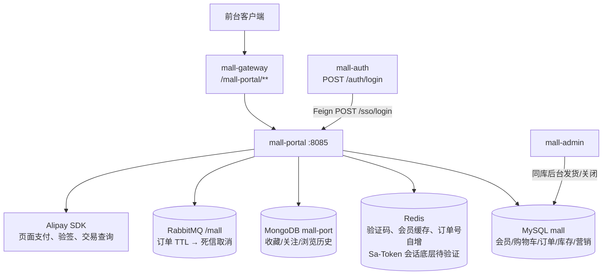
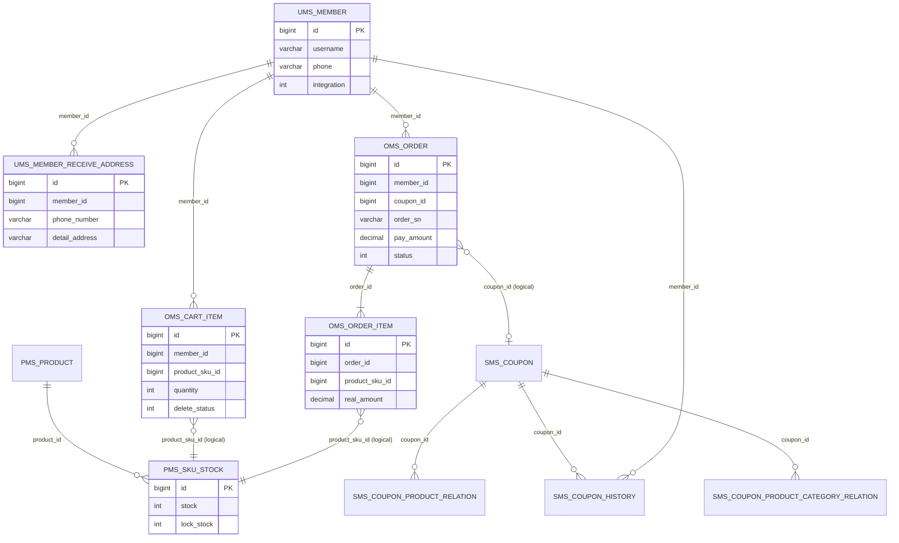
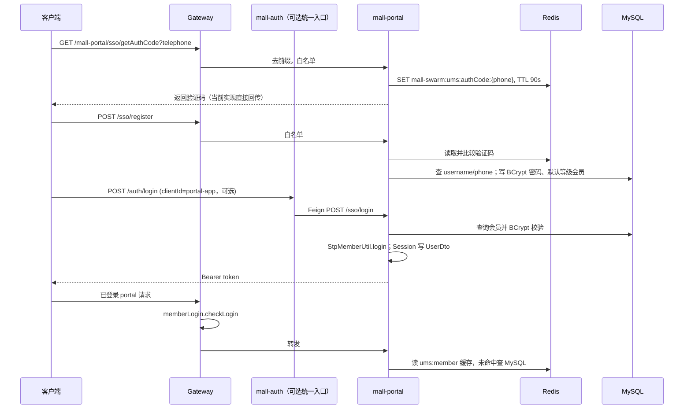
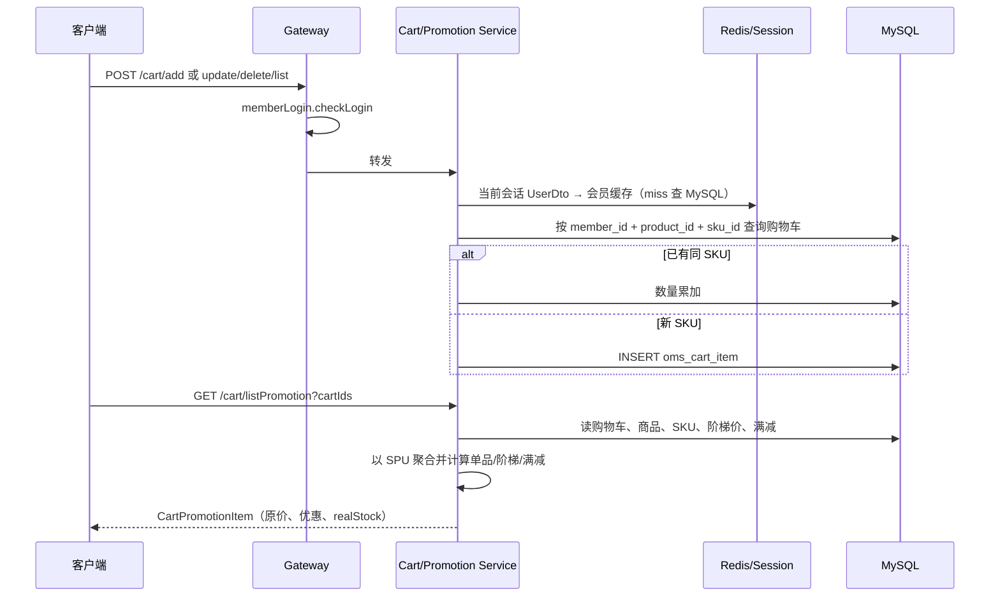
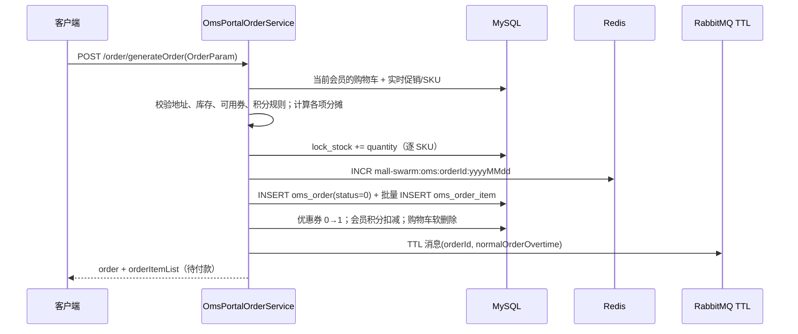
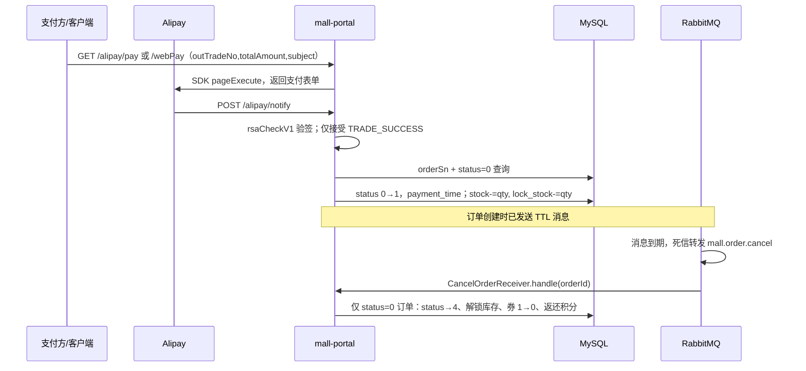

---
type: "concept"
tags: ["ecommerce", "mall-swarm", "mall-portal", "order", "payment", "rabbitmq"]
summary: "mall-portal 的源码功能地图：会员会话、购物车与促销定价、订单/库存/优惠券一致性、支付宝回调及 RabbitMQ 延迟取消。"
sources:
  - "[[30-sources/repositories/mall-swarm/来源_mall-swarm_项目源码]]"
  - "mall-portal/**"
  - "mall-common/**"
  - "mall-mbg/**"
  - "config/portal/**"
  - "document/sql/mall.sql"
  - "mall-auth/**"
  - "mall-admin/**"
  - "mall-gateway/**"
status: "evolving"
confidence: 0.93
created: "2026-07-13"
updated: "2026-07-13"
---

# 概念：mall-swarm 的 mall-portal 设计

## 结论与证据边界

`mall-portal` 是前台商城业务服务：它本地处理会员注册/登录、收货地址、购物车、优惠券、订单、库存锁定与支付宝对接；领域主数据主要落在同一个 MySQL `mall` 库，行为型的收藏/关注/浏览历史落 MongoDB，Redis 用于验证码、会员缓存与订单号序列，RabbitMQ 负责待付款订单的延迟取消。**项目并没有独立的库存、优惠或支付微服务**；这些动作在 `mall-portal` 的本地 Mapper/DAO 事务中完成。

证据：`mall-portal/src/main/java/com/macro/mall/portal/service/impl/OmsPortalOrderServiceImpl.java:33-67` 注入本地 Mapper/DAO；`mall-portal/src/main/resources/application.yml:11-40` 与 `config/portal/mall-portal-{dev,prod}.yaml` 配置 MySQL、MongoDB、Redis、RabbitMQ；`mall-portal/src/main/java/com/macro/mall/portal/service/OmsPortalOrderService.java:25-44` 标注下单、支付、取消的事务。

本文严格以可读源码、配置和 `document/sql/mall.sql` 为证据。支付生产参数（`appId`、密钥、回调公网地址）、实际多实例部署和消息确认/重试策略均为**待验证**；仓库配置中的 Alipay 参数是占位值、`notifyUrl` 为空，不能据此宣称真实生产支付已启用。

## 定义与职责

| 职责域 | 已实现职责 | 主要入口与证据 |
| --- | --- | --- |
| 会员与身份 | 注册、密码登录、短信式验证码生成/校验、Sa-Token JWT 会话、会员缓存 | `UmsMemberController`；`UmsMemberServiceImpl.register/login/getCurrentMember` |
| 地址与购物车 | 地址按当前会员隔离；购物车增删改查、SKU 变更、软删除 | `UmsMemberReceiveAddressServiceImpl`；`OmsCartItemServiceImpl` |
| 促销与结算 | 实时读取 SKU、阶梯价、满减；筛选可用券，按商品分摊活动/券/积分抵扣 | `OmsPromotionServiceImpl.calcCartPromotion`；`OmsPortalOrderServiceImpl.generateOrder` |
| 订单与库存 | 创建待付款订单及订单项，锁定库存，使用优惠券/积分，支付后扣真实库存，取消后释放锁库存 | `OmsPortalOrderServiceImpl`；`PortalOrderDao.xml` |
| 支付与异步取消 | 生成支付宝页面/手机网站支付请求；验签回调；RabbitMQ TTL 死信转发到取消消费者 | `AlipayServiceImpl`；`RabbitMqConfig`；`CancelOrderSender/Receiver` |
| 行为数据 | 商品收藏、品牌关注、浏览历史的 MongoDB Repository | `repository/*Repository.java` 与对应 Service 实现 |

## 模块结构与运行时依赖

Gateway 的 `/mall-portal/**` 路由会去掉前缀；除了登录、注册、验证码、首页/商品/品牌与 `/alipay/**`，其它 portal 前缀由 `StpMemberUtil.checkLogin()` 要求会员登录。证据：`mall-gateway/src/main/resources/application.yml:32-37,68-76`，`mall-gateway/src/main/java/com/macro/mall/config/SaTokenConfig.java:45-53`。`mall-auth` 的 `clientId=portal-app` 分支仅 Feign 转发到 portal 的 `/sso/login`，不是 token 签发者；证据：`mall-auth/.../AuthController.login`、`mall-auth/.../UmsMemberService`。

### 用户端领域模型图

图中的多数关联由服务查询而非数据库外键实现（SQL DDL 只声明主键，未声明这些 FK），故标为逻辑关联。订单在创建时把地址、商品名/图、SKU、单价及优惠结果复制到 `oms_order`/`oms_order_item`，随后地址或商品修改不应回写历史订单。证据：`document/sql/mall.sql:444-489,565-593,2833-2845,1660-1673`；`OmsPortalOrderServiceImpl.generateOrder:103-120,199-229`。

## 四条核心调用链

### 1. 会员注册、登录与身份获取

- 注册先校验 Redis 中验证码，再以 `username` 或 `phone` 查询重复，密码使用 `BCrypt.hashpw`，再写默认会员等级。证据：`UmsMemberServiceImpl.register:57-89`，`UmsMemberService.java:25-26`。
- 登录校验账号启用状态与 BCrypt 密码后，通过 `StpMemberUtil`（`TYPE=memberLogin`，`StpLogicJwtForSimple`）写 `UserDto` 到 Session；`getCurrentMember` 从该 Session 取 `id` 再查 Redis/MySQL。证据：`UmsMemberServiceImpl.login:132-158,getCurrentMember:105-118`，`StpMemberUtil.java:38-49`。
- 验证码接口把验证码直接包装为成功响应，且源码未见短信服务调用；这是已证实的敏感实现风险，不能对外当作真实短信验证。证据：`UmsMemberController.getAuthCode:76-82`，`UmsMemberServiceImpl.generateAuthCode:91-101`。

### 2. 购物车增删改查与价格计算

`oms_cart_item` 是会员维度的商品/SKU 快照，删除用 `delete_status=1` 软删除；添加只以 `memberId + productId + productSkuId + deleteStatus=0` 合并数量，不重新校验客户端提交的商品快照字段。证据：`OmsCartItemServiceImpl.add/getCartItem/delete/clear`，`document/sql/mall.sql:288-308`。

价格不信任购物车的 `price`：`listPromotion` 再从 `pms_sku_stock`、`pms_product_ladder`、`pms_product_full_reduction` 查询当前 SKU 原价与促销规则，生成 `CartPromotionItem`；单品促销用 `price - promotion_price`，阶梯价按 SPU 件数算折扣，满减按 SKU 原价占 SPU 总价比例分摊。证据：`PortalProductDao.xml.getPromotionProductList`，`OmsPromotionServiceImpl.calcCartPromotion:29-119`、`getCartItemAmount:226-237`。

### 3. 提交订单到库存、优惠、支付前状态落库

结算顺序是：重算促销→`hasStock` 校验可用库存→校验可用券→校验积分规则→计算 `realAmount`→锁库存→写订单/订单项→占券/扣积分/删购物车→发延迟取消。下单、支付成功、取消接口均在 `OmsPortalOrderService` 接口上标注 `@Transactional`，覆盖的是本服务的 MySQL 操作，**不覆盖 Redis 或 RabbitMQ 的原子提交**。证据：`OmsPortalOrderService.java:25-44`，`OmsPortalOrderServiceImpl.generateOrder:94-249`。

金额公式：订单应付=`totalAmount + freightAmount - promotionAmount - couponAmount - integrationAmount`；当前下单固定 `freightAmount=0`、`discountAmount=0`。订单项实付=`productPrice - promotionAmount - couponAmount - integrationAmount`，聚合时乘数量。证据：`OmsPortalOrderServiceImpl.handleRealAmount:511-519,calcPayAmount:541-548,calc*Amount:554-587`。

### 4. 支付回调与订单取消

支付宝回调仅在验签成功且 `trade_status=TRADE_SUCCESS` 时调用 `paySuccessByOrderSn(outTradeNo,1)`；后者查询条件包含 `orderSn + status=0 + deleteStatus=0`，因而重复的成功回调不会再次扣真实库存。证据：`AlipayServiceImpl.notify:68-94`，`OmsPortalOrderServiceImpl.paySuccessByOrderSn:423-434`，`paySuccess:253-264`，`PortalOrderDao.xml.updateSkuStock:50-68`。

延迟取消采用 TTL + 死信队列，而不是已注释的定时任务：发送时设置单条消息 `expiration`；TTL 队列指定死信 exchange/routing-key；到期后监听 `mall.order.cancel` 并调用 `cancelOrder`。`OrderTimeOutCancelTask` 的 `@Component` 被注释，不会被 Spring 注册。证据：`CancelOrderSender.sendMessage`，`RabbitMqConfig.orderTtlQueue`，`CancelOrderReceiver`，`OrderTimeOutCancelTask.java:13-28`。

## 数据与状态

### 订单状态机表

| 当前状态 | 含义 | 触发者/API 或消费者 | 目标状态 | 已有保护 | 证据 |
| --- | --- | --- | --- | --- | --- |
| 新建 | 尚未写库 | `/order/generateOrder` | `0` 待付款 | 下单内计算与本地事务；无请求幂等键 | `OmsPortalOrderServiceImpl.generateOrder:94-249` |
| `0` | 待付款 | `/alipay/notify` → `paySuccessByOrderSn`；或 `/order/paySuccess` | `1` 待发货 | 按订单号的回调入口限定 `status=0`；直接 `paySuccess(orderId)` 无此条件 | `AlipayServiceImpl.notify`；`OmsPortalOrderServiceImpl:253-264,423-434` |
| `0` | 待付款 | RabbitMQ `CancelOrderReceiver`；用户 `/order/cancelUserOrder`；`cancelTimeOutOrder`（若被调用） | `4` 已关闭 | `cancelOrder` 查询限定 `id + status=0 + deleteStatus=0`；批量超时 SQL 仅筛 `status=0` | `CancelOrderReceiver.handle`；`OmsPortalOrderServiceImpl:268-325` |
| `1` | 待发货 | 后台 `/order/update/delivery` | `2` 已发货 | SQL `WHERE id IN (...) AND status=1` | `mall-admin/.../OmsOrderDao.xml.delivery:36-64` |
| `2` | 已发货 | 前台 `/order/confirmReceiveOrder` | `3` 已完成 | 校验当前会员为订单归属且 `status==2` | `OmsPortalOrderServiceImpl.confirmReceiveOrder:337-350` |
| `3` / `4` | 已完成 / 已关闭 | 前台 `/order/deleteOrder` | `delete_status=1` | 校验归属，且只允许 3 或 4 | `OmsPortalOrderServiceImpl.deleteOrder:408-420` |
| 任意未删除状态 | 后台关闭 | 后台 `/order/update/close` | `4` 已关闭 | **无原状态限制**，且未见释放库存/退券/返积分 | `mall-admin/.../OmsOrderServiceImpl.close:61-78` |
| `5` | 无效订单 | DDL 定义 | 待验证 | 允许范围内未发现写入状态 5 的代码 | `document/sql/mall.sql:460` |

状态 0→1、0→4、1→2、2→3 的主线有明确条件，然而系统没有集中状态机或数据库乐观锁。特别是 `/order/paySuccess` 对 `orderId` 直接更新；`detail(orderId)` 也未校验订单归属。虽网关要求登录，仍应视为**已证实的越权/非法迁移风险**，需在二开前修复并做授权测试。证据：`OmsPortalOrderController.paySuccess/detail`，`OmsPortalOrderServiceImpl.paySuccess:253-264,detail:395-405`。

### 提交订单的一致性、幂等与补偿

| 维度 | 源码事实 | 风险或待验证 |
| --- | --- | --- |
| 价格 | 服务端实时读 SKU 和规则；订单项持久化价格与分摊，未直接采用购物车价格 | 促销读和库存锁之间没有版本/快照校验；并发改价边界待验证 |
| 库存 | `hasStock` 依据 `stock-lock_stock`；随后逐条 `selectByPrimaryKey` 后写 `lock_stock + quantity`；支付 SQL 扣 `stock` 同时减 `lock_stock` | 先读后写没有条件 `WHERE stock-lock_stock >= qty` 或版本列，存在并发超卖/丢失更新风险 |
| 幂等 | Redis 每日 `INCR` 只保证订单号递增；回调按 `orderSn,status=0` 抑制重复成功回调 | 下单没有幂等 token、唯一约束或请求去重；重复提交会创建多笔订单并多次锁库存 |
| MySQL 事务 | `generateOrder/paySuccess/cancelOrder/cancelTimeOutOrder` 有 `@Transactional` | RabbitMQ 投递和 Redis `INCR` 不参与该事务；未见 outbox、事务消息或投递确认，DB 成功但消息失败将不会自动取消订单 |
| 取消补偿 | 未付款取消把订单置 4、释放 `lock_stock`、优惠券回 0、返还 `useIntegration` | 释放库存 SQL 无 `lock_stock >= qty` 条件；后台关闭不走同一补偿；补偿重试/死信失败处理待验证 |

## 数据存储职责表

| 组件 | 已证实职责 | 关键证据 | 不应误判为 |
| --- | --- | --- | --- |
| MySQL | 会员、地址、购物车、订单/订单项、SKU 库存、优惠券/历史、积分与促销规则的权威数据；订单与库存状态变更 | `document/sql/mall.sql` 上述表；`OmsPortalOrderServiceImpl` | 独立订单/库存服务之间的分布式数据层 |
| Redis | `ums:authCode:{telephone}`（90s）、`ums:member:{id}`（24h）、`oms:orderId:{date}` 原子自增 | `UmsMemberCacheServiceImpl`；`application.yml:59-67`；`generateOrderSn` | 订单状态或库存的真源；源码未见其承载这些数据 |
| MongoDB | 品牌关注、商品收藏、浏览历史 Repository 的文档存储 | `MemberBrandAttentionRepository`、`MemberProductCollectionRepository`、`MemberReadHistoryRepository` | 订单、支付或聊天记录存储；允许范围内未见 |
| RabbitMQ | `mall.order.cancel.ttl` 的单条 TTL 消息到期后死信转发至 `mall.order.cancel`，触发未付款取消 | `QueueEnum`、`RabbitMqConfig`、`CancelOrderSender/Receiver` | 通知、库存扣减或支付成功的通用事件总线；未见这些生产/消费实现 |
| Alipay | 支付表单生成、`notify` RSA2 验签、交易查询；成功后推进订单支付状态 | `AlipayClientConfig`、`AlipayServiceImpl` | 支付金额的服务端再核验：`pay/webPay` 接收的 `AliPayParam.totalAmount` 未与 `oms_order.pay_amount` 比对，属于风险 |

## 关键设计与扩展点

- **双入口登录**：客户端可直达 `/sso/login`，也可经 `mall-auth /auth/login?clientId=portal-app` Feign 转发；token仍由 portal 签发。证据：`UmsMemberController.login`、`mall-auth/.../AuthController.login`。
- **优惠策略为代码分支**：促销类型 1（单品）、3（阶梯）、4（满减）写死在 `OmsPromotionServiceImpl`。二开新策略应在此服务与查询 DTO/SQL 同步扩展，而不是让 LLM 或前端直接改金额。
- **可用券是实时计算**：`UmsMemberCouponServiceImpl.listCart` 依据时间、门槛、分类/商品关系过滤，`generateOrder` 再从该结果查选券；优惠券历史是会员领取/使用状态，不是支付流水。证据：`UmsMemberCouponServiceImpl.listCart`、`OmsPortalOrderServiceImpl.getUseCoupon/updateCouponStatus`。
- **订单号**：日期 + `sourceType` + `payType` + Redis 递增值；不是用户请求幂等号。证据：`OmsPortalOrderServiceImpl.generateOrderSn:436-454`。
- **异步扩展**：已有的可复用模式只有订单 TTL 取消。若增加通知、售后或库存事件，应补充消息唯一 ID、发布确认、消费者幂等键、失败重试/死信与 DB outbox；这是**二开建议**，不是现有能力。

## AI 二开启示

### 不得直接提供给 LLM 的数据

默认不得把以下原始字段送入模型上下文、第三方推理 API、向量库或日志：会员密码哈希、Authorization/JWT/Session、验证码、手机号、姓名、详细收货地址/邮编、订单号与商品明细的可关联组合、支付金额/支付时间/支付宝交易号、发票抬头/邮箱/电话、Alipay 私钥与公钥配置。字段证据：`document/sql/mall.sql:444-489,2712-2735,2833-2845`，`AlipayConfig`，`application.yml:88-110`。

`oms_order_item.product_attr` 与 `pms_sku_stock.sp_data` 也可能含用户偏好或可关联属性；会员收藏/浏览历史在 MongoDB 中可构成行为画像。对话系统最多使用最小化、脱敏、短期授权的数据投影，不应直接查询表或 Repository。

### AI 客服工具权限矩阵

下表是基于现有只读 API/服务边界的**二开建议**，并非项目已实现 AI 工具。

| 业务工具（建议封装） | 基于的现有只读能力 | 允许范围 | 返回给模型 | 写操作与确认要求 |
| --- | --- | --- | --- |
| `查询本人订单摘要` | `/order/list`、`OmsPortalOrderService.list` | token 中当前会员，仅返回本人 | 脱敏订单号、状态、金额区间、时间、商品概述 | 只读；不得让模型传任意 memberId/orderId |
| `查询本人订单详情` | `/order/detail/{id}`，但现有实现缺归属校验 | 必须新增服务端 `memberId` 校验后才开放 | 收货信息必须掩码；不返回电话/完整地址/发票信息 | 只读；现状禁止直接暴露给 Agent |
| `查询购物车与促销预览` | `/cart/listPromotion`、`generateConfirmOrder` | 当前会话会员 | 商品、库存可用性、优惠说明与重算金额 | 只读；结算结论必须以提交订单时服务端重算为准 |
| `查询优惠券资格` | `UmsMemberCouponService.listCart` | 当前会员 | 券名称、门槛、可用/不可用原因；不返回券码 | 只读；不可代领/核销 |
| `查询支付状态` | `AlipayService.query` + 订单按归属校验 | 当前会员且订单号归属已验证 | 订单状态，不返回支付宝流水标识 | 查询应限频、审计；禁止模型自行调用支付 |
| `取消待付款订单` | `cancelOrder` | 当前会员、订单状态 0 | 仅展示影响（释放库存、退券/积分） | 必须向用户展示订单摘要并取得一次明确确认；服务端再校验归属/状态/幂等 |
| `确认收货` | `confirmReceiveOrder` | 当前会员、状态 2 | 仅展示订单摘要 | 必须一次明确确认；现有服务已有归属与状态校验，仍需 AI 调用审计 |
| `修改地址/购物车/下单/支付` | 地址、购物车、`generateOrder`、`/alipay/*` | 不建议 Agent 直写 | 无 | 地址和购物车至少显式确认；下单需服务端重算+幂等键+二次确认；支付必须由用户在受控支付页主动完成 |

AI 客服可做解释、查单、规则检索和售后材料预填；不能伪装为支付回调、不能接触密钥、不能绕过 Gateway/会员授权。售后申请虽有 `OmsPortalOrderReturnApplyController`，本轮未沿其 Service/表单深读，故其自动化范围为**待验证**。

## 风险与待验证项

### P0 复核增量：事务、并发、支付与消息（2026-07-13）

**纠正历史表述：** `OmsPortalOrderService` 的 `generateOrder`、`paySuccess`、`cancelTimeOutOrder`、`cancelOrder`、`paySuccessByOrderSn` 均在**接口**上声明 `@Transactional`，`MyBatisConfig` 启用事务管理；Controller 与 `CancelOrderReceiver` 都经注入的接口 Bean 调用，静态调用路径可进入 Spring 代理。因此不能再描述为“该方法未见事务”。事务的代码事实等级为 **B**（运行测试因 MySQL 未连接而未验证）；它仅覆盖本地数据库，不把 Redis `INCR` 和 `AmqpTemplate` 发送变成原子操作。

复核后仍为 P0 的源码风险：库存锁定为读→写、无条件库存扣减/乐观锁/下单幂等键；支付发起直接采纳客户端金额和订单号，回调仅验签/交易状态、未比对金额或商户归属；支付和取消均先查状态 0 再非条件更新；延迟消费者未见 retry/DLQ 配置；前台详情与取消没有当前会员归属校验；后台关闭未走库存/券/积分补偿。完整的正常、异常和并发路径、证据等级、测试缺口与 AI 工具闸门见 [[20-projects/mall-swarm/architecture/概念_mall-swarm_订单支付一致性]]。

1. **并发库存**：`lockStock` 是读后写，缺少条件扣减/乐观锁；需并发压测验证超卖和锁库存负数。证据：`OmsPortalOrderServiceImpl.lockStock:727-733`。
2. **支付金额与订单归属**：支付宝发起请求直接使用传入 `AliPayParam.totalAmount`；未见服务端按 `outTradeNo` 重取订单并比对金额/归属。`/order/paySuccess`、`/order/detail/{id}` 缺归属检查。证据：`AlipayServiceImpl.pay/webPay`，`OmsPortalOrderController`，`OmsPortalOrderServiceImpl`。
3. **事务外消息**：下单事务内直接投 RabbitMQ，未见 publisher confirm/outbox；需故障注入验证 DB 成功但消息投递失败、MQ 重复投递的处理。
4. **后台关闭绕过补偿**：`mall-admin` 的 `close` 直接更新任意未删除订单为 4，不限原状态且不释放库存/回滚券积分；业务规则是否允许需验证。证据：`mall-admin/.../OmsOrderServiceImpl.close:61-78`。
5. **定时兜底未启用**：`OrderTimeOutCancelTask` 非 Bean；TTL 消息异常时没有已启用的扫描补偿。实际 RabbitMQ broker 配置、消息持久化/ACK、重试和死信告警待验证。
6. **支付配置**：仓库 dev/prod 都指向 Alipay sandbox 且密钥为占位、`notifyUrl` 为空；生产 Nacos 是否覆盖这些值待验证。
7. **状态审计**：前台支付/取消/确认收货没有写 `oms_order_operate_history`；后台发货/关闭会写。完整审计需求待验证。

## 相关链接

- [[20-projects/mall-swarm/architecture/主题_mall-swarm_架构全景_综述]]：全服务、Gateway 与部署边界；本页补全前台订单事实链。
- [[20-projects/mall-swarm/architecture/概念_mall-swarm_mall-auth设计]]：统一登录入口分流与 token 责任边界。
- [[20-projects/mall-swarm/architecture/概念_mall-swarm_mall-gateway设计]]：portal 路由、白名单和会员登录校验位置。
- [[20-projects/mall-swarm/architecture/概念_mall-swarm_mall-mbg设计]]：MyBatis Generator 生成的模型/Mapper 以及表结构取证边界。
- [[20-projects/mall-swarm/architecture/概念_mall-swarm_mall-common设计]]：`CommonResult`、`RedisService`、`UserDto` 等跨模块契约。
