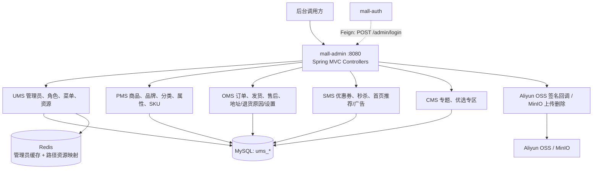
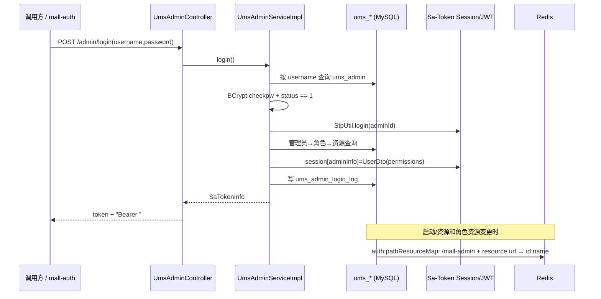
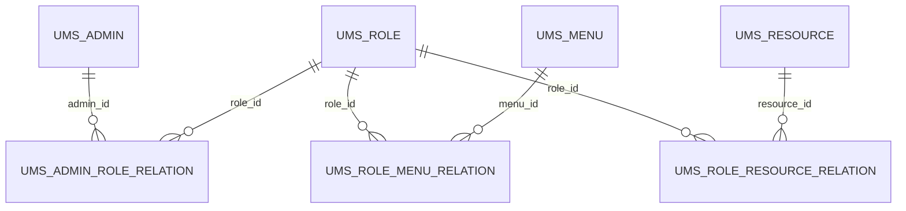
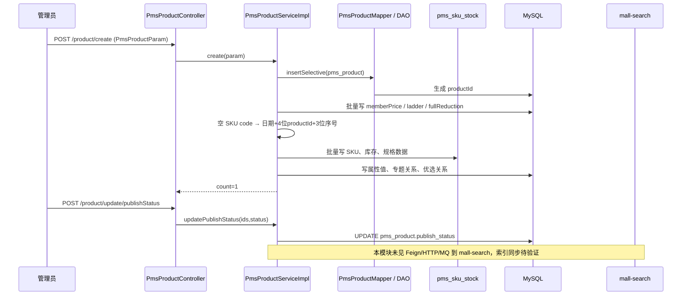
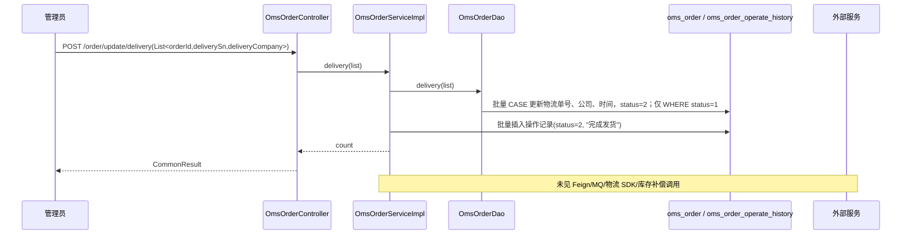

# 概念：mall-swarm mall-admin 设计

## 定义与职责

`mall-admin` 是 `mall-swarm` 的后台管理服务：Spring Boot 入口注册 Nacos、开启 OpenFeign，并由 `server.port=8080` 对外提供 MVC Controller。它直接使用 `mall-mbg` 的生成 Mapper/Model，以及本模块手写 DAO XML 管理 MySQL 中的后台权限、商品、订单和营销内容数据。证据：`mall-admin/src/main/java/com/macro/mall/MallAdminApplication.java` 的 `@EnableDiscoveryClient`、`@EnableFeignClients`；`mall-admin/src/main/resources/application.yml` 的 `server.port`、MyBatis mapper 路径；`mall-admin/pom.xml` 的 `mall-mbg` 依赖。

本页只以源码、配置、SQL 和构建文件为据；README 不作为业务能力证据。下表是 Controller 可直接证明的功能地图，而非产品宣传清单。

## 后台功能模块图

| 业务域 | 已证实的 Controller/API 族 | 数据/实现锚点 |
| --- | --- | --- |
| 管理员与权限 | `/admin`、`/role`、`/menu`、`/resource`、`/resourceCategory` | `UmsAdminController`、`UmsRoleController`、`UmsResourceController`；`ums_admin`、`ums_role`、`ums_menu`、`ums_resource` 及关系表定义在 `document/sql/mall.sql` |
| 商品主数据 | `/product`、`/brand`、`/productCategory`、`/productAttribute`、`/productAttribute/category` | 各 `Pms*Controller`；`PmsProductServiceImpl`、`PmsProductDao.xml` |
| SKU 与库存 | `/sku/{pid}`、`/sku/update/{pid}` | `PmsSkuStockController`、`PmsSkuStockServiceImpl`、`PmsSkuStockDao.xml` 的 `pms_sku_stock` 写入 |
| 订单、售后与基础设置 | `/order`、`/returnApply`、`/returnReason`、`/companyAddress`、`/orderSetting` | `OmsOrderController`、`OmsOrderServiceImpl`、`OmsOrderReturnApplyServiceImpl` |
| 营销 | `/coupon`、`/couponHistory`、`/flash`、`/flashSession`、`/flashProductRelation`、`/home/*` | `SmsCouponController`、`SmsFlashPromotion*Controller`、首页品牌/新品/推荐商品/专题/广告 Controller |
| 内容 | `/subject`、`/prefrenceArea` | `CmsSubjectController`、`CmsPrefrenceAreaController`；商品保存时写专题/优选关系 |
| 文件 | `/aliyun/oss/policy`、`/aliyun/oss/callback`、`/minio/upload`、`/minio/delete` | `OssController`、`OssServiceImpl`、`MinioController` |

`UmsMemberLevelController` 还提供只读 `/memberLevel/list`。上述“覆盖”仅指后台 API 存在；例如支付、搜索索引、履约消息不因目录出现而推定已在 admin 实现。

## 模块结构与运行时依赖

- `controller/`：36 个后台 API Controller 的 HTTP 入口（以 `rg --files mall-admin/.../controller` 和各类 `@RequestMapping` 为证）。
- `service/impl/`：业务编排；生成 Mapper 与手写 DAO 都在这里注入。`PmsProductServiceImpl` 与 `OmsOrderServiceImpl` 是本轮两条写链的主入口。
- `dao/*.xml`：复合查询、批量插入或条件更新，例如 `PmsProductDao.xml#getUpdateInfo`、`OmsOrderDao.xml#delivery`。
- `mall-mbg`：生成的 `*Mapper`、`*Example`、`model`，承担单表 CRUD；扫描配置见 `mall-admin/src/main/resources/application.yml#mybatis.mapper-locations`。
- MySQL：`application.yml` 和 `config/admin/mall-admin-{dev,prod}.yaml` 都给出 datasource；SQL 表定义见 `document/sql/mall.sql`。
- Redis：`UmsAdminCacheServiceImpl` 缓存管理员；`UmsResourceServiceImpl#initPathResourceMap` 写入资源路径散列。键前缀由 `application.yml#redis.*` 配置。
- 会话：Sa-Token 使用 `StpLogicJwtForSimple`（`SaTokenConfigure#getStpLogicJwt`），配置为 Header `Authorization`、前缀 `Bearer`、有效期 604800 秒（`application.yml#sa-token`）。
- 对象存储：构建同时依赖 Aliyun OSS 与 MinIO（`mall-admin/pom.xml`）；开发/生产环境均配置 endpoint、bucket 和访问凭据（`config/admin/mall-admin-*.yaml`）。
- 远程边界：本模块启用了 OpenFeign，但其源码树未声明 `@FeignClient`；反向可证实的是 `mall-auth/.../UmsAdminService` 以 `@FeignClient("mall-admin")` 调用 `POST /admin/login`。因此本轮三条 admin 写链均未见 admin 发起的跨服务调用。

## 核心调用链一：权限登录与资源校验

### RBAC 模型

管理员、角色、菜单、资源是两组多对多关系：

- **身份认证**：`UmsAdminServiceImpl#login` 按用户名找 `UmsAdmin`，使用 `BCrypt.checkpw` 验密码并要求 `status == 1`；之后 `StpUtil.login(adminId)`，把 `UserDto(id, username, clientId=admin-app, permissionList)` 放入 Sa-Token session。`permissionList` 是资源的 `id:name`，由 `getResourceList` 取出。登录日志写 `ums_admin_login_log`。证据：该类的 `login`、`insertLoginLog`；`mall-common/.../AuthConstant.java`。
- **授权数据**：`UmsAdminRoleRelationDao.xml#getResourceList` 经 `ums_admin_role_relation → ums_role → ums_role_resource_relation → ums_resource` 查询去重资源；`UmsRoleDao.xml#getMenuList` 经角色菜单关系生成菜单。`/admin/info` 返回 menus 和角色名，故菜单是前端导航数据，资源是路径权限数据。证据：两个 DAO SQL 与 `UmsAdminController#getAdminInfo`。
- **配置与失效**：资源的创建/修改/删除会调用 `UmsResourceServiceImpl#initPathResourceMap`；角色资源重新分配和删除角色也会刷新。该方法以 `"/" + spring.application.name + resource.url` 为 key、`resource.id + ":" + resource.name` 为 value，重建 Redis hash `auth:pathResourceMap`。证据：`UmsResourceServiceImpl#initPathResourceMap`、`UmsRoleServiceImpl#allocResource/delete`、`AuthConstant#PATH_RESOURCE_MAP`。
- **管理员缓存**：`getCurrentAdmin` 先从 Redis（`mall-swarm:ums:admin:{id}`）取管理员，再回源；更新、删人、改密码、退出会删该缓存。证据：`UmsAdminCacheServiceImpl`、`UmsAdminServiceImpl#getCurrentAdmin/update/delete/updatePassword/logout`。
- **待验证：请求资源校验的执行者**。本模块能生成 token、session 权限列表和 Redis 路径映射，但在允许读取的 `mall-admin/**`、`mall-common/**` 内未见 Servlet Filter、Interceptor 或 `@SaCheckPermission` 将请求路径与 `auth:pathResourceMap` 比较。因此不能仅凭这些数据断言“admin 进程内已逐路径拦截”；实际网关/认证链应在后续按范围读取后验证。

## 核心调用链二：SPU、SKU 与库存

## 数据与状态

- SPU 使用 `pms_product`；商品服务的请求 DTO `PmsProductParam` 继承 `PmsProduct`，并携带阶梯价、满减、会员价、SKU、属性值、专题关系和优选关系的列表。证据：`PmsProductParam`；`document/sql/mall.sql` 的 `pms_product` 定义。
- `create` 先插 SPU，再以 `productId` 批量写入 `pms_member_price`、`pms_product_ladder`、`pms_product_full_reduction`、`pms_sku_stock`、`pms_product_attribute_value`、`cms_subject_product_relation`、`cms_prefrence_area_product_relation`。证据：`PmsProductServiceImpl#create`、`relateAndInsertList`。
- SKU 未给 `skuCode` 时由 `handleSkuStockCode` 生成“日期 + 四位商品 id + 三位列表索引”；SKU 表写入 `price/stock/low_stock/pic/sale/sp_data`。证据：`PmsProductServiceImpl#handleSkuStockCode`；`PmsSkuStockDao.xml#insertList`；`document/sql/mall.sql` 的 `pms_sku_stock`。
- 商品编辑会先更新 SPU，再删除并重建价格、属性、专题/优选关系；SKU 则按传入 id 分为新增、删除和逐条更新。证据：`PmsProductServiceImpl#update/handleUpdateSkuStockList`。编辑详情由 `PmsProductDao.xml#getUpdateInfo` 联表读取。
- 独立库存接口 `POST /sku/update/{pid}` 调用 `PmsSkuStockDao.xml#replaceList`，以 MySQL `REPLACE INTO` 覆盖传入的 SKU 行；实现没有使用路径变量 `pid` 过滤或回填 `productId`。证据：`PmsSkuStockController#update`、`PmsSkuStockServiceImpl#update`、`PmsSkuStockDao.xml#replaceList`。
- 上下架是 `POST /product/update/publishStatus`，仅批量更新 `pms_product.publish_status`；审核、推荐、新品、软删除分别更新 `verify_status/recommand_status/new_status/delete_status`，审核额外写 `pms_product_vertify_record`。证据：`PmsProductController` 对应 API；`PmsProductServiceImpl#update*Status`。

### 搜索同步结论

**未在本轮允许范围内发现同步实现。** `MallAdminApplication` 虽启用 Feign，但 `mall-admin/src/main/java` 没有 `@FeignClient`；`PmsProductServiceImpl` 没有 HTTP、Feign、MQ 或 Elasticsearch 调用，`updatePublishStatus` 仅调用 Mapper。因此“创建/上架必然同步搜索索引”不能成立，属于**待验证**的跨模块一致性风险，需在允许读取 `mall-search` 的索引写入口或消息消费者后继续追踪。

## 关键设计

- 商品多表创建、更新、订单发货写历史均未标注 `@Transactional`（`PmsProductServiceImpl`、`OmsOrderServiceImpl`）。任一后续写失败时能否整体回滚依赖未在本轮读到的事务配置，故为待验证的一致性风险。
- `replaceList` 的“替换”语义与 `pid` 未参与约束，属于库存写操作需高优先级加校验/确认的证据化风险。
- 审核记录的 `vertifyMan` 固定为 `"test"`，未从当前会话取真实管理员。证据：`PmsProductServiceImpl#updateVerifyStatus`。

## 核心调用链三：订单批量发货（选择的订单管理链路）

| 后台操作 | 实际状态/数据变更 | 证据 |
| --- | --- | --- |
| 查询详情 | 联查订单、订单项、操作历史 | `OmsOrderDao.xml#getDetail`；`OmsOrderController#detail` |
| 批量发货 | `oms_order.status` 仅从 1 更新为 2；写 `delivery_sn`、`delivery_company`、`delivery_time`；随后写历史状态 2 | `OmsOrderDao.xml#delivery`；`OmsOrderServiceImpl#delivery` |
| 批量关闭 | 对未软删的指定订单设 `status=4`，并对所有传入 id 写历史状态 4 | `OmsOrderServiceImpl#close` |
| 批量删除 | 仅将 `delete_status=1`（软删） | `OmsOrderServiceImpl#delete` |
| 修改收货人/费用/备注 | 更新订单字段并插入操作历史，历史 status 来自请求参数 | `OmsOrderServiceImpl#updateReceiverInfo/updateMoneyInfo/updateNote` |
| 退货申请 | 1 确认退货（金额、退货地址、处理信息）；2 完成退货（收货信息）；3 拒绝；仅状态 3 可删除 | `OmsOrderReturnApplyServiceImpl#updateStatus/delete` |

订单 SQL 直接限制发货只处理当前状态为 1；但本轮不以数字名词推断“1=待发货、2=已发货、4=已关闭”，因为 `oms_order.status` 的字段注释/完整状态机尚需逐段复核。`delivery` 在订单更新 count 为 0 时仍为输入 list 生成操作历史，且没有 `@Transactional`；这是操作历史与订单状态可能不一致的待验证风险。后台订单实现未见对支付、物流供应商、库存、搜索或消息服务的发起调用。

## OSS / MinIO：上传、访问控制与元数据

- **Aliyun OSS 直传签名**：`GET /aliyun/oss/policy` 根据日期构造 `mall/images/yyyyMMdd` 前缀，签名有效期由 `aliyun.oss.policy.expire`（配置为 300 秒）决定，policy 限制大小 `0..maxSize MB` 及 object key 必须以该前缀开始；回调返回 filename、size、mimeType、width、height。证据：`OssServiceImpl#policy/callback`；`config/admin/mall-admin-dev.yaml#aliyun.oss`。代码生成的上传 host 和回调 URL 均使用 `http://`。
- **MinIO 服务端代理上传**：`POST /minio/upload` 直接接收 multipart；bucket 不存在时创建，并设置 bucket policy 为 `Principal:"*"`、`Action:"s3:GetObject"`，即对象读取对所有主体开放；对象名仅为 `yyyyMMdd + "/" + 原始文件名`，成功返回拼接 URL。证据：`MinioController#upload/createBucketPolicyConfigDto`。
- **删除**：`POST /minio/delete?objectName=...` 直接将调用方给出的 objectName 传给 `removeObject`。证据：`MinioController#delete`。
- **文件元数据边界**：本轮未发现上传/回调向 MySQL 写入独立文件元数据表；OSS 回调只是组织并返回参数，MinIO 也只返回 name/url。因此文件与商品图片等业务字段的绑定、对象所有者、引用计数、孤儿文件清理均为**待验证**，不能误称“项目已有文件资产管理”。

## API 风险清单与 AI 管理助手工具白名单草案

风险按“对订单履约、库存/价格、权限、文件公开面和个人数据的不可逆或外部影响”划分；它是基于当前 API 实现的治理建议，不是项目既有 AI 功能。

| 等级 | API（示例，按族归类） | 原因 | AI 工具策略 |
| --- | --- | --- |
| 低 | `GET /product/list`、`/product/updateInfo/{id}`、`/sku/{pid}`、`/order/list`、`/order/{id}`、`/returnApply/list`/`{id}`、`/coupon/list`/`{id}`、`/flash/list`/`{id}`、`/subject/list`、`/brand/list`、`/productCategory/list/*`、`/menu/treeList`、`/role/list*`、`/resource/list*` | 查询或编辑前取数；订单详情含收货人/电话，属于个人数据 | **白名单：只读工具**；执行身份权限过滤、字段脱敏、页大小/时间范围限制；订单/售后数据默认不送入外部模型 |
| 中 | `/minio/upload`、`/aliyun/oss/policy`、商品草稿 `POST /product/create/update`、营销草稿创建/编辑、首页推荐排序 | 产生文件或业务草稿；尚未直接履约，但可能公开内容或积累垃圾文件 | **仅生成预览/草稿；人工确认必需**。上传限制 MIME、病毒扫描、随机对象键、私有 bucket；创建/编辑展示差异和影响范围 |
| 高 | `/sku/update/{pid}`、`/product/update/publishStatus`、`/product/update/verifyStatus`、`/product/update/deleteStatus`、`/order/update/delivery`、`/order/update/close`、订单收货人/费用修改、`/returnApply/update/status/{id}`、管理员/角色/资源/菜单的 create/update/delete/alloc*、`/admin/role/update`、`/admin/updatePassword`、`/minio/delete` | 可改变库存、上架可见性、审核、履约、金额/个人地址、售后、权限或删除对象 | **不进入自动执行白名单；每次人工确认必需**，显示目标 ID、前后差异、行数、操作者、理由；高危操作还需二次授权、幂等键和审计事件 |

建议的 AI 工具白名单以“**读取事实 → 生成建议 → 人工批准 → 受控执行**”为主：

1. `searchProducts`、`getProductEditInfo`、`getSkuStocks`：只读商品与库存分析；库存数、价格、供应信息按岗位最小化。
2. `searchOrders`、`getOrderDetail`、`searchReturnApplications`：只读售后/订单核对；工具响应默认掩码手机号、地址与会员标识，模型侧不保留原文。
3. `listPromotions`、`listCouponHistory`、`listCategories/Brands/Subjects`：运营诊断和文案建议，不写库。
4. `previewProductChange`、`previewPromotionChange`：二开建议的“差异预览”工具，只生成结构化 patch，不调用现有 POST API。
5. `requestConfirmedWrite`：二开建议的受控写闸门；必须携带当前管理员、资源权限、请求快照、目标 ID、diff、确认令牌、审批人和审计 ID。库存、订单、权限、对象删除必须人工确认，禁止模型凭自然语言直接调用。

## 扩展点与 AI 二开启示

- **现有扩展点**：Controller → Service → Mapper/DAO 的边界清晰；`PmsProductParam` 聚合商品子表；`UmsResourceServiceImpl#initPathResourceMap` 是资源规则刷新点；`OmsOrderOperateHistory` 是订单后台变更的现有记录载体。它们不是 AI 接口，但适合二开在服务边界增加策略与审计。
- **二开建议：数据范围**。AI 工具的授权不可只沿用“模型拿到 token 即可”；每个读取工具应再按 `UserDto.permissionList` 和资源/租户（当前 SQL 未见租户字段，故为待设计项）裁剪。订单读取要脱敏，权限/凭据、完整地址、登录 IP 禁止进入外部模型上下文。
- **二开建议：审批与确认**。将“建议”持久化为不可执行的变更计划；提交时重新读取版本/状态，展示 diff，再由具备对应 RBAC 资源的人工批准。针对 `REPLACE` 库存、批量上下架、发货/关闭、角色资源分配和 MinIO 删除，使用双确认与批量阈值。
- **二开建议：审计与可追溯**。新增独立 AI 操作审计表或事件流（非复用 `operateMan="后台管理员"` 这种固定字符串），记录模型版本、提示/脱敏摘要、工具输入输出摘要、确认人、执行人、相关订单/商品 ID、结果与回滚链接。不要把未实现的审计机制写成当前能力。
- **二开建议：一致性**。商品写入后以 outbox/可靠事件驱动搜索索引同步，并给出可重试和对账；订单与历史写入加入事务/幂等。当前项目未见这些实现，属于建议。

## 风险与待验证项

1. 路径资源映射确实被写入 Redis，但请求时的实际匹配/拒绝代码不在本轮允许读取范围内，需验证网关或认证服务的消费者。
2. `mall-admin` 无本地 Feign client 代码，商品状态和订单操作未见调用搜索、库存、物流、支付、消息服务；跨服务最终一致性均待验证。
3. `PmsProductServiceImpl`、`OmsOrderServiceImpl` 未见 `@Transactional`；多表商品保存与订单/历史写入的原子性待验证。
4. `PmsSkuStockServiceImpl#update` 忽略 URL `pid`，且使用 `REPLACE INTO`；需补产品归属、并发版本、库存变更原因与低库存规则校验。
5. MinIO 首次建桶会公开对象读取；对象名含原始文件名，且无本地持久元数据、MIME 白名单、病毒扫描或所有权检查。OSS/MinIO 凭据目前可在配置看到示例值，生产密钥注入与轮换机制待验证。
6. `application.yml` 暴露全部 Actuator endpoint 且显示 env/configprops 的值；结合文件存储和 datasource 配置，生产暴露面与脱敏策略需验证并收紧。
7. 订单 status 数字含义、关闭是否应限制当前状态、退货完成是否触发退款/库存处理，均需在 portal/支付/消息代码范围内继续证明。

## 相关链接

- [[overview/ecommerce/mall-swarm/主题_mall-swarm_架构全景_综述]]
- [[concepts/ecommerce/mall-swarm/概念_mall-swarm_mall-mbg设计]]
- [[concepts/ecommerce/mall-swarm/概念_mall-swarm_mall-common设计]]
- [[sources/ecommerce/mall-swarm/来源_mall-swarm_项目源码]]
