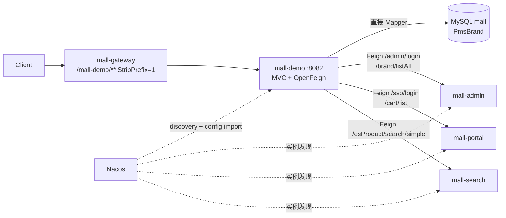
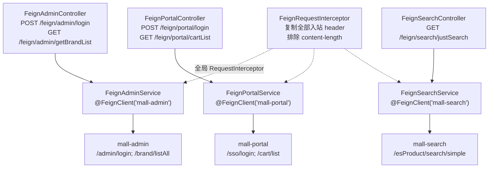
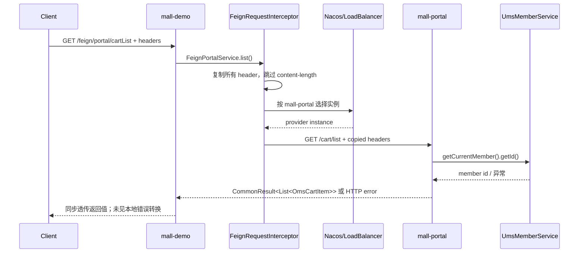

# 概念：mall-swarm mall-demo 设计

## 结论与证据边界

**`mall-demo` 是一个可运行的教学/远程调用验证服务，不应视为生产业务模块。**它有独立 Spring Boot 入口、`8082` 端口、Nacos 注册/配置导入和 Gateway 路由；同时保留直接访问 `PmsBrandMapper` 的品牌 CRUD，并在三个 `Feign*Controller` 中把外部请求同步转发给 admin、portal、search。它不在受控 Docker Compose、Kubernetes 清单或启动脚本中，且模块只含一个空的 Spring Context 测试；在允许范围内未见领域专属表、生产业务编排、部署资产或调用治理实现。

**证据**：`mall-demo/pom.xml`；`mall-demo/src/main/java/com/macro/mall/MallDemoApplication.java#main`；`mall-demo/src/main/resources/application.yml#server.port`；`DemoController`、`FeignAdminController`、`FeignPortalController`、`FeignSearchController`；`document/docker/docker-compose-app.yml`、`document/k8s/`、`document/sh/` 对 `mall-demo` 的文件检索；`mall-demo/src/test/java/com/macro/mall/MallDemoApplicationTests.java`。

本文只依据所列源码、配置和构建/部署文件。Nacos 运行时配置能覆盖本地配置，但受控镜像 `config/demo/mall-demo-{dev,prod}.yaml` 未配置 Feign 超时、重试、降级或错误解码；Nacos 服务端是否另行设置这些项为**待验证**。

## 定义与职责

| 能力 | 源码事实 | 判断 |
| --- | --- | --- |
| 可运行服务 | `MallDemoApplication` 标注 `@SpringBootApplication`、`@EnableDiscoveryClient`、`@EnableFeignClients`；`application.yml` 配置 `mall-demo:8082`。 | 是可独立启动的服务。 |
| 本地教学 CRUD | `DemoController` → `DemoServiceImpl` → `PmsBrandMapper`，直接连 `mall` MySQL。 | 传统 MVC/MyBatis 示例。 |
| 远程调用验证 | 三个 Feign Client 与三个代理 Controller 覆盖登录、品牌、购物车、简单搜索。 | OpenFeign 契约/透传示例。 |
| 生产业务承载 | 未发现业务专属模型、任务、消息、容器编排、健康检查专项或有意义测试。 | 无源码证据；不应承担生产关键路径。 |

## 模块结构与运行时依赖

- 构建：`mall-demo/pom.xml` 依赖 `mall-mbg`、`spring-boot-starter-web`、OpenFeign、Nacos discovery/config、Boot Admin Client；根 `pom.xml#modules` 将它纳入 Maven 聚合。
- 数据：`application.yml#spring.datasource` 和 `MyBatisConfig#@MapperScan` 指向共享的 `mall` 数据库与 `com.macro.mall.mapper`；`DemoServiceImpl` 直接调用 `PmsBrandMapper`。
- 注册/配置：`application-dev.yml` 导入 `nacos:mall-demo-dev.yaml` 并连 `localhost:8848`；prod 对应 `nacos-registry:8848` 与 `mall-demo-prod.yaml`。受控配置镜像只配置数据源、日志/Logstash。证据：两个 profile 文件与 `config/demo/mall-demo-*.yaml`。
- 北向路由：Gateway 的 `id: mall-demo` 以 `lb://mall-demo` 路由 `/mall-demo/**`，`StripPrefix=1`。证据：`mall-gateway/src/main/resources/application.yml#spring.cloud.gateway.routes`。

## Feign 调用关系图

## 服务调用契约表

| 调用方入口 → 服务名 | Feign 方法/下游 HTTP 契约 | 提供方实现 | DTO 与返回 | 证据 |
| --- | --- | --- | --- | --- |
| `POST /feign/admin/login` → `mall-admin` | `FeignAdminService#login`：`POST /admin/login`，JSON body | `UmsAdminController#login`：`@Validated @RequestBody UmsAdminLoginParam`，成功返回 token/tokenHead | demo 自有 `demo.dto.UmsAdminLoginParam`；字段与 admin DTO 都是 `username/password`，但 demo DTO **没有** `@NotEmpty`；原样返回 raw `CommonResult` | `FeignAdminService#login`；两个 `UmsAdminLoginParam`；`UmsAdminController#login` |
| `GET /feign/admin/getBrandList` → `mall-admin` | `FeignAdminService#getList`：`GET /brand/listAll` | `PmsBrandController#getList` | 共享 `CommonResult`；内部 `PmsBrand` 由 `mall-mbg` 提供 | `FeignAdminService#getList`；`PmsBrandController#getList` |
| `POST /feign/portal/login` → `mall-portal` | `FeignPortalService#login`：`POST /sso/login?username=&password=` | `UmsMemberController#login` | 标量 query 参数；返回 raw `CommonResult`（成功含 member token/tokenHead） | `FeignPortalService#login`；`UmsMemberController#login` |
| `GET /feign/portal/cartList` → `mall-portal` | `FeignPortalService#list`：`GET /cart/list` | `OmsCartItemController#list`，内部调用 `getCurrentMember()` | 共享 `CommonResult`；成功数据为 `List<OmsCartItem>`，demo 未声明泛型 | `FeignPortalService#list`；`OmsCartItemController#list` |
| `GET /feign/search/justSearch` → `mall-search` | `FeignSearchService#search`：`GET /esProduct/search/simple?keyword=&pageNum=0&pageSize=5` | `EsProductController#search` | 共享 `CommonResult`；成功数据为 `CommonPage<EsProduct>`，demo 未声明泛型 | `FeignSearchService#search`；`EsProductController#search` |

### 契约共享与兼容性

- **共享的只有通用包装及部分模型**：三组接口都导入 `mall-common` 的 `CommonResult`；本地 CRUD 与 admin 的品牌列表都使用 `mall-mbg` 的 `PmsBrand`。证据：三个 `Feign*Service`、`DemoController`、两个模块 POM。
- **登录请求没有共享 DTO**：demo 与 admin 各自定义同名、相同 JSON 字段的 `UmsAdminLoginParam`，也没有公共 API 模块或显式版本号。字段新增/重命名、校验规则变化、响应 `data` 结构变化都只能在运行时暴露，缺少编译期契约保护。证据：上述两个 DTO 与 Feign 注解。
- **二开建议**：将服务间 API 放入版本化的 contract 模块（稳定 request/response DTO、错误码与 OpenAPI/契约测试），避免直接暴露 MyBatis Model 和 raw `CommonResult`；兼容演进使用可选字段、明确 API version、弃用窗口与消费者契约测试。这不是现有能力。

## 核心调用链与时序

以购物车代理为例：入站请求由 demo Controller 接收，Feign 拦截器从 Servlet `RequestContextHolder` 取得当前请求，将每个 header（仅排除 `content-length`）加到下游模板；服务名由 `@FeignClient("mall-portal")` 交给 discovery/load-balancer 解析；portal 的 `OmsCartItemController#list` 从当前 Sa-Token 会员上下文取 ID 后查询，`CommonResult` 被同步返回给调用方。

**证据**：`FeignPortalController#cartList`、`FeignPortalService#list`、`FeignRequestInterceptor#apply`、`OmsCartItemController#list`。Nacos 到具体实例的负载均衡选择是 OpenFeign/Nacos 依赖组合的运行时行为；本项目没有选择策略配置，实例选择细节为**待验证**。

## 关键设计、认证与可观测性

1. **认证 Header 有“全量复制”实现，但不是安全的身份委托协议。**拦截器可把 `Authorization` 一并带到 portal 的购物车调用，因此在请求线程内，已有会员 token 有机会被下游识别；admin/portal 登录本身则不依赖已有 token。拦截器不限制 header allowlist，也不校验受信调用者，可能把 Cookie、内部头、租户头或错误的客户端声明扩散到下游。证据：`FeignRequestInterceptor#apply`；`OmsCartItemController#list`；`UmsMemberController#login`。
2. **TraceId 没有项目级证据。**允许范围内未检出 TraceId/MDC/B3/W3C `traceparent` 创建、日志 pattern 注入或 tracing starter；拦截器虽会“被动复制”客户端自带的任何追踪 header，但不会生成、校验或把它写进日志。`FeignConfig#feignLoggerLevel` 设为 `FULL`，会记录请求/响应细节，生产敏感信息风险反而更高。证据：`FeignConfig#feignLoggerLevel,#requestInterceptor`；`FeignRequestInterceptor#apply`；`mall-common/src/main/resources/logback-spring.xml`。
3. **异常信息不保证正确的业务包装。**`Feign*Controller` 仅 return 下游调用结果；没有 `ErrorDecoder`、`@ControllerAdvice` 对 `FeignException` 的处理、fallback 或异常映射。`mall-common` 的 `GlobalExceptionHandler` 仅处理 `ApiException`、参数绑定/校验异常，不处理 Feign 失败；非 2xx、连接失败和解码失败预计上抛至默认框架处理，实际 HTTP 状态/body 为**待验证**。证据：三个 Feign Controller；`FeignConfig`；`mall-common/.../GlobalExceptionHandler.java`。

## 超时、重试、不可用与循环调用

| 关注点 | 已证实行为 | 风险 / 待验证 |
| --- | --- | --- |
| 超时 | 受控 `mall-demo` 本地/Nacos 镜像均未设置 `spring.cloud.openfeign.*` 的 connect/read timeout。 | 使用 Spring Cloud/OpenFeign 依赖版本默认值；有效值可能被 Nacos 运行时覆盖，**待验证**。 |
| 重试 | 未检出 `Retryer` Bean、Feign retry 属性或 resilience 配置。 | 不可断言“绝不重试”，但项目没有显式重试治理；POST 登录重试的幂等性也未被定义。 |
| 服务不可用/降级 | 未检出 `fallback`、`FallbackFactory`、Sentinel、Resilience4j、circuit breaker。 | 失败会同步向上冒泡，调用方无法得到受控的降级 `CommonResult`；实际异常表现待集成测试。 |
| 异常处理 | 只有 `CommonResult` 的正常反序列化；Controller 不捕获 Feign 异常。 | 下游 4xx/5xx 与网络异常的映射不稳定，且缺少重试次数、目标服务、耗时的结构化记录。 |
| 循环调用 | demo 仅向 admin/portal/search 单向发起 Feign；在允许的三组提供方 API 中未见回调 `mall-demo` 的 Feign Client。 | 当前六条契约未构成源码可见环；扩展时仍应禁止同步环，**待以依赖图/集成测试持续校验**。 |

## 数据与状态

- demo 自己的品牌 CRUD 读写共享 MySQL `pms_brand`（实际表名由 `PmsBrandMapper`/MBG 映射决定，本页不把 POM 当作 SQL 证据）；分页由 `DemoServiceImpl#listBrand` 的 `PageHelper.startPage` 触发。
- 远程代理本身不持久化下游响应、token 或用户状态；状态归属仍在 admin/portal/search。`/cart/list` 的会员身份依赖转发的认证 header 与下游 Sa-Token 会话。
- `application.yml#management.endpoints.web.exposure.include='*'`，且 health/env/configprops 均开放细节/值显示；作为示例服务可以观察配置，但如果被部署到可达网络会暴露敏感运行信息。实际网关白名单与网络边界请参见 [[concepts/ecommerce/mall-swarm/概念_mall-swarm_mall-gateway设计]]。

## 扩展点

- 新增调用：新增带服务名、HTTP method、path、显式 request/response DTO 的 Feign interface，再由一个薄 Controller 或应用服务调用；不要让 Controller 直接成为跨域编排中心。
- Header：现有 `FeignRequestInterceptor` 是唯一横切点；二开应替换为 allowlist（如 `traceparent`、已验证的 delegation token、幂等键）并剥离 Cookie、`Host`、转发头和客户端伪造的 `X-User-*`。
- 可观测性：在调用前生成/续传 trace context，记录 service、operation、status、latency、retry count、circuit state，严禁记录密码、完整 `Authorization`、Cookie 与 Feign FULL body。

## 面向 AI 编排服务的调用规范建议（非项目现有能力）

`mall-demo` 可作为“服务发现 + 明确 HTTP 契约 + 受控 header 传播”的**教学起点**，不可直接作为 AI 工具调用模板。建议如下：

| 规范 | 应继承 | 必须避免 / 补齐 |
| --- | --- | --- |
| 服务定位 | 通过服务名而非硬编码 IP 调用；把每个下游操作建成显式接口。 | AI 编排服务不得复用 demo 的全量 header 拷贝。 |
| 契约 | 每个工具明确 method、path、参数和返回包装。 | 建立 `v1` 契约 DTO、schema/契约测试、错误码和弃用规则；不使用 raw `CommonResult`/MyBatis Model 作为 Agent 工具 schema。 |
| 身份 | 对用户请求保留可验证的委托关系。 | 使用短期、audience 绑定、最小 scope 的 delegation token；系统任务使用独立 service account。模型不能获得 admin/会员原始 Token。 |
| 可靠性 | 把调用边界集中化，便于统计。 | 按操作设置 connect/read/overall deadline；只对幂等读取做有限重试；配置熔断、bulkhead、fallback，并把写操作设计为 idempotency-key + 人工确认。 |
| 观测与审计 | 调用入口可插入统一拦截。 | 采用 W3C trace context，审计 `agentRunId`、actor、delegator、tool、scope、resource、审批与结果；日志脱敏且默认不启用 FULL body。 |
| 拓扑 | 当前调用没有可见同步环。 | 维护调用图并在 CI 检查禁止环；跨多个业务写操作用 Saga/异步命令，不以链式同步 Feign 编排事务。 |

## 风险与待验证项

1. 启动带 Nacos、MySQL、admin/portal/search 的集成环境，分别验证成功、4xx/5xx、DNS/实例缺失、连接超时、read timeout 的 HTTP 响应与日志；当前只有空 context test，不能替代这些验证。
2. 查 Nacos 实际 Data ID 是否覆盖 `spring.cloud.openfeign`、load-balancer、日志或 actuator 配置；受控 `config/demo` 镜像没有这些字段。
3. 用真实 member token 验证 `/feign/portal/cartList`：Authorization 是否被 Feign、服务端和 Sa-Token 正确识别；同时验证无 token、过期 token、恶意自定义 header 与 Cookie 的传播结果。
4. 检查生产网络是否完全不暴露 demo；虽然受控 Compose/K8s 未部署它，Gateway 已有路由，若有人单独注册同名实例，它可被网关发现/访问。
5. 为所有六个契约增加消费者驱动契约测试、header allowlist 测试、故障注入测试和敏感日志扫描后，才能考虑将其中的模式用于生产 AI 编排服务。

## 相关链接

- [[overview/ecommerce/mall-swarm/主题_mall-swarm_架构全景_综述]] — 项目服务地图、Gateway 与部署边界。
- [[concepts/ecommerce/mall-swarm/概念_mall-swarm_mall-auth设计]] — admin/member Token 签发及 Gateway 鉴权边界。
- [[concepts/ecommerce/mall-swarm/概念_mall-swarm_mall-gateway设计]] — `/mall-demo/**` 路由与入口安全规则。
- [[concepts/ecommerce/mall-swarm/概念_mall-swarm_mall-common设计]] — `CommonResult` 与全局 MVC 异常处理的公共层边界。
