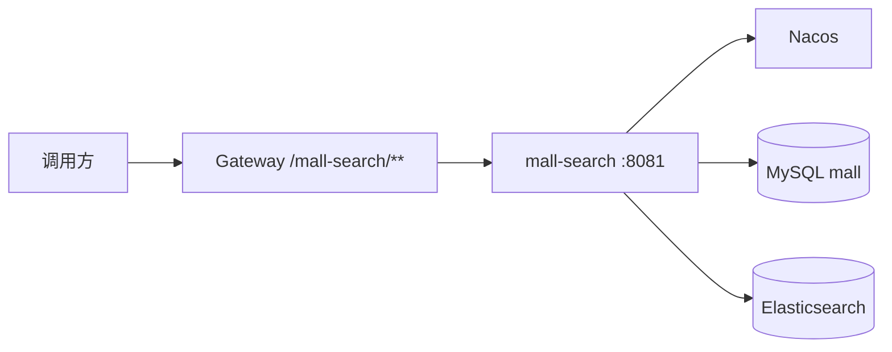
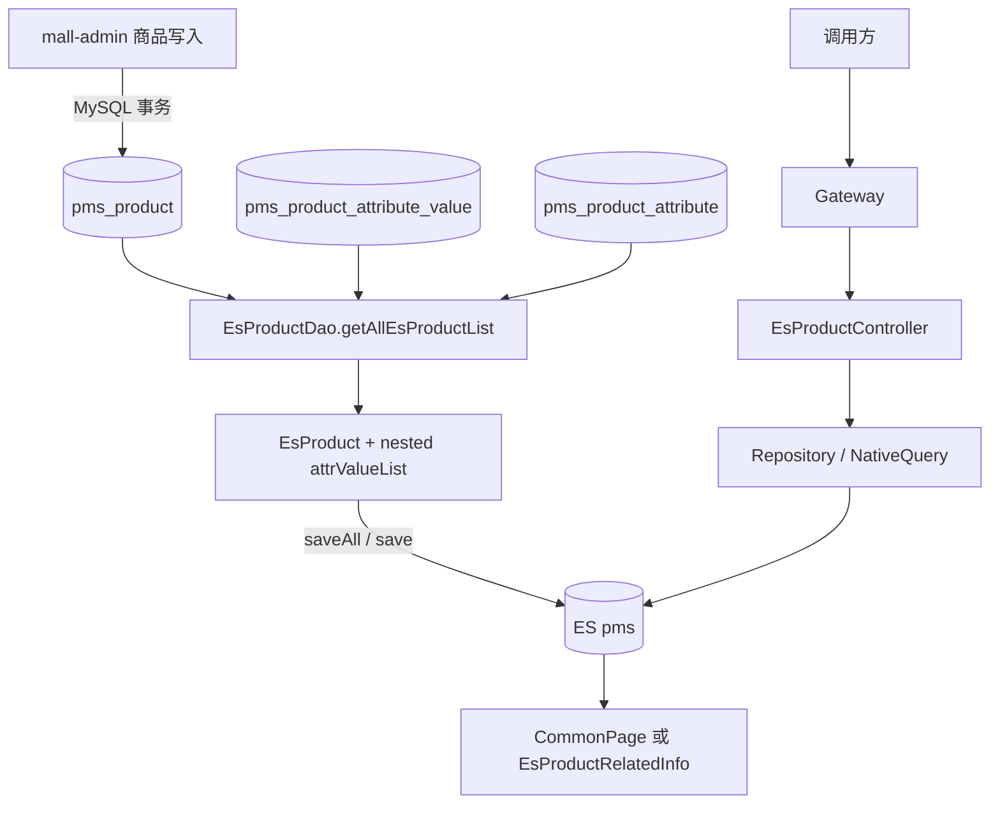

# 概念：mall-swarm 的 mall-search 设计

## 定义与职责

`mall-search` 是端口 `8081` 的独立商品检索服务：从 MySQL `pms_product`、`pms_product_attribute_value`、`pms_product_attribute` 投影出 ES 商品文档，提供索引导入/删除/单件创建、关键词检索、品牌/分类过滤、聚合筛选信息及相关推荐。它注册到 Nacos，并经 Gateway `/mall-search/**` 转发。

**证据：**`mall-search/pom.xml`（ES、Nacos 依赖）；`MallSearchApplication`（`@EnableDiscoveryClient`）；`mall-search/src/main/resources/application.yml`（`server.port=8081`）；`mall-gateway/src/main/resources/application.yml`（`mall-search` route）；`EsProductController`。

它不是 portal 当前前台商品搜索的实际后端：portal 的 `/product/search` 使用 `PmsProductMapper` 和 PageHelper 直接查 MySQL，未调用 mall-search/ES。**证据：**`mall-portal/.../PmsPortalProductController#search`、`PmsPortalProductServiceImpl#search`。

## 模块结构与运行时依赖

| 层次 | 实现 | 证据 |
| --- | --- | --- |
| HTTP | `EsProductController` | `/esProduct` 下导入、删建、搜索、推荐、聚合接口 |
| 服务 | `EsProductServiceImpl` | 写入、NativeQuery、聚合与 DTO 转换 |
| MySQL 投影 | `EsProductDao` + `EsProductDao.xml` | 三表 LEFT JOIN 构造文档 |
| ES 访问 | `EsProductRepository`、`ElasticsearchTemplate` | Repository CRUD/派生查询、模板 NativeQuery |
| 文档/DTO | `EsProduct`、`EsProductAttributeValue`、`EsProductRelatedInfo` | 索引实体、nested 属性、筛选返回值 |

开发/生产 Nacos 镜像将 ES 配置为 `localhost:9200`/`es:9200`；Docker 为 ES `7.17.3` 单节点、`-Xms512m -Xmx1024m` 且挂载 plugins/data；K8s 只有一个 mall-search replica。**证据：**`config/search/mall-search-{dev,prod}.yaml`；`document/docker/docker-compose-env.yml`；`document/k8s/mall-search-deployment.yaml`。

**Redis 边界：**mall-search 从 `mall-mbg` 排除 `spring-boot-starter-data-redis`，本模块未见 Redis 配置或调用；Redis 不承担本模块搜索缓存。**证据：**`mall-search/pom.xml` exclusion、`mall-search/**`。 

## 索引、Document、mapping 与字段映射

`EsProduct` 声明 `@Document(indexName="pms")`、`@Setting(shards=1, replicas=0)`。`name`、`subTitle`、`keywords` 是 `Text + ik_max_word`；`productSn`、品牌/分类名称和属性 `name/value` 是 `Keyword`；`attrValueList` 是 `Nested`。Compose 仅挂载 plugins，未提交 IK 安装或自定义 analyzer 配置，实际 `ik_max_word` 可用性为**待验证**。**证据：**`mall-search/.../domain/EsProduct.java`、`EsProductAttributeValue.java`；`document/docker/docker-compose-env.yml`。

| ES 字段 | MySQL 来源 | 查询/业务用途 | 证据 |
| --- | --- | --- | --- |
| `id` | `p.id` | 文档 ID | `EsProduct#id`；`EsProductDao.xml#getAllEsProductList` |
| `productSn` | `p.product_sn` | Keyword 货号 | 同上 |
| `brandId` / `brandName` | `p.brand_id` / `p.brand_name` | term 过滤 / Keyword terms 聚合 | `EsProduct.java`；`EsProductServiceImpl#search/searchRelatedInfo` |
| `productCategoryId` / `productCategoryName` | `p.product_category_id` / `p.product_category_name` | term 过滤 / Keyword terms 聚合 | 同上 |
| `name` | `p.name` | IK 关键词匹配，权重 10 | `EsProduct.java`；`#search` |
| `subTitle` | `p.sub_title` | IK 关键词匹配，权重 5 | 同上 |
| `keywords` | `p.keywords` | IK 关键词匹配，权重 2 | 同上 |
| `pic`、`price`、`sale`、`newStatus`、`recommandStatus`、`stock`、`promotionType`、`sort` | `p` 同名列 | 展示/状态/排序；未显式 `@Field`，精确 ES 类型待以 `_mapping` 核验 | `EsProductDao.xml`、`EsProduct.java` |
| `attrValueList.*` | `pav` LEFT JOIN `pa` | Nested 属性 ID/值/类型/名；`type=1` 参数用于聚合 | `EsProductDao.xml`；`EsProductAttributeValue.java`；`#searchRelatedInfo` |

测试 `MallSearchApplicationTests#testEsProductMapping` 只 `putMapping(createMapping(...))` 后打印 mapping，没有创建索引、断言或自动化校验；部署是否自动创建 `pms` 索引为**待验证**。

## MySQL 商品数据 → ES 索引 → 搜索 API

`importAll()` 查所有 `delete_status=0 AND publish_status=1` 商品并 `saveAll`；`create(id)` 查一条后 `save`；相同 ID 是 upsert，但全量不先删除旧文档，故不是严格重建。**证据：**`EsProductServiceImpl#importAll/create`；`EsProductDao.xml#getAllEsProductList`；`EsProductRepository`。

## 核心调用链、搜索与聚合

| 能力 | 现有行为 | 证据 |
| --- | --- | --- |
| 简单搜索 | `/search/simple` 派生查询 `name OR subTitle OR keywords` | `EsProductController`；`EsProductRepository` |
| 综合搜索 | 空词 `match_all`；否则 function score 匹配 name/subTitle/keywords，权重 10/5/2、`minScore=2` | `EsProductServiceImpl#search` |
| 过滤与分页 | 只接收 `brandId`、`productCategoryId` term filter；`PageRequest.of(pageNum,pageSize)`，页号从 0 开始 | `#search`；`EsProductController#search` |
| 排序 | 1=id desc（新品）、2=sale desc、3=price asc、4=price desc，随后追加 `_score desc` | `#search`；最终多排序优先级应集成测试确认 |
| 筛选聚合 | 品牌名、分类名各 top 10；nested 属性仅 `type=1`，属性 ID/值/名各 top 10 | `#searchRelatedInfo/convertProductRelatedInfo` |
| 相关推荐 | MySQL 取源商品，ES 按 name/subTitle/keywords/brand/category 加权 8/2/2/5/3 并排除自身 | `#recommend` |

当前 API 不支持属性值、价格区间、库存等过滤。SQL 虽定义属性 `search_type`（0 不检索、1 关键词、2 范围），搜索实现未读取该字段，不能称为已实现范围检索。**证据：**`EsProductController` 参数；`EsProductServiceImpl`；`document/sql/mall.sql` 的 `pms_product_attribute.search_type`。

## 同步机制与一致性风险

| 场景 | 源码现状 | 风险/二开建议 |
| --- | --- | --- |
| 全量 | `POST /esProduct/importAll` 手工 `saveAll` | 只 upsert、不清孤儿文档；**二开建议：**版本化新索引、ID 对账、alias 原子切换。 |
| 增量 | `POST /create/{id}` 可手工单件 upsert；delete 接口可手工删 | admin `create/update/updatePublishStatus/updateDeleteStatus` 未调用 ES/Feign/消息；**二开建议：**事务 outbox + 幂等消费者。 |
| 消息/定时/重试 | mall-search 未见 RabbitMQ 依赖、消费者、`@Scheduled`/`@EnableScheduling` | 无失败重试、死信、断点续跑、延迟和漂移修复；**二开建议：**outbox 重试/死信、定时对账与 lag/失败/孤儿指标。 |
| 可见性 | 导入仅选未删且上架；ES 查询不再加可见性过滤 | 后续下架/软删不会自动撤文档，可能返回失效商品，直至人工删除/重建。 |
| 失败 | `save/saveAll` 无业务捕获、重试或失败记录 | 运行时客户端策略待验证；代码层无补偿。 |

**直接证据：**`mall-admin/.../PmsProductServiceImpl#create/update/updatePublishStatus/updateDeleteStatus` 直接写 MySQL；`mall-search/.../EsProductServiceImpl`；在允许范围内对 mall-search 无消息/定时实现。

## 输入约束、性能边界与防滥用

Gateway 对 `/mall-search/**` 设静态路由且列入 `secure.ignore.urls`。因此包括 `importAll/create/delete` 的索引管理接口在网关层是白名单；Controller 内未见鉴权注解。**证据：**`mall-gateway/src/main/resources/application.yml`；`EsProductController`。

- 没有 `@Valid`、最大词长、`pageSize`/ID 列表上限；负 page 或非正 pageSize 可触发 `PageRequest` 异常，大页/长词/批量 ID 会放大压力。
- `searchRelatedInfo` 包含多层 nested terms 聚合；单桶有 top 10，但没有超时、熔断、缓存、慢查询阈值或审计。
- `importAll` 将全部可见商品载入 List 后 `saveAll`，没有分页流式导入、任务状态或公开运维隔离。

**二开建议：**读搜索与索引运维 API 分离；运维接口鉴权/审计/异步化；网关实施 IP/用户限流、词长与 pageSize 限制、深分页策略；补超时、熔断、指标和告警。这些不是已有功能。

## 关键设计、数据状态与扩展点

1. 反规范化：三表 LEFT JOIN 将属性嵌入文档，换取单次检索/聚合。**证据：**`EsProductDao.xml`、`EsProduct#attrValueList`。
2. 应用层相关性：function score 而非单一 multi-match。**证据：**`EsProductServiceImpl#search/recommend`。
3. 投影扩展点：新增检索字段必须同步改 `EsProductDao.xml` alias、`EsProduct`、mapping 和重建测试；复杂 DSL 沿 `ElasticsearchTemplate` 扩展；聚合结构变更同步 `convertProductRelatedInfo`。
4. 状态：源 SQL 纳入未删/上架；ES 保留新品、推荐、库存、促销，但查询未按这些过滤；属性 type=0 规格、1 参数，聚合排除规格。**证据：**`EsProductDao.xml`；`document/sql/mall.sql`；`#searchRelatedInfo`。

## AI 二开启示：能力边界对比

以下均为**二开建议**，不代表现有 AI、向量或 RAG 能力。

| 能力 | 可复用现有字段 | 缺口 |
| --- | --- | --- |
| 关键词检索 | `name/subTitle/keywords` IK、品牌/分类、现有权重 | 同义词、纠错、查询理解、评测与观测。 |
| 过滤检索 | brand/category ID、nested 属性 ID/值/类型/名 | API 未接属性/价格/库存 filter；需结构化 DSL、显式数值 mapping/校验。 |
| 向量检索 | 标题、副标题、关键词、品牌/分类、属性可合成语义文本；ID 可作主键和 filter metadata | 未见 `dense_vector`、embedding 模型、kNN、版本/重嵌入任务；新增 embedding、模型/文本版本和异步索引。 |
| RAG | 标题、卖点词、分类、品牌、参数作召回元数据 | 未索引 `description/detail_desc/detail_html`，无 chunk/引用/LLM 编排/评测；价格库存促销应生成前实时读权威源。 |

稳妥 RAG 应另建商品详情 chunk 知识索引，以商品 ID、上架状态、品牌/分类/属性过滤；融合关键词和向量召回，并保留片段/版本/来源。不可把可能滞后的 ES 价格库存当作生成答案的权威事实。

## 风险与待验证项

1. 网关白名单覆盖索引写删接口，需核验是否另有外层防护。
2. ES 索引创建、alias/template/ILM 均未见显式实现；目标 `pms/_mapping` 与索引生命周期待验证。
3. IK 插件安装和版本兼容待验证。
4. 未标注 `@Field` 的实际 mapping 待以 `GET pms/_mapping` 固化为回归断言。
5. portal MySQL 搜索与 mall-search 的关键词、可见性、排序可能分叉。

## 相关链接

- [[overview/ecommerce/mall-swarm/主题_mall-swarm_架构全景_综述]]
- [[concepts/ecommerce/mall-swarm/概念_mall-swarm_mall-mbg设计]]
- [[concepts/ecommerce/mall-swarm/概念_mall-swarm_mall-admin设计]]
- [[overview/java/spring-ai/主题_Spring_AI源码架构_综述]]（仅二开学习，不代表已集成）
