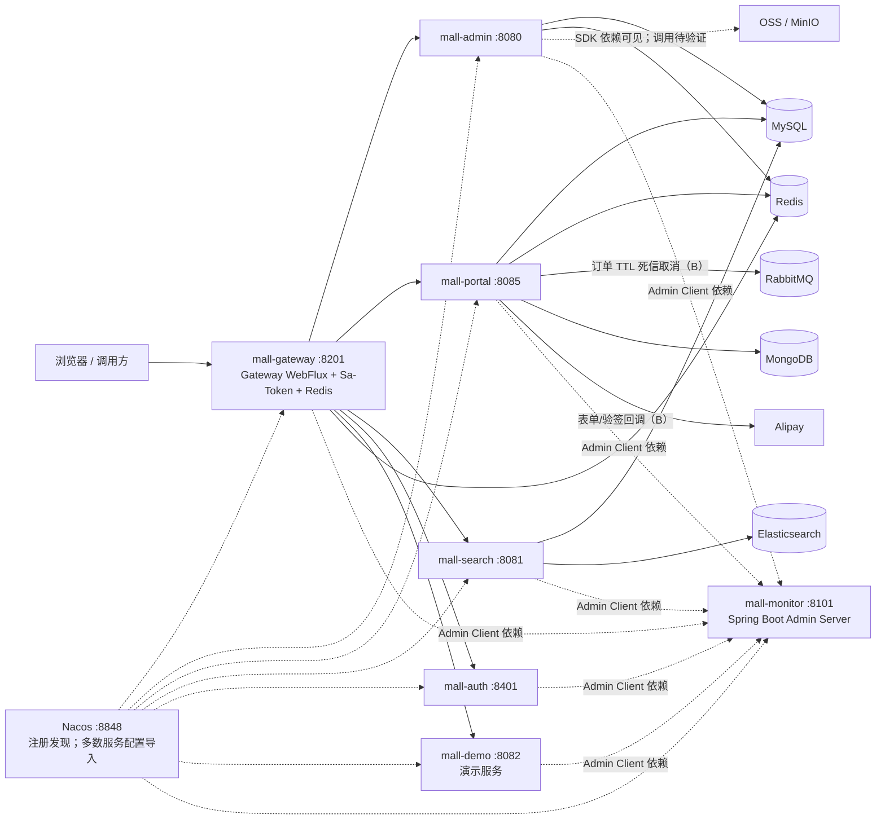

# 主题：mall-swarm 架构全景 综述

## 结论边界

该项目已可由源码入口证明为 Java 17 / Spring Boot 3.5 / Spring Cloud Alibaba 的 Maven 多模块微服务工程，并同时提供本地进程、Docker Compose 与 Kubernetes 三种运行/部署入口。它的业务服务划分、实际订单状态机和消息链路尚未在本轮读取，不能把 README 的商城能力清单当作当前实现清单。

详细证据见 [[sources/ecommerce/mall-swarm/来源_mall-swarm_项目源码]]；入口及网关鉴权补充见 [[sources/java/mall-swarm/来源_mall-swarm_项目入口与模块地图]]。Gateway 的静态/服务发现路由、Sa-Token、Knife4j 和 WebFlux 风险详见 [[concepts/ecommerce/mall-swarm/概念_mall-swarm_mall-gateway设计]]。

## 模块地图

| 分层 | 模块 | 本轮可确认的边界 |
| --- | --- | --- |
| 共享/数据层 | `mall-common`、`mall-mbg` | 公共依赖与 MyBatis Generator 数据访问基础；无独立进程 |
| 业务服务 | `mall-admin`、`mall-portal`、`mall-search`、`mall-auth` | 四个可执行服务；具体业务职责待读内部调用链 |
| 边缘与运维 | `mall-gateway`、`mall-monitor` | Gateway WebFlux/Nacos/Redis/Sa-Token Reactor；Gateway 同时有五条静态路由与 discovery locator，详见网关概念页；Boot Admin Server |
| 演示 | `mall-demo` | 独立可启动、声明 OpenFeign/Nacos；不纳入 Compose/K8s 清单 |
| 配置与交付 | `config/`、`document/docker/`、`document/k8s/`、`document/sh/` | Nacos 配置镜像、容器/编排/脚本资产 |

## 运行时组件图

实线表示 POM、配置或部署脚本可直接佐证的连接；虚线表示依赖/配置存在但尚未读到实际调用或消息收发实现。标记 **B** 是多处源码一致但未完成运行验证，不表示生产行为已经确认。

## 请求、消息与数据的高层流向

1. **请求入口（已证实）**：Gateway 配置了到 auth/admin/portal/search/demo 的负载均衡路由；每个目标服务都有独立应用名和端口。请求从网关进入后，网关再选择服务实例。
2. **服务发现与配置（已证实）**：七个应用启用 Nacos discovery；除 monitor 外，应用 profile 从 Nacos 导入同名环境配置。配置镜像不含 auth，运行时实际 Data ID 需查 Nacos。
3. **数据承载（已证实到“接入层”）**：admin/portal/search 配置 MySQL；admin/gateway/portal 配置 Redis；portal 配置 MongoDB 和 RabbitMQ；search 配置 Elasticsearch。具体表、索引、缓存键、消息队列生产者/消费者都待读源码。
4. **履约消息（待验证）**：RabbitMQ 被 portal 配置和 POM 引入，但不能据此断言“下单后会异步扣库存/取消订单”。必须读取订单创建、支付回调、库存服务和消息监听代码后再画因果链。

## 技术选型及证据

| 技术 | 证据 | 可确认的结论 |
| --- | --- | --- |
| Spring Boot 3.5.14 / Java 17 | 根 `pom.xml` | 工程基线 |
| Spring Cloud 2025 + Alibaba | 根 POM BOM；模块 Nacos 依赖/配置 | 微服务发现与配置骨架 |
| Gateway WebFlux | gateway POM 与 `application.yml` | 北向路由层 |
| Sa-Token / Redis / JWT | gateway/admin/portal POM 与配置 | 已接入鉴权会话相关组件；规则细节待读 |
| MyBatis / Generator / Druid / MySQL | mbg POM；服务配置 | 关系数据访问技术栈 |
| Elasticsearch | search POM 与配置 | 搜索技术接入 |
| MongoDB / RabbitMQ | portal POM 与配置 | 文档数据与消息组件接入；业务用途待证实 |
| Boot Admin / Actuator / Logstash | monitor POM；各服务 Admin Client / 配置 | 监控、管理端点、日志采集接入 |
| Docker / Kubernetes | 根 POM、Compose、脚本、K8s 清单 | 容器镜像与两类部署资产存在 |

## 已实现、演示与规划：分层判断

- **已由工程证据确认**：九模块构建结构、七个启动入口、Nacos/Gateway/Monitor 接入、上述数据库/中间件/SDK 的依赖或配置、六个核心服务的 Docker Compose/Kubernetes 资产。
- **演示能力**：`mall-demo` 是明确命名的独立模块，具备 OpenFeign/Nacos 依赖与启动入口，但不在 Compose/K8s 编排中。README 提供的在线页面、功能展示和业务图仅保留为演示/说明线索。
- **规划能力或不确定项**：在本轮允许文件中未发现独立路线图或可执行任务清单；README 所列业务功能、支付、库存、订单履约以及 AI 能力都必须通过内部源码再确认。

## 当前已知 AI 能力与接入判断

目前没有入口层证据表明项目已经集成模型、向量库、RAG、Agent 或工作流引擎：根/模块 POM、环境配置、Compose、K8s、脚本均未见相关依赖或配置。

可作为**待验证的 AI 接入候选边界**而非既有能力的是：

- `mall-search`：已有 Elasticsearch 接入，但尚未证明向量字段、向量检索或商品知识索引存在。
- `mall-portal`：已有 RabbitMQ、MongoDB、Redis，可能适合承接异步任务、对话状态或行为数据；具体一致性与治理边界待读。
- `mall-admin`：已有对象存储和后台服务承载，但适合何种运营/内容 AI 场景需先确认权限与业务服务边界。

后续设计可参考 [[overview/java/spring-ai/主题_Spring_AI源码架构_综述]]，但不应误写为本项目已使用 Spring AI。

## 认证与授权补充（mall-auth 深读）

`mall-auth` 不是当前 Token 签发主体：`POST /auth/login` 仅按 `admin-app` / `portal-app` 分流到 `mall-admin`、`mall-portal` 的 Feign 登录接口；下游分别以 Sa-Token `StpLogicJwtForSimple` 校验密码、签发 Token 并写入 Session。Gateway 根据 `/mall-admin/**` 与 `/mall-portal/**` 使用不同 login type 校验；管理端还读取 Redis 的路径—资源映射进行权限校验。详细调用链、Token 生命周期及证据见 [[concepts/ecommerce/mall-swarm/概念_mall-swarm_mall-auth设计]]。

该分层不是充分的纵深防御：受控 Compose 同时映射 admin:8080、portal:8085 和 auth:8401 到宿主机，而允许范围的 admin/portal 源码未见独立 HTTP 鉴权 filter；直连是否可绕过 Gateway 的登录和资源校验必须作为部署风险验证。服务账号、refresh token、OAuth2 授权码/client credentials、Feign 身份透传均未在允许源码内发现，不可假定存在。

## 公共层补充：mall-common 的边界

`mall-common` 已提供 `CommonResult`/`CommonPage`、认证常量与 `UserDto` 等跨服务数据契约，并提供 Redis、MVC 异常包装、Servlet Controller 日志和 Logstash 配置等技术封装；它不是独立服务，也未实现模型、RAG、Agent 或统一 AI 调用层。尤其要注意它携带 MVC/Servlet 依赖和切面，而 Gateway 采用 WebFlux：公共 DTO 可复用，MVC 的异常/日志实现不应直接作为网关的 reactive 方案。详见 [[concepts/ecommerce/mall-swarm/概念_mall-swarm_mall-common设计]]。

## 搜索模块学习进展（2026-07-13）

`mall-search` 已确认以 MySQL 三表投影构建 ES `pms` 索引，`name`/`subTitle`/`keywords` 使用 `ik_max_word`，并提供关键词加权、品牌/分类过滤、聚合筛选和相关推荐；但 portal 当前商品检索仍直查 MySQL。索引全量/单件同步均由 `/esProduct` 管理接口手工触发，源码未见 admin 商品变更事件、消息消费者、定时补偿或漂移对账；Gateway 白名单还覆盖整个 `/mall-search/**`，包含导入和删除。mall-search 已显式排除 Redis，不承担搜索缓存。详见 [[concepts/ecommerce/mall-swarm/概念_mall-swarm_mall-search设计]]。

## 推荐源码学习路线

1. **订单创建主线**：先读 `mall-portal` 的下单入口 Controller，沿 Service、Mapper/Repository 到 `mall-mbg`，记录订单、订单项、优惠、库存、事务和缓存边界。
2. **支付与状态变化**：在 portal 内定位 Alipay SDK 调用、支付回调入口、订单状态更新与幂等控制；再查支付失败/超时分支。
3. **库存与履约**：定位库存扣减/回滚调用、库存表 Mapper、RabbitMQ producer/consumer、延迟/取消订单队列与消费者；只有确认消息方向后再绘制消息图。
4. **后台管理与权限**：读 admin 的商品/库存/订单管理接口及资源权限初始化，追踪 gateway 的鉴权规则如何与下游服务配合。
5. **搜索同步**：读 search 的商品索引构建、同步触发、ES 查询与回退策略，判断其是否可演进为商品知识检索底座。
6. **AI 切入点评估**：在以上事实链稳定后，选择一个低风险、可审计场景（例如后台商品资料辅助或运营检索）；再决定用服务内适配层、异步任务还是独立 AI 服务，并补充模型、向量、脱敏、权限、观测和成本治理。

## Gateway 深度学习结论（2026-07-13）

- 网关的五条稳定对外前缀是 `/mall-auth/**`、`/mall-admin/**`、`/mall-portal/**`、`/mall-search/**`、`/mall-demo/**`，均为本地 YAML 静态 `lb://` 路由并 `StripPrefix=1`；同时开启 Nacos discovery locator。仓库可见的 Nacos gateway 环境配置未定义 routes，故不能把静态路由误写为 Nacos 动态配置。
- Sa-Token 在 Gateway 区分后台 `StpUtil` 和前台 `StpMemberUtil(memberLogin)`；admin 权限从 Redis `auth:pathResourceMap` 匹配原始网关路径。search/auth 全前缀白名单，portal/admin 是部分白名单加登录校验。完整规则、过滤器证据和异常边界见 [[concepts/ecommerce/mall-swarm/概念_mall-swarm_mall-gateway设计]]。
- 现有网关未见限流、AI 审计、超时/熔断或流式响应专用配置；因此 AI 二开宜以 Gateway 做鉴权、配额与审计横切，以独立 AI 服务承载模型与 SSE/RAG/Agent，而非将模型调用直接放入 Gateway。此为二开建议，不是现有功能。

## 第二轮 P0：认证、旁路与部署暴露面（2026-07-13）

第二轮静态核查确认：Docker Compose 同时发布 admin、portal、auth、search 的宿主机端口；Kubernetes 仅把 Gateway 声明为 NodePort，却未在仓库提供下游 NetworkPolicy、Ingress 或 mTLS。下游未见统一 HTTP 身份过滤器，因此 Gateway 不能被视为唯一可信入口。另有 auth/search 全前缀白名单、Actuator/OpenAPI 暴露、ES 管理写接口、全 Header Feign 透传和 Monitor 固定账号等高优先级面。完整 B/C 证据、AI 用户委托/服务身份/scope/二次确认/审计与拒绝策略见 [[concepts/ecommerce/mall-swarm/概念_mall-swarm_认证网关与部署安全]]；尚未做真实 HTTP、K8s、Nacos、Redis 多实例集成验证，不能升级为 A 级结论。

相关基础：[[concepts/java/mybatis/概念_MyBatis核心生命周期与Configuration]]、[[concepts/java/spring/概念_Spring数据访问_JdbcTemplate_事务传播_MyBatis_多数据源]]。

## 数据访问层学习进展（2026-07-13）

已完成 `mall-mbg` 深度学习：SQL 脚本可核对的 76 张表被 MBG 配置以 `%` 全表模式生成 76 组 Model/Example/Mapper/XML；admin 与 portal 同时扫描生成 Mapper 和各自手写 DAO。商品、订单、会员/权限与营销数据的 AI 可见性必须按字段最小化，会员/订单/管理员数据默认不可直接进入模型上下文。详情、关系图、领域表分组、分页/批量操作风险和再生成流程见 [[concepts/ecommerce/mall-swarm/概念_mall-swarm_mall-mbg设计]]。

## 前台商城与订单链路补充（mall-portal 深读，2026-07-13）

`mall-portal` 已由源码证明为会员、购物车、促销结算、订单、SKU 锁库存、支付宝与延迟取消的本地业务服务，而非协调独立库存/支付/优惠微服务。订单创建在 MySQL 本地事务内重算价格、锁 `pms_sku_stock.lock_stock`、写 `oms_order`/`oms_order_item`、占优惠券/积分、软删购物车并投 RabbitMQ TTL 取消消息；支付成功验签后把订单从待付款改为待发货，同时 `stock -= qty`、`lock_stock -= qty`。MongoDB 只在本轮所见的收藏/关注/浏览历史中使用。完整领域图、四条时序图、状态机、数据职责、AI 工具权限与风险见 [[concepts/ecommerce/mall-swarm/概念_mall-swarm_mall-portal设计]]。

需优先验证或二开修复的源码事实包括：SKU 锁库存为先读后写、下单无业务幂等键、MySQL 事务不覆盖消息投递、支付发起金额未回查订单、直接支付/详情入口缺归属或状态保护、后台关闭订单绕过库存/券/积分补偿。它们是风险结论，不表示已经观察到生产事故。

## P0 风险优先级：订单一致性与支付安全复核（2026-07-13）

本轮完成了上述结论的代理与调用路径复核。**纠正：** portal/admin 的关键订单 Service 接口均声明 `@Transactional`，对应模块显式启用事务管理，Controller 和 RabbitMQ consumer 经接口 Bean 进入业务方法；不能再表述为“订单没有事务”。但这是本地数据库事务的 **B 级代码事实**，不覆盖 Redis 订单号自增、RabbitMQ 发送或支付宝平台。

优先级由高到低如下：

1. **P0-1（B）库存与下单幂等：** `hasStock` 后的锁库存是读后写，没有条件更新、版本或幂等键；重复提交和并发 SKU 下单不能从源码获得防超卖保证。
2. **P0-2（B/C）支付与取消竞争：** 回调验签和串行重复回调的 `status=0` 查询存在，但支付/取消都是先查再非条件写；金额、app/seller、订单归属、交易号未完整绑定。MQ 重投、ACK/requeue/DLQ 和多实例交错仍是 C 级运行时问题。
3. **P0-3（B/C）本地事务—消息原子缺口：** 下单直接发送 TTL 消息，未见 outbox、after-commit、publisher confirm 或发布幂等；数据库与消息失败时没有可见对账/补偿。
4. **P0-4（B）接口和状态边界：** `/alipay/**` 是网关白名单；前台订单详情/取消缺本人归属校验；后台关闭不限原状态且不补偿，发货/关闭历史可能与实际更新行不一致。

运行命令 `mvn -pl mall-portal -am test -DskipTests=false` 未进入业务断言：portal `@SpringBootTest` 因本地 MySQL 连接被拒绝失败，Nacos 也不可达；因此没有 A 级订单结论。完整证据、正常/异常/并发路径、必补集成测试及 AI 客服/订单助手的禁止权限和确认规则见 [[concepts/ecommerce/mall-swarm/概念_mall-swarm_订单支付一致性]]。

## 监控与可观测性学习进展（2026-07-13）

已完成 `mall-monitor` 深度学习：它由 `@EnableAdminServer` 启动，作为 Nacos Discovery Client 发现候选实例，并在 Admin discovery 中排除自身；admin/auth/gateway/portal/search/demo 都声明 Spring Boot Admin Client，且本地 Actuator 配置统一暴露全部 Web 管理端点并显示 health、env、configprops 的详细值。共享 Logback 可将 DEBUG、ERROR、业务与访问日志分别经 TCP `4560`–`4563` 发往 Logstash，但无 trace/user 审计关联的源码证据，且 pipeline 不在仓库。完整的拓扑、Server 认证、端点边界、ELK 链路、安全风险和 AI 可观测性最小指标集见 [[concepts/ecommerce/mall-swarm/概念_mall-swarm_mall-monitor设计]]；所有 AI 指标均为二开建议。

## mall-admin 深度学习进展（2026-07-13）

已完成后台服务的三条核心链路：Sa-Token 登录与 UMS RBAC 数据装配、商品/SPU/SKU 多表保存与库存写入、订单批量发货。`mall-admin` 可由 Controller 证明覆盖管理员/角色/菜单/资源、商品/品牌/分类/属性/SKU、订单/售后、营销/内容和 OSS/MinIO；但当前范围未见 admin 发起的 Feign 调用，商品上下架也只更新 MySQL，不能断言搜索索引同步已经实现。权限侧已证实管理员—角色—菜单/资源的多对多关系及 Redis 路径资源映射的生产，但实际请求路径拦截器待后续验证。对象存储没有独立文件元数据持久化，MinIO 初次建桶会设置公开读取策略。详见 [[concepts/ecommerce/mall-swarm/概念_mall-swarm_mall-admin设计]]。

## mall-demo 深度学习进展（2026-07-13）

`mall-demo` 是可启动但未受控部署的教学/远程调用验证服务：一面直接以 MyBatis 操作共享 `PmsBrand` 数据，另一面以 OpenFeign 把六个示例入口同步代理至 `mall-admin`、`mall-portal`、`mall-search`。它的 RequestInterceptor 会复制全部入站 header（仅跳过 `content-length`），因此认证 header 可以随请求向下游传递，但没有 header allowlist、TraceId 生成/日志关联、显式超时/重试、熔断降级或 Feign 异常映射。该模式可为未来 AI 服务提供“服务发现与显式契约”的学习样本，不能直接复用为生产调用层；应补齐最小权限委托、版本化 DTO、超时/幂等/熔断和审计。完整契约表、关系图、时序和二开规范见 [[concepts/ecommerce/mall-swarm/概念_mall-swarm_mall-demo设计]]。

## 第二轮 P1：Nacos 配置与运行态验证（2026-07-13）

静态交叉核验把原先笼统的“运行环境待验证”收敛为可执行项：六个服务声明 Nacos config import，monitor 只做 discovery；仓库的 `config/` 镜像覆盖 admin/portal/gateway/search/demo，却缺少 auth 的两个预期 Data ID。K8s 六个应用只注入 profile、时区和 Nacos 地址，仓库没有 ConfigMap、Secret、Ingress、NetworkPolicy、探针或资源限制；Compose 可静态展开，但应用服务依赖 external links 而无就绪检查。以上均为 **B**，不能代替 Nacos 实存配置或集群对象。

本机只读探测没有发现 mall 容器，Kubernetes 没有 current context，且配置地址的 Nacos readiness 不可达；因此没有 mall 正向 **A** 级运行事实。Nacos namespace/group/ACL/历史、最终配置覆盖关系、容器健康、K8s Secret/入口策略和中间件认证/暴露仍为 **C**。精确命令、服务依赖矩阵、风险和 AI 上线前置条件见 [[concepts/ecommerce/mall-swarm/概念_mall-swarm_Nacos配置与运行态验证]]。
